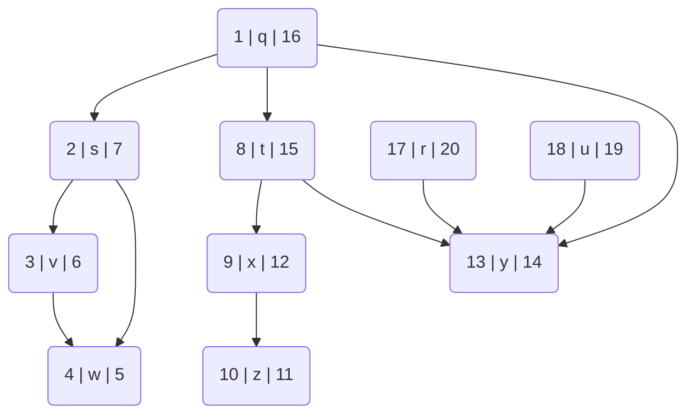

#  Data_&_Algo_ESE
> Author : Aaron Augustine

> Star the gist so that I can get a consensus on how many people are using this resource
> 
[Github Repo Link for all ESE Notes](https://github.com/ToothlessRider/ESE_Notes.git).

# Table of Contents :
1. [PYQs](#previous-year-questions)
2. [Breadth first search](#bfs)
	- [Pseudocode](#pseudocode-bfs)
	- [Time Complexity](#time-complexity-bfs)
3. [Depth First Seach](#dfs)
4. [Djikstra's Algorithm](#djik-algo)
	- [Pseudocode](#pseudocode-djk)
	- [Time Complexity](#time-complexity-djk)
5. [Bellman Ford Algorithm](#bell-ford)
6. [Assignment Questions](#assignment-questions)

## Previous Year Questions 
Q1. a. **An algorithm has two phases. The first phase, initialization, takes time O(n^3^). The second phase, which is the main computation, takes time O(n^2^). What is the most accurate description of the complexity of the overall algorithm**

Ans. 
1.  The initialization phase takes $O(n^3)$time.
2.  The main computation phase takes $O(n^2)$time.

The total time complexity 𝑇(𝑛) of the algorithm is the sum of the time complexities of both phases:

$T(n) = O(n^3)+O(n^2)$

When adding time complexities, the term with the highest order of growth dominates, because it grows faster than the others as 𝑛 increases. Here, $O(n^3)$grows faster than $O(n^2)$.

Thus, the most accurate description of the overall complexity of the algorithm is:

$T(n)=O(n^3)$

This is because the $O(n^3)$term will dominate the $O(n^2)$ term for sufficiently large 𝑛.

<hr>

Q1. b. **Suppose we have an O(n) time algorithm that finds the median of an unsorted array. Now consider a QuickSort implementation where we first find the median using the above algorithm, then use the median as a pivot. What will be the worst-case time complexity of this modified QuickSort?**

Ans.
In a standard QuickSort algorithm, the worst-case time complexity is $O(n^2)$ when the pivot chosen leads to the most unbalanced partitions (e.g., when the smallest or largest element is always chosen as the pivot).

However, if we modify QuickSort to use the median of the array as the pivot, and we assume that finding the median can be done in $O(n)$ time, the worst-case time complexity changes significantly. Here's how:

1. **Finding the Median**: According to the problem, we have an $O(n)$ time algorithm to find the median of an unsorted array.
2. **Partitioning Around the Median**: Using the median as the pivot ensures that the partitioning is always balanced. Each partition will be approximately half the size of the array.


The steps for the modified QuickSort are:
1. Find the median of the array, which takes $O(n)$ time.
2. Partition the array around the median, which takes $O(n)$ time.
3. Recursively apply the same process to the two halves.

Let's analyze the time complexity more formally:

- Let $T(n)$ be the time complexity of this modified QuickSort algorithm.
- The median-finding step takes $O(n)$ time.
- Partitioning the array around the median also takes $O(n)$ time.

After partitioning, we recursively sort the two halves, each of which has at most $\lceil \frac{n}{2} \rceil$ elements. Therefore, the recurrence relation for the time complexity is:

$T(n) = O(n) + T\left(\left\lceil \frac{n}{2} \right\rceil\right) + T\left(\left\lfloor \frac{n}{2} \right\rfloor\right)$

Since $\left\lceil \frac{n}{2} \right\rceil + \left\lfloor \frac{n}{2} \right\rfloor = n$, we can approximate this as:

$T(n) = O(n) + 2T\left(\frac{n}{2}\right)$

This recurrence relation is characteristic of the divide-and-conquer algorithm where the problem is divided into two equal parts, and additional linear work is done outside the recursive calls. According to the Master Theorem for divide-and-conquer recurrences, this specific form of recurrence has the solution:

$T(n) = O(n \log n)$

Thus, the worst-case time complexity of the modified QuickSort, where the median is found in $O(n)$ time and used as the pivot, is $O(n \log n)$. This is a significant improvement over the worst-case time complexity of the standard QuickSort, which is $O(n^2)$.

<hr>

Q2. a.**Suppose you are playing game of shooting balloon. You expect to shoot n balloons in the board, assuming you are sharpshooter, 100% hit. There are two scenarios, you need find the appropriate Big O notation for each scenario. <br>In these problems, one unit of work is shooting one balloon.
(i). Scenario 1: For every 2 balloons you are able to shoot, one new balloon is inserted in the board. So, if there were 20 balloons, after you shoot the first 2, there are 19 on the board. After you shoot the next 2, there are 18 on the board. How many balloons do you shoot before the board is empty?**

Ans. 
1.  **Initial Conditions**:
- Let 𝑛 be the initial number of balloons on the board.
- You shoot balloons two at a time, and for every two balloons you shoot, one new balloon is added.

2.  **Step-by-Step Process**:
- Initially, there are n balloons.
- After shooting 2 balloons, 1 new balloon is added, so the number of balloons decreases by 1. The board now has n−1 balloons.
- After shooting another 2 balloons, another balloon is added, reducing the count by 1 again. The board now has n−2 balloons.
- This process continues until all the balloons are gone.

3.  **Iterations**:
- Each iteration involves shooting 2 balloons and having 1 new balloon added.
-  After each iteration, the total number of balloons decreases by 1.

4.  **Total Iterations**:
- To reduce the number of balloons from n to 0, you will need n iterations because each iteration reduces the count by 1.

6.  **Total Number of Balloons Shot**:
- In each iteration, you shoot 2 balloons.
- Therefore, the total number of balloons shot is 2(k - 1)
- Where k is number of initial balloons

### Conclusion:

The total number of balloons shot before the board is empty = 2*k - 1 . Therefore, the Big-O notation for the number of balloons you need to shoot before the board is empty is:
>O(n)

In this case the number of balloons shot 
$= 2\times(20 - 1)$
$= 38$

<hr>

Example :
If we assume number of balloons are [ k ] = 8  
Shooting rate is 2 balloons every time. n = 2
Number added each time = 1

k = 8

8 - 2 = 6 > 6 + 1 = 7 <br>7 - 2 = 5 > 5 + 1 = 6 <br>6 - 2 = 4 > 4 + 1 = 5 <br>5 - 2 = 3 > 3 + 1 = 4 <br>4 - 2 = 2 > 2 + 1 = 3 <br>3 - 2 = 1 > 1 + 1 = 2 <br>2 - 2 = 0 > 0 

Number of instances = k = 8 <br>Number of baloons shot = 2(k - 1) = 14


<hr>

Q2. a. (ii). **Scenario 2 for the above problem of shooting the balloon: By the time you have shoot the first n balloons, n-1 new balloons have been inserted on the board. <br>After shooting those n-1 balloons, there are n-2 new balloons are inserted on the board. After checking out those n-2 balloons . there are n-3 new balloons on the board. This same pattern continues until no new balloon are inserted on the board. How many total balloons do you shoot before the board is empty?** 

Ans. 

Number of balloons : 6
number of balloons shot(n) = 6

6 - 6 = 0 > 0 + 5 = 5 <br>5 - 5 = 0 > 0 + 4 = 4  <br>4 - 4 = 0 > 0 + 3 = 3 <br>3 - 3 = 0 > 0 + 2 = 2  <br>2 - 2 = 0 > 0 + 1 = 1 <br>1 - 1 = 0 > 0 + 0 = 0

so 21 balloons should have been burst in this case

$\Sigma Sum = [ n + (n-1) + ....... + 1 + 0 ] = \frac{n\times(n+1)}{2}$
$\Sigma Sum = \frac{n \times (n+1)}{2}$

Iterations = n
Number of balloons shot = $\frac{n \times (n+1)}{2}$

Therefore the time complexity : 
$O(\frac{n^2+n}{2}) = O(n^2) + O(n) = O(n^2)$


<hr>

Q2. b. **Assuming you had an antique computer that could perform one comparison every 1/1 ,OOO of a second, an insertion sort of 10,000 items should take about 7 hours.<br> Calculate the minimum amount of time taken to sort 250 elements**

Ans. 
Given that an insertion sort of 10,000 items takes about 7 hours, we can directly calculate the time since the complexity for best case insertion sort is $O(n)$

If sorting 10,000 elements takes 7 hours, then sorting 1 element would take:

$\frac{7 hours}{10,000 elements} = \frac{x hours}{1 element}$

Solving for 𝑥:

$x = \frac{7 \times 1 }{10,000}\text{ hours per element}$


Now, we can use this to find out how long it takes to sort 250 elements:

$\text{Time to sort 250 elements} = \frac{250 \times 7}{10,000} \text{ hours}$

$\text{Time to sort 250 elements} = \frac{1750}{10,000} \text{ hours}$

$\text{Time to sort 250 elements} = 0.175 \text{ hours}$

So, sorting 250 elements using insertion sort would take approximately 0.175 hours, or 10.5 minutes.

#### Worst Case : 
Given that an insertion sort of 10,000 items takes about 7 hours, we can directly calculate the time since the complexity for best case insertion sort is $O(n^2)$

$\frac{10000^2}{250^2} = \frac{7}{x}$

$\frac{1000000000}{62500} = \frac{7}{x}$

$1600= \frac{7}{x}$

$x = \frac{7}{1600} = 0.004375 hours = 0.0043\times60\times60 = 15.75 seconds$


<hr>

Q2. c. **Write the time complexity of the following algorithms.**
(i)
```
int value = 0;
for(int i = 0; i < n; i++) {
    for(int j = 0; j < n; j++) {
        value += l;
    }
}

```
Ans. 
(i)The total number of operations is 𝑛×𝑛=𝑛^2^
> Time complexity = $O(n^2)$

<hr>

(ii)
```
int main() {
    int i, n = 8;
    for (i = 2; i <= n; i = pow(i, 2)) {
        cout << "Hello World !!!\n";
    }
    return 0;
}

```
Ans. 
(ii) The loop condition 𝑖<=𝑛 fails when 𝑖=16 for 𝑛=8. The number of iterations is determined by how many times you can square 𝑖 before it exceeds 𝑛. This is approximately log⁡log⁡𝑛 times.
> TIme Complexity = O(loglogn)

<hr>

(iii)
```
void function(int n) {
    int count = 0;
    for (int i = n / 2; i <= n; i++) {
        for (int j = 1; j <= n; j = 2 * j) {
            for (int k = 1; k <= n; k = k * 2) {
                count++;
            }
        }
    }
}

```
Ans. 

(iii) The total number of operations is: 𝑂(𝑛)×𝑂(log⁡𝑛)×𝑂(log⁡𝑛)=𝑂(𝑛log^⁡2^𝑛)

> Time Complexity = 𝑂(𝑛log⁡^2^𝑛)

<hr> 

Q3. **What is the order of each of the following tasks? <br> Choose from O(1), O(log2 n),  O(n), O(nlog2 n), O(n2), O(2n)...etc; each order may appear more than once.)
(i) What is the time complexity of quicksort on already sorted data elements with the last element chosen as a pivot.
(ii) What is the runtime of Dijkstra's algorithm when the implementation is based on a binary heap (V — number of vertices, E — number of edges)?
(iii) What is the best case time complexity of selection sort?
(iv) What is the time complexity of the Breadth First Search using adjacency list ?
(v) What is the space complexity of the Depth First Search?**

Ans. 
(i) The time complexity of Quicksort on already sorted data elements with the last element chosen as the pivot is $O(n^2)$
(ii) The runtime of Dijkstra's algorithm when implemented using a binary heap is $O((V+E)log⁡V)$
(iii) The best case time complexity of selection sort is $O(n^2)$
(iv) The time complexity of Breadth-First Search using an adjacency list is $O(V+E)$
(v) The space complexity of Depth-First Search is $O(V+E)$

<hr>

Q3. b. **Explain Big $O$ and Big- $\theta$  asymptotic notation.**

Ans. 
#### Big $O$ Notation
Big O notation is used to describe an upper bound on the time complexity or space complexity of an algorithm. It provides an asymptotic measure of the performance of an algorithm as the input size grows. Specifically, Big O notation characterizes functions according to their growth rates: how quickly they grow as the size of the input increases.

Formally, if 𝑓(𝑛) and 𝑔(𝑛) are two functions, we say that 𝑓(𝑛)=𝑂(𝑔(𝑛)) if there exist positive constants 𝑐 and 𝑛0​ such that for all 𝑛≥𝑛0​:

𝑓(𝑛)≤𝑐⋅𝑔(𝑛)

In other words, beyond a certain point, 𝑓(𝑛) grows no faster than 𝑔(𝑛) up to a constant factor. Big O notation is typically used to describe the worst-case scenario of an algorithm.

#### Big- $\theta$ Notation

Big-Theta notation provides a tight bound on the time complexity or space complexity of an algorithm. It represents both the upper and lower bounds, meaning it gives an exact asymptotic behavior of a function.

Formally, if 𝑓(𝑛) and 𝑔(𝑛) are two functions, we say that 𝑓(𝑛)=Θ(𝑔(𝑛)) if there exist positive constants 𝑐1​, 𝑐2​, and 𝑛0​ such that for all 𝑛≥𝑛0:

𝑐1⋅𝑔(𝑛)≤𝑓(𝑛)≤𝑐2⋅𝑔(𝑛)

In other words, 𝑓(𝑛) grows at the same rate as 𝑔(𝑛) up to constant factors. Big-Theta notation is used to describe the average-case complexity or the tight bounds of an algorithm.

<hr>

Q3. c. **Sort the following elements using insertion sort algorithm.
15, 20, 10, 30, 50, 18, 5, 45**

Ans. 

**Steps of Insertion Sort**

1.  Start with the second element (index 1) and compare it with the first element.
2.  Insert the second element in the correct position relative to the first element.
3.  Move to the next element and compare it with the previous elements, inserting it into its correct position.
4.  Repeat until the entire array is sorted.
```
+------+-------------------------------+
| Step |      	Array State            |
+------+-------------------------------+
|  0   | 15, 20, 10, 30, 50, 18, 5, 45 |
|  1   | 15, 20, 10, 30, 50, 18, 5, 45 |
|  2   | 10, 15, 20, 30, 50, 18, 5, 45 |
|  3   | 10, 15, 20, 30, 50, 18, 5, 45 |
|  4   | 10, 15, 20, 30, 50, 18, 5, 45 |
|  5   | 10, 15, 18, 20, 30, 50, 5, 45 |
|  6   | 5, 10, 15, 18, 20, 30, 50, 45 |
|  7   | 5, 10, 15, 18, 20, 30, 45, 50 |
+------+-------------------------------+

```

<hr> 

0.4 a. **Consider a situation where swap operation is very costly. Which sorting algorithms should be preferred so that the number of swap operations are minimized in general?**

Ans. 
Here The answer depends on the which algorithm has minimum number of swaps among these And Among these ,selection sort has the minimum number of swaping complexity =$O(n)$ always so Selection sort is preferable here  
  

<hr> 

Q4. b. **Write the algorithm for quick sort.**

Ans. 
#### Quick Sort 
It is a divide-and-conquer algorithm that selects a 'pivot' element from the array and partitions the other elements into two sub-arrays, according to whether they are less than or greater than the pivot. The sub-arrays are then sorted recursively.

### Algorithm:

1.  **QuickSort(arr, low, high)**
    
    -   If `low` < `high`:
        -   Partition the array `arr` using a pivot element.
        -   Recursively sort the elements before and after partition.
2.  **Partition(arr, low, high)**
    
    -   Choose a pivot element from the array.
    -   Rearrange the array elements so that all elements less than the pivot are on the left side and all elements greater than the pivot are on the right side.
    -   Return the index of the pivot element after partition.

#### Pseudocode : 
```python
QuickSort(Arr,l,r)
	if( r - l <= 1)
		return;
	
	yellow = l + 1;
	for( green = l + 1; green < r; green++ ) 
		if ( Arr[green] <= Arr[l] ) // l is pivot element
			swap(Arr, yellow, green);
			yellow++;
		
	swap(Arr,l,yellow-1); // moving pivot element ahead of lower part

	//Recursively calling QuickSort
	Quicksort(Arr,l,yellow-1);
	Quicksort(Arr,yellow,r);

```
<hr> 

Q4. c. **Show how depth-first search works on the following graph starting from node q.<br> Assume that the for loop in the DFS procedure considers the vertices in alphabetical order, and assume that each adjacency list is ordered alphabetically. <br>Show the discovery and finishing times for each vertex, and show the classification of each edge.**
****
Ans. 
Let's re-evaluate the DFS traversal with the correction that $t$ will continue to discover $y$ after exploring $x$.

### Corrected DFS Traversal:

1. Start at $q$:
   - Discovery time: 1
   - Adjacent vertices: [s, t, y] (alphabetical order)

2. Move to $s$:
   - Discovery time: 2
   - Adjacent vertices: [v, w] (alphabetical order)

3. Move to $v$:
   - Discovery time: 3
   - Adjacent vertices: [w]

4. Move to $w$:
   - Discovery time: 4
   - No more adjacent vertices
   - Finishing time: 5

5. Back to $v$:
   - Finishing time: 6

6. Back to $s$:
   - Finishing time: 7

7. Back to $q$, move to $t$:
   - Discovery time: 8
   - Adjacent vertices: [x, y] (alphabetical order)

8. Move to $x$:
   - Discovery time: 9
   - Adjacent vertices: [z]

9. Move to $z$:
   - Discovery time: 10
   - No more adjacent vertices
   - Finishing time: 11

10. Back to $x$:
    - Finishing time: 12

11. Back to $t$, move to $y$:
    - Discovery time: 13
    - No more adjacent vertices
    - Finishing time: 14

12. Back to $t$:
    - Finishing time: 15

13. Back to $q$:
    - Move to $y$ (already visited)
    - Finishing time: 16

14. Next unvisited vertex: $r$:
    - Discovery time: 17
    - Adjacent vertices: [u]

15. Move to $u$:
    - Discovery time: 18
    - No more adjacent vertices
    - Finishing time: 19

16. Back to $r$:
    - Finishing time: 20

### Updated Discovery and Finishing Times:
- $q$: Discovery: 1, Finishing: 16
- $s$: Discovery: 2, Finishing: 7
- $v$: Discovery: 3, Finishing: 6
- $w$: Discovery: 4, Finishing: 5
- $t$: Discovery: 8, Finishing: 15
- $x$: Discovery: 9, Finishing: 12
- $z$: Discovery: 10, Finishing: 11
- $y$: Discovery: 13, Finishing: 14
- $r$: Discovery: 17, Finishing: 20
- $u$: Discovery: 18, Finishing: 19

### Corrected Edge Classification:
- Tree edges: (q, s), (s, v), (v, w), (q, t), (t, x), (x, z), (t, y), (r, u)
- Back edges: None
- Forward edges: None
- Cross edges: (q, y)

### DFS Result:

| Vertex | Discovery Time | Finishing Time |
|--------|----------------|----------------|
| q      | 1              | 16             |
| s      | 2              | 7              |
| v      | 3              | 6              |
| w      | 4              | 5              |
| t      | 8              | 15             |
| x      | 9              | 12             |
| z      | 10             | 11             |
| y      | 13             | 14             |
| r      | 17             | 20             |
| u      | 18             | 19             |

This corrected process shows the DFS traversal with proper discovery and finishing times for each vertex, as well as the correct classification of each edge.




<hr> 

Q5. a. **Find the shortest path from following graph using Dijkstra's algorithm.**
****
Ans. 
To find the shortest path from node `A` to all other nodes using Dijkstra's algorithm, we'll follow these steps:

1. **Initialization**:
   - Set the distance to the start node \(A\) to 0 and to all other nodes to infinity.
   - Mark all nodes as unvisited. Create a set of all the unvisited nodes called the unvisited set.

2. **Algorithm Execution**:
   - Select the unvisited node with the smallest known distance (initially \(A\)).
   - For the current node, consider all its unvisited neighbors and calculate their tentative distances through the current node.
   - Compare the newly calculated tentative distance to the current assigned value and assign the smaller one.
   - After considering all the neighbors of the current node, mark it as visited.
   - Repeat until all nodes are visited.

### Step-by-Step Execution:
| Pass | Initially | 1 | 2 | 3 | 4 |  Shortest Dist | Predecessor | 
| -- | -- | -- | -- | -- | -- | -- | -- |
| Active Vertex | - | A | C |D |E | - | - |
| A | 0 | 0 | | | | 0 | - |
| B | ∞ | 6 | | | | 6 | A |
| C | ∞ | [5] | | | | 5 | A |
| D | ∞ | ∞ | [8] | | | 8 | C |
| E | ∞ | ∞ | 16 |[15] |  |15 | D |

Shortest Path : E - > D - > C - > A


#### Initialization:
- Distance from `A` to `A` = 0.
- Distance from `A` to all other nodes = ∞.
- Unvisited set = {A, B, C, D, E}.

#### Iteration 1 (Current Node = A):
- Distances:
  - `A` to `A`: 0
  - `A` to `B`: 6 (through edge A->B)
  - `A` to `C`: 5 (through edge A->C)
  - `A` to `D`: ∞
  - `A` to `E`: ∞
- Mark `A` as visited.
- Unvisited set = {B, C, D, E}.

#### Iteration 2 (Current Node = C):
- Distances:
  - `A` to `C` to `D`: 5 + 3 = 8
  - `A` to `C` to `E`: 5 + 11 = 16
  - `A` to `B`: 6
  - `A` to `D`: 8
  - `A` to `E`: 16
- Mark `C` as visited.
- Unvisited set = {B, D, E}.

#### Iteration 3 (Current Node = B):
- Distances:
  - `A` to `B`: 6
  - `A` to `B` to `D`: 6 + 4 = 10
  - `A` to `D`: 8 (already smaller than 10)
  - `A` to `E`: 16
- Mark `B` as visited.
- Unvisited set = {D, E}.

#### Iteration 4 (Current Node = D):
- Distances:
  - `A` to `D`: 8
  - `A` to `D` to `E`: 8 + 7 = 15
  - `A` to `E`: 15
- Mark `D` as visited.
- Unvisited set = {E}.

#### Iteration 5 (Current Node = E):
- Distances:
  - `A` to `E`: 15
- Mark `E` as visited.
- Unvisited set = {}.

### Shortest Path Distances from `A`:
- `A` to `A`: 0
- `A` to `B`: 6
- `A` to `C`: 5
- `A` to `D`: 8
- `A` to `E`: 15

### Path Reconstruction:
1. **Path to B**: A -> B
2. **Path to C**: A -> C
3. **Path to D**: A -> C -> D
4. **Path to E**: A -> C -> D -> E

The final shortest paths from `A` using Dijkstra's algorithm are:
- `A` to `B`: 6
- `A` to `C`: 5
- `A` to `D`: 8
- `A` to `E`: 15

<hr>

Q5. b. Find the shortest path from following graph using Bellman ford algorithm.

****

Ans. 
To find the shortest path from node `A` to all other nodes using the Bellman-Ford algorithm, follow these steps:

### Bellman-Ford Algorithm Steps:

1. **Initialization**:
   - Set the distance to the start node \(A\) to 0 and to all other nodes to infinity.
   - Set the predecessor for each node to `null`.

2. **Relaxation**:
   - For each edge, update the distance to the destination node if the distance to the source node plus the edge weight is less than the current known distance to the destination node.
   - Repeat this process for \(V-1\) iterations, where \(V\) is the number of vertices.

3. **Check for Negative-Weight Cycles**:
   - Check all edges again to detect any negative-weight cycles. If a shorter path is found, then a negative-weight cycle exists.

|Vertex|0|1|2|3|4|5|6|7|
|--|--|--|--|--|--|--|--|--|
| A |0|0|0|0|0|0|0|0|
| B | ∞|8|8|8|8|8|8|8|
| C | ∞|∞|14|14|7|7|7|4|
| D | ∞|∞|∞|∞|9|9|9|9|
| E | ∞|6|6|6|6|6|6|6|
| F | ∞|∞|∞|9|9|9|9|9|
| G | ∞|∞|∞|8|8|8|4|4|
| H | ∞|∞|∞|∞|∞|11|11|11|

From after iteration 7 a negative cycle exists

<hr>

## Complexity Table : 
| Algorithm | Time Complexity ( Adj Mat ) | Time Complexity ( Adj List )| Space Complexity ( Adj Mat )| Space Complexity  ( Adj List )|
|--|--|--|--|--|
|BFS |$O(V^2)$|$O(V+E)$|$O(V^2)$|$O(V+E)$|
|DFS |$O(V^2)$|$O(V+E)$|$O(V^2)$|$O(V+E)$|

<hr>

|Algorithm | Time Complexity ( Binary Heap ) | Time Complexity ( Priority queue ) |
|--|--|--|
|Djikstras | $O((V+E)logV)$ | $O(V^2)$|

> [Youtube reference](https://www.youtube.com/watch?v=N2P7w22tN9c&t=387s&ab_channel=GateSmashers) 

## BFS
- Explore the graph level by level. 
	- First visit those vertices that are 1 step away and then those 2 and so on...
	- Keeping track of those visited and those that are yet to be explored is important

### Pseudocode BFS
```java
function BFS(i) // BFS starting from vertex i
    // Initialization
    for j = 1 to n
        visited(j) = 0

    Q = [] // Initialize an empty queue
    
    // Start the exploration at vertex i
    visited[i] = 1
    append(Q, i)
    
    // Explore each vertex in Q
    while Q is not empty
        j = extract_head(Q)
        for each (j, k) in E
            if visited[k] == 0
                visited[k] = 1
                append(Q, k)
            end if
        end for
    end while
end function

```

## Time complexity BFS


Q1. **What is a graph ?**

Ans. 
* It is a **non-linear** data structure consisting of vertices and edges.
* Vertices = nodes
* Edges = lines that connect the nodes

<hr>

Q2. **What are the differences between an Adjacency List and Adjacenct Matrix ?**

Ans. 
****
**Adjacency List**
1. It is an array of lists, where the index displays a vertex and the second column shows all connected vertices.

****
**Adjacency Matrix**
1. It is a matrix of size V x V, where V = number of vertices.
2. The element at row i and column j is 1 only if that edge exists. Else it is 0.
****

<hr>

Q3. What is Breadth First search and what are the steps followed in BFS ?

Ans. 
### Breadth-First Search (BFS) Overview

Breadth-First Search (BFS) is a fundamental graph traversal algorithm used to explore the vertices of a graph systematically. It starts at a given vertex and explores all its neighbors at the present depth before moving on to vertices at the next depth level. BFS is particularly useful for finding the shortest path on unweighted graphs.

### Steps Followed in BFS

1. **Initialization:**
   - **Visited Array:** Initialize an array or a set to keep track of visited vertices to avoid processing the same vertex multiple times.
   - **Queue:** Initialize a queue to manage the vertices to be explored.

2. **Start Exploration:**
   - **Starting Vertex:** Mark the starting vertex as visited and enqueue it.

3. **Exploration Loop:**
   - **Dequeue Vertex:** Remove the front vertex from the queue (let's call it `current_vertex`).
   - **Visit Neighbors:** For each neighbor of `current_vertex`, if the neighbor has not been visited:
     - Mark the neighbor as visited.
     - Enqueue the neighbor.

4. **Repeat:**
   - Repeat the exploration loop until the queue is empty.

### Pseudocode

```java
function BFS(i) // BFS starting from vertex i
    // Initialization
    for j = 1 to n
        visited(j) = 0

    Q = [] // Initialize an empty queue
    
    // Start the exploration at vertex i
    visited[i] = 1
    append(Q, i)
    
    // Explore each vertex in Q
    while Q is not empty
        j = extract_head(Q)
        for each (j, k) in E
            if visited[k] == 0
                visited[k] = 1
                append(Q, k)
            end if
        end for
    end while
end function
```

### BFS Properties

- **Time Complexity:** O(V + E), where V is the number of vertices and E is the number of edges. Each vertex and each edge is processed at most once.
- **Space Complexity:** O(V), due to the space required for the queue and the visited array/set.

### Use Cases of BFS

- **Shortest Path:** BFS is commonly used to find the shortest path from the start vertex to any other vertex in an unweighted graph.
- **Level Order Traversal:** In tree structures, BFS can be used to perform level-order traversal.
- **Connectivity:** BFS can be used to determine if a graph is connected or to find connected components.

By following these steps and understanding the properties and use cases, BFS becomes a powerful tool for graph traversal and various graph-related problems.

<hr>

## DFS


<hr>

## Djik Algo
Q1. **What are greedy algorithms ?**

Ans. 


<hr>

### Pseudocode DJK 

```python
function Dijkstra(G, s):
    for each vertex v in G:
        dist[v] = ∞                // Initialize distances
        prev[v] = undefined        // Initialize predecessors
    
    dist[s] = 0                    // Distance from start to start is 0
    Q = set of all vertices in G   // All nodes in the graph

    while Q is not empty:
        u = vertex in Q with min dist[u]  // Vertex with the smallest distance
        Q.remove(u)                       // Remove u from the set

        for each neighbor v of u:
            alt = dist[u] + weight(u, v)  // Calculate alternative path distance
            if alt < dist[v]:             // Found a shorter path to v
                dist[v] = alt             // Update distance to v
                prev[v] = u               // Update predecessor of v

    return dist, prev                    // Return distances and predecessors

```
> This is as per the pseudocode mentioned in PPTs

```python
Dijkstra(G, s)
    for all v ∈ V
        dist[v] <- infinity
        prev[v] <- null
    dist[s] <- 0
    Q <- MAKEHEAP(V)
    
    while not EMPTY(Q)
        u <- EXTRACTMIN(Q)
        
        for all edges (u, v) ∈ E
            if dist[v] > dist[u] + w(u, v)
                dist[v] <- dist[u] + w(u, v)
                DECREASEKEY(Q, v, dist[v])
                prev[v] <- u

```

### Time Complexity DJK
* Outer loop runs n times
	* In each iteration, we select one vertex
	* $O(n)$ scan to find minimum distance vertex
* Each time we select a vertex v, we have to scan all
its neighbours to update minimum distances
	* $O(n)$ scan of adjacency matrix to find all neighbours

Overall : $O(n^2)$
Adjacency List : $O(n^2)$
Binary Heap : $O((n+m)logn)$

<hr>

## Bell Ford
> It computes single source shortest paths
> Negative weights are allowed but not negative cycles


<hr>

## Assignment Questions

#### Assignment 1
Q1. **Discuss briefly the sequence of steps in designing and analysing an algorithm.** 

Ans: Below is the sequence of steps in designing and analysing: 
1. *Define the problem*: <br>Clearly understand and define the problem you want to solve. Identify the inputs, desired outputs, and any constraints or requirements. 
2. *Understand the requirements*:<br>Gather all the necessary information about the problem and its requirements. Consider factors such as time complexity, space complexity, and any specific constraints or limitations. 
3. *Determine the algorithmic approach*: <br>Choose an appropriate algorithmic approach based on the problem requirements and constraints. Consider techniques like brute force, divide and conquer, dynamic programming, or greedy algorithms, depending on the problem's nature.
4. *Develop a high-level algorithm*: Create a high-level algorithmic outline that describes the overall logic and steps of your solution. This step provides a conceptual understanding of the solution.
5. *Analyse the algorithm*:<br>Conduct a theoretical analysis of the algorithm to evaluate its efficiency. Consider factors like time complexity, space complexity, and the algorithm's worst-case, average-case, and best-case performance scenarios. 
6. *Implement the algorithm*: <br>Translate the high-level algorithm into actual code using a programming language. Take care to implement the algorithm correctly, considering the data structures and control flow.
7. *Test and debug*: Verify the algorithm's correctness and identify any errors or bugs in the implementation. Test the algorithm with different inputs, including edge cases, to ensure it handles all scenarios correctly.
8. *Measure and optimize*: <br>Measure the algorithm's actual performance by running it on various inputs and gathering empirical data. Identify any bottlenecks or areas where optimization is needed. Optimize the algorithm by refining the code, improving data structures, or applying algorithmic optimizations.
9. *Validate the solution*: <br>Compare the algorithm's output against the expected results to ensure it solves the problem correctly. Validate the solution against the requirements and constraints outlined in the problem definition. 
10. *Iterate and refine*: <br>If the algorithm does not meet the desired requirements or performance goals, iterate through the steps again to refine the solution. Analyze the bottlenecks or issues identified during testing and optimization, and make appropriate modifications.

<hr>

Q2. **Discuss in detail about amortized analysis.**

Ans: 
- Amortized analysis evaluates the average performance of an algorithm over a sequence of operations, considering both efficient and costly operations together for a comprehensive understanding.

- It helps understand how varying time complexities of individual operations balance out over time, providing an average performance guarantee.

- This analysis is useful when some operations have undesirable worst-case time complexity, but the overall average time complexity is efficient. It helps in understanding the long-term behaviour of the algorithm or data structure. Three common techniques are used in amortized analysis.

1. **Aggregate Analysis**: Determines the total cost of a sequence of operations and divides it by the number of operations to obtain the average cost. 
2. **Accounting Method**: Assigns credits or charges to operations to cover their costs, ensuring that the total credits assigned are sufficient. 
3. **Potential Method**: Defines a potential function to measure the "potential energy" of the data structure or algorithm and estimate the amortized cost based on potential differences.

<hr>

Q3.**Explain Divide and Conquer strategy.**

Ans. The Divide and Conquer strategy is a fundamental technique used in the design and analysis of algorithms. It involves breaking down a complex problem into smaller, more manageable subproblems, solving them independently, and then combining the solutions to obtain the final result.

The Divide and Conquer strategy typically consist of three main steps:

1. **Divide**: The problem is divided into smaller subproblems that are structurally similar to the original problem but of reduced size. This step involves breaking down the problem into independent parts that can be solved separately.

2. **Conquer**: Each subproblem is solved independently using the same Divide and Conquer strategy recursively. If the subproblem is small enough, a simple base case is reached where the solution can be computed directly.

3. **Combine**: The solutions of the subproblems are combined to obtain the solution to the original problem. This step involves merging or aggregating the results obtained from the subproblems to derive the final solution.

<hr>

Q4. **Perform BFS traversal on the below graph starting from node A. If multiple nodechoices may be available for next travel, choose the next node in alphabetical order.**

Ans:


∙ Step 1:

- Visited: A

- Queue: [B]

∙ Step 2:

- Visited: A, B

- Queue: [C, G]

∙ Step 3:

- Visited: A, B, C

- Queue: [G, E]

∙ Step 4:

- Visited: A, B, C, G

- Queue: [E]

∙ Step 5:

- Visited: A, B, C, G, E

- Queue: []

The BFS traversal order starting from node A is: A, B, C, G, E.

<hr>

Q5. **Show how depth-first search works on the following graph. Assume that the for loop in the DFS procedure considers the vertices in alphabetical order, and assume that each adjacency list is ordered alphabetically. Show the discovery and finishing times for each vertex, and show the classification of each edge.**

Ans:

Step 1:
- Starting at vertex q
- Discovery Time of q: 1
- Explore neighbours of q: s, t, and w
- Choosing vertex s next (in alphabetical order)

Step 2:
- Discovery Time of s: 2
- Explore neighbours of s: v
- Choosing vertex v next (in alphabetical order)

Step 3:
- Discovery Time of v: 3
- Explore neighbours of v: w
- Choosing vertex w next (in alphabetical order)

Step 4:
- Discovery Time of w: 4
- Explore neighbours of w: s
- All neighbours of w are already visited.
- Finishing Time of w: 5

Step 5:
- All neighbours of v are already visited.
- Finishing Time of v: 6

Step 6:
- All neighbours of s are already visited.
- Finishing Time of s: 7

Step 7:
- Explore neighbours of q: s, t, and w
- Choosing vertex t next (in alphabetical order)

Step 8:
- Discovery Time of t: 8
- Explore neighbours of t: x and y
- Choosing vertex x next (in alphabetical order)

Step 9:
- Discovery Time of x: 9
- Explore neighbours of x: z
- Choosing vertex z next (in alphabetical order)

Step 10:
- Discovery Time of z: 10
- All neighbours of z are already visited.
- Finishing Time of z: 11

Step 11:
- All neighbours of x are already visited.
- Finishing Time of x: 12

Step 12:
- Explore neighbours of t: x and y
- Choosing vertex y next (in alphabetical order)

Step 13:
- Discovery Time of y: 13
- Explore neighbours of y: q
-  All neighbours of y are already visited, Finishing Time of y: 14 

Step 14:
- All neighbours of t are already visited.
- Finishing Time of t: 15

Step 15:
- Explore neighbours of q: s, t, and w
- Choosing vertex w next (in alphabetical order)

Step 16:
- All neighbours of q are already visited.
- Finishing Time of q: 16

Step 17:
- Discovery Time of r: 17
- Explore neighbours of r: u, y
- Choosing vertex u next (in alphabetical order)

Step 18:
- Discovery Time of u: 18
- ll neighbours already visited
- Finishing time of u: 19

Step 19:
- All neighbours of r already visited, Finishing time of r: 20 

Step 20:
- The graph traversal is complete.

Discovery and Finishing times:
- Vertex q: Discovery Time = 1, Finishing Time = 16
- Vertex r: Discovery Time = 17, Finishing Time = 20
- Vertex s: Discovery Time = 2, Finishing Time = 7
-  Vertex t: Discovery Time = 8, Finishing Time = 15
- Vertex u: Discovery Time = 18, Finishing Time = 19
- Vertex v: Discovery Time = 3, Finishing Time = 6
- Vertex w: Discovery Time = 4, Finishing Time = 5
- Vertex x: Discovery Time = 9, Finishing Time = 12
- Vertex y: Discovery Time = 13, Finishing Time = 14
- Vertex z: Discovery Time = 10, Finishing Time = 11

Edges Classification:
- (q, s): Tree Edge
- (q, t): Tree Edge
- (q, w): Tree Edge
- (r, u): Tree Edge
- (r, y): Tree Edge
- (s, v): Tree Edge
- (t, x): Tree Edge
- (t, y): Tree Edge
- (u, y): Tree Edge
- (v, w): Tree Edge
- (x, z): Tree Edge
- (y, q): Cross Edge
- (z, x): Back Edge

Shortest path algorithm used, such as Dijkstra's algorithm or Bellman-Ford algorithm.

<hr>

6. Rewrite the pseudocode for the DFS, using a stack to eliminate recursion Solution :

∙ To rewrite the procedure dfs using a stack to eliminate recursion, we would need to create an empty stack and push the starting node onto it. Then, we would enter a loop that continues until the stack is empty. Within the loop, we would pop the top node from the stack and process it. If the node has not been visited, we mark it as visited and add its unvisited neighbors to the stack. This continues until all nodes have been visited.

Here's an example implementation in Python:

```python
def dfs_stack(start_node):
	visited = set() stack =
	[start_node] 

	while stack:
	node = stack.pop() 
	if node not in visited: 
		visited.add(node) 
		for neighbor in node.neighbors: 
			if neighbor not in visited: 
				stack.append(neighbor)
```

In this implementation, we use a set to keep track of visited nodes, and we add unvisited neighbors to the stack. This effectively mimics the recursive call stack that would have been created in the original implementation. By

using a stack, we eliminate the need for recursion and make the function more memory-efficient.

1. Initialize an empty stack and push the starting node onto it.

2. While the stack is not empty, perform the following steps:

a. Pop the top node from the stack and process it (e.g., mark it as visited or print its value).

b. For each neighbor of the popped node that has not been visited, push the neighbor onto the stack and mark it as visited. By using a stack to manage the nodes to be processed, you effectively eliminate the need for recursion in the DFS procedure.

<hr>

#### Assignment 2

Q1. **What are the different classification of edges that can be encountered dwing DFS operation and how it is classified? Explain with example.**

Ans. 
1. **Tree Edge** : Edges forming the DFS Tree (or forest.) Edge (u,v) is a tree edge of v was first discovera by exploring edge (u,v). A tree edge always describes a relation between a node and one of its direct descendants.
2.  **Back Edge** : Edges connecting a vertex u to an ancestor u in a depth-first tree. Self loops are considered to be back-edges. Back Edges describe descendant to ancestor relations, as they lead from high' to 'low' nodes.
3. **Forward Edges**: Non-tree Edges (u,v) connecting a vertex u to a descendant v in a depth-first tree. Forward edges describe ancestor-to-descendant relations, as they lead from "low' to 'high' nodes. 
4. **Cross Edges**: All other edges. Cross Edges link nodes with no ancestor - descendant relation and point from 'high' to 'low' nodes.

Examples of Edge Classification : 
****

****
****

Q2. white applications of BFS and DFS :- 

Ans. 
#### Applications of BFS : 
1. *Shortest Path and Minimum Spanning Tree. for unweighted graph* : In an unweighted graph, the shortest path is the path with the least number of edges. BFS can be used to find the shortest path between 2 vertices in an unweighted graph. It can also be applied to find the minimum spanning tree in a weighted graph with equal edge weights. 
2.  *GPS Navigation systems*: BFS is used to find all neighboring locations.
3. Broadcasting in Network : In networks, a broadcasted packet follows BFS to reach all nodes. 
4. Cocial Networking Websites: In social networks, we can find people within a given distance 'k' from a person using BFS till 'k' levels.
5. Other : Artificial Intelligence, Network Security, Connected components, Topological Sorting, etc. 

Applications of DFS :
1. *Maze Generation* : DFS can be used to generate Mandom mazes. 
2.  *Tracktracking*: Can be used in Backtracking Algorithms. 
3. *Web Crawlers*: Can be used in the implementation of web crawlers to explore the links on a website
4. *Cycle Detection*: If during DFS traversal, a back edge is encountered, it indicates the presence of a cyde in the graph.

<hr>

Q3. **Explain in detail about Goreedy Algorithms.**

Ans. A greedy algorithm is a type of optimization algorithm that makes locally optimal choices at each step to find a globally optimal solution. It operates on the principle of taking the best option now' without considering the long-term consequences. 

STEPS FOR CREATING GREEDY ALGORITHM : 
The steps to define a gready algorithm are - 
1. *Define the problem*: <br>Clearly state the problem to be solved and the objective to be optimized. 
2. *Identify the gready choice*:<br> Determine the locally optimal choice at each step based on the current state. 
3. *Make the greedy choice*: <br>Select the groody choice and update the current state. 
4. *Repeat*: <br>Continue making greedy choices until a solution is reached.
 
 EXAMPLES:
5. *Fractional Knapsack*: <br>Optimizes the value of items that can be fractionally induced in a knapsack with limited capacity
6. *Dijkstra's Algorithm*: <br>finds the shortest path from a source vertex to all other vertices in a weighted. graph.
7. *Kruskal's Algorithm*: <br>Finds the minimum spanning tree of a weighted graph.
8. *Huffman Coding*: <br>Compresses data by assigning shorter codes to more frequent symbols.

APPLICATIONS OF GREEDY ALGORITHMS :
1. Assigning tasks to resources to minimize waiting time or maximize efficiency. 
2. Selecting the most valuable items to fit into a knapsack with limited capacity.
3.  Dividing an image into regions with similar characteristics.
4. Reducing the size of dato by removing redundant information.

LIMITATIONS OF GREEDY ALGORITHMS :
1. Gredy algorithms may not always find the best. possible solution.
2. The order in which the elements are considered can significantly impact the outcome.
3. Greedy algorithms focus on local optimizations and may miss better solutions that require considering a broader context. 
4.  Greedy algorithms are not applicable to problems

<hr>

Q4. Give the computational complexity of single source shortest path algorithm for the following graph. representations. 

Ans.
#### ADJACENCY MATRIX: 
- Sime Complexity: $O(V^2)$, where Vis the number of verdices in the graph.
- Space Complexity: $O(V^2)$, as the adjacency matrix requires a 2D Matrix of size $V\times V$ to store the edge weights. 

The adjacency matrix representations allows for direct access to edge weights between any pair of vertices, which simplifies the shortest path calculation. However, the time complexity is quadratic, making it less efficient for longe graphs. 

#### ADJACENCY LIST: 
- Sime complexity: O (V+E), where Vis the number of vertices & E is the number of edges in the graph. 
- Space Complexity: O(V+E), as the adjacency list requires storing the vertex and edge information.

The adjacency list representation uses a list or array to represent each vertex and its adjacent vertices. This representation is more memory- efficient than the adjacency matrix you sparse. graphs. The time complexity is determined by the Add class comment... specific shortest path algorithm used, such as Dijkstras or Bellman-Ford algorithm.

<hr>

Q5. **Run Dijkstra's Algorithm on the following graph. First using vertex 's' as the source and then using using vertex 'z' as the source. Show the distance and the predecessor values and the vertices in set S after each iteration of the while loop.**
****
Ans. 

#### Taking source 's'

| Nodes | Initially | 1 | 2 | 3 | 4 | 5 | Shortest Distance | p |
|--|--|--|--|--|--|--|--|--|
||| s | t | y | x | y |  | |
| s | 0 | ---| --- | --- | --- | --- | 0 | - |
| t | ∞ | 3/s | --- | --- | --- | --- | 3 | s |
| x | ∞ | ∞ | 9/t | 9/t | --- | --- | 9 | t | 
| y | ∞ | 5/s | 5/s | --- | --- | --- | 5 | s |
| z | ∞ | ∞ | ∞ | 11/y | 11/y | --- | 11 | y |
 
#### Taking source 'z'
| Nodes | Initially | 1 | 2 | 3 | 4 | 5 | Shortest Distance | p |
|--|--|--|--|--|--|--|--|--|
|  | | z | s | t | x | y | | | 
| s | ∞ | 3.z | --- | --- | --- | --- | 3 | z |
| t | ∞ | ∞ | 6/s | --- | --- | --- | 6 | s | 
| x | ∞ | 7/z | 7/z | 7/z | --- | --- | 7 | z |
| y | ∞ | ∞ | 8/s | 8/s | 8/s | --- | 8 | s | 
| z | 0 | --- | --- | --- | --- | --- | 0 | - |
<hr>

Q6. **What is binary search tree (BST) and specify the steps showing the construction of a BST for the data 10,8, 15, 12, 13, 07, 09, 17, 20, 18, 04, 05.**

Ans. A Binary search tree (BST) is a data structure in which each node has a key/value pair. <br>The BST property states that the key of every node in the left subtree is less than the key of the node itself, and the key of every node in the right subtree is greater than the key of the node itself. This property allows for efficient searching, insertion and deletion operations on the tree. Binary search trees are commonly used in various algorithms and data structures due to their ordered and efficient nature.

#### Construction

1. Add $1^{st}$ Node : 10 

****

2. Next node : 8 <brt> $\because$ 8 < 10, insert the node to the left of 10
****
3. Next node : 15 <br> $\because$ 15 > 10, insert 15 to the right of 10
****
4. Next node : 12 <br> $\because$ 12 > 10,  Move to the right of 10 and to the left of 15
****
5. Next node : 13 <br> $\because$ 13 > 10\text{ move it to the right of 10, <br> 13 < 15, move to left of 15 <br> 13 > 12, insert node to right of 12 and between 15
****
6. Next node : 7 <br> $\because$ 7 < 10,  move to left of 10 <br> 7 < 8 insert node to left of 8
****
7. Next node : 9 <br> $\because$ 9 <10  move to left of 10 <br> 9 > 8, Insert node right of 8
****
8. Next node : 17 <br> $\because$ 17 > 10, move to right of 10 <br> 17 > 15 , insert node to right of 15 
****
9. Next node : 20 <br> $\because$ 20 > 10,  move to right of 10 <br> 20 > 15, move to right of 15 <br> 20 > 17, insert right of 17
****
10. Next node : 18 <br> $\because$ 18 > 10, move right to 10 <br> 19 > 15, move to right of 15 <br> 18 > 17, move to right of 17 <br> 18 < 20, Insert to left of 20
****
11. Next node : 4 <br> $\because$ 4 < 10  move to left of 10 <br> 4 < 8, move to left of 8 <br> 4 < 7, insert to left of 7 
****
12. Next node : 5 <br> $\because$ 5 < 10, move to left of 10 <br> 5 < 7, move to left of 7<br> 5 > 4, insert node right of 4
****
13. This is the final search tree
****


