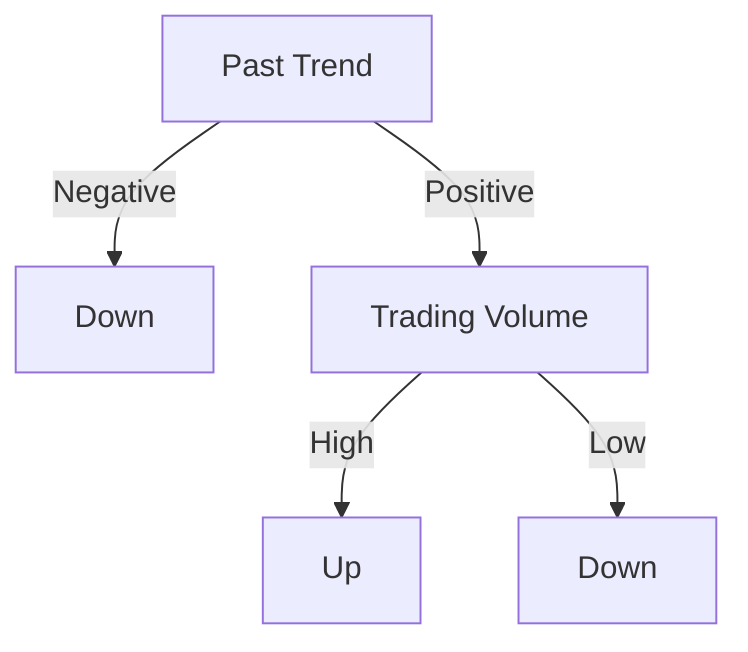

#  Data_Mining_ESE
> Author : Aaron Augustine

> Star the gist so that I can get a consensus on how many people are using this resource
> 
[Github Repo Link for all ESE Notes](https://github.com/ToothlessRider/ESE_Notes.git)

# Table of Contents 
1. [Previous Year Questions](#previous-year-questions)
2. [Data Warehouse, Online Analytical Processing](#dw-olap)
	- [Data Cube](#data-cube)	
	- [Modelling Techniques](#modelling-techniques)
	- [Aggregate Functions](#aggregate-functions)
3. [Cluster Analysis](#cluster-1)
	- [Good Clustering](#good-clustering)
	- [Requirements of Clustering in DM](#requirements-of-clustering-in-dm)
	- [Clustering Approaches](#clustering-approaches)
	- [K Means Clustering](#k-means-clustering)
	- [Measuring Inter-Cluster Similarity](#measuring-inter-cluster-similarity)
4. [Hierarchial Clustering](#cluster-2)
	- [Hierarchial Agglomerative Clustering](#hierarchial-agglomerative-clustering)
	- [Density Based Clustering](#density-based-clustering)
		- [Density Based Spatial Clustering of Applications with Noise (DBSCAN)](#dbscan)
5. [High Dimensional Data Clustering](#cluster-3)
	- [Cluster Validity](#cluster-validity)
	- [Cohesion and Separation](#cohesion-and-separation)
6. [Data Preprocessing](#data-preprocessing)
	- [Data Cleaning](#data-cleaning)
	- [Data Transformation](#data-transformation-nagas)
	- [Data Reduction](#data-reduction)
	- [Data Discretization](#discretization)
7. [Numerical Practice](#numerical-practice)
	- [Naive Bayes Classifier](#naive-bayes-classifier)
	- [Association Rule Mining - Apriori Algorithm](#apriori-algorithm)
	- [K Means Clustering](#k-means-clustering-q)
	- [Silhouette Coefficient](#silhouette-coefficient)


## Previous Year Questions

Q1. a. 
**Do as directed:**
1. **The measure of skewness coefficient is negative then the relation between mean, median and mode is given by**

Ans. 1. 
When the skewness coefficient is negative, it indicates that the distribution of data is **negatively skewed (or left-skewed)**. In a negatively skewed distribution, the tail on the left side is longer than the right side.

The relationship between the mean, median, and mode in a negatively skewed distribution is typically as follows:

$\text{Mean} < \text{Median} < \text{Mode}$

In summary:
- The **mean** is the lowest value among the three measures of central tendency.
- The **median** is in the middle.
- The **mode** is the highest value.

This pattern reflects the fact that in a negatively skewed distribution, the mean is pulled to the left by the longer tail of the distribution, while the mode remains the peak or highest frequency point, and the median lies between the mean and mode.

****

<hr>

2. **What do the two axes of the line graphs represent and what is the relation between them.**

Ans.
A line graph typically has:

- **X-axis (Horizontal)**: Represents the independent variable (e.g., time, age).
- **Y-axis (Vertical)**: Represents the dependent variable (e.g., sales, growth).

The relationship shown can be:
- **Positive**: Upward trend, indicating the dependent variable increases as the independent variable increases.
- **Negative**: Downward trend, indicating the dependent variable decreases as the independent variable increases.
- **No Relationship**: Flat or no clear trend.

Example : The following is a graph of temperature versus time where time is the independent variable and temperature is being represented with respect to different times in the day

****

<hr>

3. **Comment on symmetricity of proximity matrix.**

Ans.
A proximity matrix is a square matrix used in various fields such as statistics, data analysis, and machine learning to represent the distances or similarities between pairs of objects. The symmetricity of a proximity matrix depends on the nature of the measure used to compute the proximities.

### Symmetricity of a Proximity Matrix

1. **Symmetric Proximity Matrix**:
   - A proximity matrix is symmetric if the measure of proximity (distance or similarity) between any two objects is the same regardless of the order of the objects.
   - In mathematical terms, a proximity matrix $P$ is symmetric if $P_{ij} = P_{ji}$ for all $i$ and $j$.
   - Common examples of symmetric proximity matrices include those based on Euclidean distance, cosine similarity, or Pearson correlation coefficient.

   **Example**:

****
  
   This matrix is symmetric because $P_{ij} = P_{ji}$ for all $i$ and $j$.

2. **Asymmetric Proximity Matrix**:
   - A proximity matrix is asymmetric if the measure of proximity between any two objects can differ depending on the order of the objects.
   - In mathematical terms, a proximity matrix $P$ is asymmetric if there exists at least one pair of objects $i$ and $j$ such that $P_{ij} \neq P_{ji}$.
   - Asymmetric proximity matrices are less common but can arise in specific contexts, such as when measuring directed relationships or asymmetric similarity measures.

   **Example**:

****
   
   This matrix is asymmetric because $P_{12} \neq P_{21}$, $P_{13} \neq P_{31}$ , etc.

### Interpretation and Applications

- **Symmetric Proximity Matrices**: These are used in many standard clustering and multidimensional scaling techniques, where the relationship between objects is assumed to be mutual and undirected.
  
- **Asymmetric Proximity Matrices**: These are used in specialized contexts where the relationship is directional, such as web page link analysis (PageRank), certain types of ecological data, or user preference data where the similarity may not be mutual.

### Conclusion

The symmetricity of a proximity matrix is determined by whether the measure used to compute the proximities is symmetric or asymmetric. Symmetric proximity matrices are more common and are used in many standard data analysis techniques, whereas asymmetric matrices are used in more specialized applications.

<hr>

4. **Give the strength and limitations of average clustering.**

Ans.

~~Not in ppts~~
### Strengths of Average Clustering

1. **Simple to Understand and Implement**: The algorithm is straightforward and easy to execute.
2. **No Need for Predefined Cluster Number**: The method does not require specifying the number of clusters in advance.
3. **Produces a Dendrogram**: Provides a visual representation of cluster hierarchy and relationships.
4. **Handles Various Data Types**: Compatible with different distance or similarity measures.
5. **Less Sensitive to Outliers**: Considers average distances, reducing the impact of noise and outliers.

### Limitations of Average Clustering

1. **Computational Complexity**: High time and space complexity, making it impractical for large datasets.
2. **Lack of Scalability**: Inefficient for very large datasets due to computational demands.
3. **Assumes Hierarchical Structure**: May not be suitable if the data lacks a hierarchical structure.
4. **Sensitive to Distance Measures**: Results vary with different distance or similarity measures.
5. **No Objective Cluster Number**: Determining the optimal number of clusters is subjective.
6. **Non-Intuitive Clusters**: Can produce clusters that are less meaningful compared to other methods.

<hr>

5. **With an example explain how initial seed plays an important role in
clustering.**

Ans.
The initial seed in clustering, particularly in methods like k-means, plays a crucial role because it significantly influences the resulting clusters. Here's a detailed example to illustrate this:

### Example: k-Means Clustering

#### Scenario

Suppose we have a dataset of points in a 2-dimensional space:

$\{(1, 2), (2, 1), (1, 1), (10, 10), (10, 11), (11, 10)\}$

We want to cluster these points into two clusters (k=2).

#### Initial Seed Selection

1. **Random Seed 1**:
   - Initial centroids: $(1, 2)$ and $(10, 10)$

   Iteration 1:
   - Assign points to nearest centroid:
     - Cluster 1: $(1, 2), (2, 1), (1, 1)$
     - Cluster 2: $(10, 10), (10, 11), (11, 10)$

   - Compute new centroids:
     - New centroid for Cluster 1: $((1.33, 1.33)$
     - New centroid for Cluster 2: $(10.33, 10.33)$

   The algorithm continues iterating, but these clusters are stable and represent the natural grouping in the data.

2. **Random Seed 2**:
   - Initial centroids: $(1, 2)$ and $(2, 1)$

   Iteration 1:
   - Assign points to nearest centroid:
     - Cluster 1: $(1, 2), (1, 1)$
     - Cluster 2: $(2, 1), (10, 10), (10, 11), (11, 10)$

   - Compute new centroids:
     - New centroid for Cluster 1: $(1, 1.5)$
     - New centroid for Cluster 2: $(8.25, 8)$

   Iteration 2:
   - Reassign points to nearest centroid:
     - Cluster 1: $(1, 2), (1, 1)$
     - Cluster 2: $(2, 1), (10, 10), (10, 11), (11, 10)$

   - The clusters become distorted and may not represent the natural grouping well, leading to incorrect clustering.

### Explanation

- **Initial Seed 1** leads to a natural separation of the points into two clusters that match intuitive groupings (one around $(1, 2)$ and one around $(10, 10)$ ).
- **Initial Seed 2** causes the algorithm to start with suboptimal centroids, leading to an unstable and incorrect clustering result.

### Conclusion

The initial seed selection is critical in k-means clustering because it affects the convergence and final clusters. Poorly chosen initial seeds can lead to suboptimal clustering results, while good initial seeds can lead to more accurate and meaningful clusters. This is why techniques like k-means++ are used to select better initial seeds to improve the performance and results of the k-means algorithm.

<hr>

Q1. b. **Calculate the dissimilarity between jack and mary using jaccard's similarity. Also give the contingency table for the same.**
| Name|Gender|Fever|Cough|Test-1|Test-1|Test-3|Test-4|
|--|--|--|--|--|--|--|--|
|Jack|M|P|N|P|N|N|N|
|Mary|F|P|N|P|N|P|N|
|Jim|M|P|P|N|N|N|N|

Ans.

**Contingency Table**
$\text{Jack and Mary}$
| - | Y | N | Sum|
|--|--|--|--|
|Y|2 |0|2|
|N|1|3|4|
|Sum|3|3|6|

$\text{Jackards Coefficient similarity} = 1 - \frac{f_{yn} + f{ny}}{ f_{ny} + f_{yn} + f_{yy}}$ or $1 -d(i,j)$ 

$\text{Jackards Coefficient similarity} =1 - \frac{0 + 1}{2 + 0 + 1 } = \frac{2}{3} = 0.67$ 

> These are the additional contingency tables for the remaining possible combinations

$\text{Mary and Jim}$
| - | Y | N | Sum|
|--|--|--|--|
|Y|1|2|3|
|N| 1|2|3|
|Sum|2|4|6|

$\text{Jack and Jim}$
| - | Y | N | Sum|
|--|--|--|--|
|Y|1|1|2
|N| 1|3|4|
|Sum|2|4|6|


<hr>

Q1. c. **Differentiate between**
1. **Intrinsic and extrinsic measures**

Ans.
Sure, here's a summary of the differentiation between intrinsic and extrinsic measures in a tabular format:

| Aspect            | Intrinsic Measures                             | Extrinsic Measures                                     |
|-------------------|-----------------------------------------------|-------------------------------------------------------|
| Definition        | Properties inherent to the object itself.   | Influenced by external factors or context.           |
| Focus             | Internal qualities or characteristics.      | Relationship between the object and its environment. |
| Dependency        | Independent of external influences.         | Influenced by external factors or conditions.        |
| Examples          | Physical properties, qualities, features.   | Market value, social status, environmental factors.  |

**Example:**
- **Intrinsic**: Hardness, clarity, and color of a diamond.
- **Extrinsic**: Market value of a diamond influenced by demand, supply, and economic conditions.

<hr>

2. #### Cohesion and Separation

| Cluster Coehsion | Cluster Separation | 
|--|--|
| Measures how closely related the objects in a cluster are | Measures how distinct or well separated a cluster is from the other clusters | 
| Sum of the weight of all links in the cluster | Sum of all the weights between the nodes of different clusters | 
| Ex : SSE ( Sum of Squared Error ) | Ex : WSS ( Within cluster SSE ) and BSS ( Between cluster SSE )

****

<hr>

3. **Symmetric and asymmetric attributes. Give an example**

Ans.
~~Not in PPTs~~

#### Symmetric vs. Asymmetric Attributes

Here's the information presented in a table format:

| Aspect            | Symmetric Attributes                                      | Asymmetric Attributes                                   |
|-------------------|----------------------------------------------------------|---------------------------------------------------------|
| Definition        | Outcomes or values are equally important.               | Certain values are more significant than others.        |
| Examples          | Age: 30 to 40 is the same as 40 to 30.<br> Height: 5 feet to 6 feet is the same as 6 feet to 5 feet. | Market Basket: Presence of an item (1) is more important than absence (0).<br> Medical Tests: Presence of a symptom (positive) is more significant than absence (negative). |
| Usage             | Suitable for Euclidean distance.                        | Suitable for Jaccard similarity.                        |

**Example in a Dataset:**
- **Symmetric Attributes**: Age, height, weight.
- **Asymmetric Attributes**: Purchase of items (Milk, Bread, Butter).

#### Dataset Example:
| Customer | Age | Height | Weight | Milk | Bread | Butter |
|----------|-----|--------|--------|------|-------|--------|
| 1        | 25  | 5.7    | 160    | 1    | 1     | 0      |
| 2        | 30  | 5.9    | 170    | 0    | 1     | 1      |

- **Symmetric Analysis**: Use Euclidean distance for age, height, weight.
- **Asymmetric Analysis**: Use Jaccard similarity for Milk, Bread, Butter.

<hr>

4. **Agglomerative and divisive clustering**

Ans.

### Agglomerative vs. Divisive Clustering

| Aspect           | Agglomerative Clustering                                  | Divisive Clustering                            |
|------------------|----------------------------------------------------------|-----------------------------------------------|
| **Definition**   | Bottom-up approach, merging pairs of clusters.         | Top-down approach, recursively splitting clusters. |
| **Process**      | Start with each point as a cluster, merge closest pairs until all points are in one cluster. | Start with all points in one cluster, recursively split until each point is a cluster. |
| **Advantages**   | Simple, no need to specify clusters in advance.          | Considers global structure, suitable for certain data types. |
| **Disadvantages**| Computationally expensive, merging decisions are irreversible. | Computationally intensive, requires splitting criteria. |
| **Example**      | Hierarchical clustering with dendrograms.                | Recursive splitting in hierarchical clustering. |

### Summary:
- **Agglomerative**:
  - **Approach**: Bottom-up.
  - **Advantages**: Simple, no need to specify clusters.
  - **Disadvantages**: Computationally expensive, irreversible merges.
- **Divisive**:
  - **Approach**: Top-down.
  - **Advantages**: Considers global structure, suitable for certain data types.
  - **Disadvantages**: Computationally intensive, requires splitting criteria.
<hr>

Q2. a. **Consider the following data, where the return tells us if it's a up or down the characteristics required for the same. Using the following table, create a decision tree and predict whether return is up or down for the following tuple (Use Gini index as criterion). Find the class of (positive, Iow, low)**

| Past Trend | Open Interest | Trading Volume |Return | 
| -- | -- | -- | -- |
|Positive| Low | High | Up |
|Negative| High| Low | Down| 
|Positive| Low | High | Up |
|Positive| High | High | Up |
|Negative| Low | High| Down| 
|Positive| Low | Low | Down |
|Negative| High| High | Down| 
|Negative| Low| High | Down| 
|Positive| Low | Low | Down |
|Positive| High| High | Up |

Ans.
To create a decision tree using the Gini index as the criterion and predict whether the return is up or down for the tuple (Positive, Low, Low), follow these steps:

### Step 1: Calculate Gini Index for the Entire Dataset
The Gini index for a dataset is calculated as follows:

$\text{Gini} = 1 - \sum_{i=1}^{n} (p_i^2)$

where $p_i$ is the probability of class $i$ .

#### Dataset:
| Past Trend | Open Interest | Trading Volume | Return |
|------------|---------------|----------------|--------|
| Positive   | Low           | High           | Up     |
| Negative   | High          | Low            | Down   |
| Positive   | Low           | High           | Up     |
| Positive   | High          | High           | Up     |
| Negative   | Low           | High           | Down   |
| Positive   | Low           | Low            | Down   |
| Negative   | High          | High           | Down   |
| Negative   | Low           | High           | Down   |
| Positive   | Low           | Low            | Down   |
| Positive   | High          | High           | Up     |

- **Up**: 4 instances
- **Down**: 6 instances

$p(\text{Up}) = \frac{4}{10} = 0.4$

$p(\text{Down}) = \frac{6}{10} = 0.6$

$\text{Gini} = 1 - (0.4^2 + 0.6^2) = 1 - (0.16 + 0.36) = 1 - 0.52 = 0.48$

### Step 2: Calculate Gini Index for Splits
We need to calculate the Gini index for potential splits on each attribute.

#### Split on "Past Trend":
- **Positive**: 6 instances (4 Up, 2 Down)
- **Negative**: 4 instances (0 Up, 4 Down)


$\text{Gini}_{\text{Positive}} = 1 - \left(\left(\frac{4}{6}\right)^2 + \left(\frac{2}{6}\right)^2\right) = 1 - \left(\frac{16}{36} + \frac{4}{36}\right) = 1 - \frac{20}{36} = 1 - 0.5556 = 0.4444$

$\text{Gini}_{\text{Negative}} = 1 - \left(\left(\frac{0}{4}\right)^2 + \left(\frac{4}{4}\right)^2\right) = 1 - (0 + 1) = 0$

Weighted Gini for "Past Trend":

$\text{Gini}_{\text{split}} = \frac{6}{10} \times 0.4444 + \frac{4}{10} \times 0 = 0.2666 + 0 = 0.2666$

#### Split on "Open Interest":
- **Low**: 6 instances (2 Up, 4 Down)
- **High**: 4 instances (2 Up, 2 Down)

$\text{Gini}_{\text{Low}} = 1 - \left(\left(\frac{2}{6}\right)^2 + \left(\frac{4}{6}\right)^2\right) = 1 - \left(\frac{4}{36} + \frac{16}{36}\right) = 1 - \frac{20}{36} = 1 - 0.5556 = 0.4444$

$\text{Gini}_{\text{High}} = 1 - \left(\left(\frac{2}{4}\right)^2 + \left(\frac{2}{4}\right)^2\right) = 1 - \left(\frac{4}{16} + \frac{4}{16}\right) = 1 - \frac{8}{16} = 1 - 0.5 = 0.5$


Weighted Gini for "Open Interest":

$\text{Gini}_{\text{split}} = \frac{6}{10} \times 0.4444 + \frac{4}{10} \times 0.5 = 0.2666 + 0.2 = 0.4666$


#### Split on "Trading Volume":
- **High**: 7 instances (4 Up, 3 Down)
- **Low**: 3 instances (0 Up, 3 Down)


$\text{Gini}_{\text{High}} = 1 - \left(\left(\frac{4}{7}\right)^2 + \left(\frac{3}{7}\right)^2\right) = 1 - \left(\frac{16}{49} + \frac{9}{49}\right) = 1 - \frac{24}{49} = 1 - 0.4897 = 0.5103$


$\text{Gini}_{\text{Low}} = 1 - \left(\left(\frac{0}{3}\right)^2 + \left(\frac{3}{3}\right)^2\right) = 1 - 1 =	 0$

Weighted Gini for "Trading Volume":

$\text{Gini}_{\text{split}} = \frac{7}{10} \times 0.5103 + \frac{3}{10} \times 0 = 0.3571 + 0 = 0.3571$

### Step 3: Choose the Best Split

The attribute with the lowest weighted Gini index is chosen for the split.  

- **Past Trend**: 0.2666
- **Open Interest**: 0.4666
- **Trading Volume**: 0.3571


The best split is on "Past Trend".

### Step 4: Build the Decision Tree

#### Root Node: "Past Trend"

- **Positive**: 6 instances (4 Up, 2 Down)

- **Negative**: 4 instances (0 Up, 4 Down) 

**Negative** node is pure (all Down).
For "Positive":

**Split on "Trading Volume"**:

- **High**: 4 instances (3 Up, 1 Down)

- **Low**: 2 instances (0 Up, 2 Down)


The next best split for the "Positive" node is "Trading Volume".

### Final Decision Tree:


### Prediction for (Positive, Low, Low):
Following the decision tree:
- Past Trend = Positive
- Trading Volume = Low

The predicted return is **Down**.

<hr>

Q2. b. **Explain briefly various measures associated with attribute selection?**

Ans. 
Certainly! Here are the shortened points for the specified attribute selection measures:

### 1. Information Gain
- **Definition**: Measures reduction in entropy after splitting on an attribute.
- **Formula**:
  $\text{Information Gain}(A) = \text{Entropy}(D) - \sum_{v} \frac{|D_v|}{|D|} \times \text{Entropy}(D_v)$
- **Usage**: Decision trees (ID3).
- **Pros**: Simple, effective.
- **Cons**: Biased towards attributes with more values.

### 2. Gini Index
- **Definition**: Measures impurity of a dataset.
- **Formula**:
 $\text{Gini Index}(A) = 1 - \sum_{i} p_i^2$
- **Usage**: Decision trees (CART).
- **Pros**: Simple, efficient.
- **Cons**: Less informative than entropy-based measures.

### 3. Gain Ratio
- **Definition**: Adjusts information gain by intrinsic information.
- **Formula**:
  $\text{Gain Ratio}(A) = \frac{\text{Information Gain}(A)}{\text{Intrinsic Value}(A)}$ <br>
 $\text{Intrinsic Value}(A) = -\sum_{v} \frac{|D_v|}{|D|} \log_2 \left(\frac{|D_v|}{|D|}\right)$
- **Usage**: Decision trees (C4.5).
- **Pros**: Reduces bias towards many-valued attributes.
- **Cons**: More complex to compute.

### 4. Correlation Coefficient
- **Definition**: Measures linear relationship between attribute and class label.
- **Formula**:
$\text{Correlation Coefficient}(A, Y) = \frac{\text{Cov}(A, Y)}{\sigma_A \sigma_Y}$
- **Usage**: Regression tasks.
- **Pros**: Easy to interpret.
- **Cons**: Only captures linear relationships.

These measures help in selecting the most relevant attributes for model construction based on different criteria and are chosen based on the nature of the data and the specific task at hand.

<hr>

Q2. c. **Suppose we have data on few individuals randomly surveyed. The data gives the responses towards interests to promotional offers made in the areas of Finance, Travel, Reading, and Health. Sex is the output attribute to be predicted. <br>Apply Naive Bayesian classification algorithm to classify the new instance. (Finance = No, Travel = Yes, Reading = Yes, Health = No).**

| Finance | Travel | Reading | Health | Sex | 
| -- | -- | -- | -- | -- |
| Yes | No | Yes | No | Male |
| Yes | Yes | No | No | Male |
| No | Yes | Yes | Yes | Female |
| No | Yes | No | Yes | Male |
| Yes | Yes | Yes | Yes | Female |
 Yes | No | No | No | Female |
| Yes | No | No | No | Male |
| Yes | Yes | No  | No | Male |
| No | No | No | Yes | Female |
| Yes | No | No | no | Male |

Ans. 
### Applying Naive Bayesian Classification

  

To classify the new instance $(\text{Finance} = \text{No}, \text{Travel} = \text{Yes}, \text{Reading} = \text{Yes}, \text{Health} = \text{No})$, we'll use the Naive Bayes algorithm. We'll calculate the probability of the instance being Male and Female given the attributes.

  

### Step 1: Calculate Prior Probabilities

  

First, we need to determine the prior probabilities for each class (Sex).

  

- **Number of Males (Male)**: 6

- **Number of Females (Female)**: 4

- **Total Instances**: 10

  

$P(\text{Male}) = \frac{6}{10} = 0.6$

$P(\text{Female}) = \frac{4}{10} = 0.4$

  

### Step 2: Calculate Likelihoods

  

Next, we calculate the likelihood of the attributes given each class.

  

#### Likelihoods for Male

- **P(Finance = No | Male)**: 1 out of 6 Males have Finance = No

$P(\text{Finance} = \text{No} | \text{Male}) = \frac{1}{6} \approx 0.1667$

- **P(Travel = Yes | Male)**: 3 out of 6 Males have Travel = Yes

$P(\text{Travel} = \text{Yes} | \text{Male}) = \frac{3}{6} = 0.5$

  

- **P(Reading = Yes | Male)**: 1 out of 6 Males have Reading = Yes

$P(\text{Reading} = \text{Yes} | \text{Male}) = \frac{1}{6} \approx 0.1667$

  

- **P(Health = No | Male)**: 4 out of 6 Males have Health = No

$P(\text{Health} = \text{No} | \text{Male}) = \frac{5}{6} = 0.8333$

  

#### Likelihoods for Female

- **P(Finance = No | Female)**: 2 out of 4 Females have Finance = No

$P(\text{Finance} = \text{No} | \text{Female}) = \frac{2}{4} = 0.5$

  

- **P(Travel = Yes | Female)**: 2 out of 4 Females have Travel = Yes

$P(\text{Travel} = \text{Yes} | \text{Female}) = \frac{2}{4} = 0.5$

  

- **P(Reading = Yes | Female)**: 2 out of 4 Females have Reading = Yes

$P(\text{Reading} = \text{Yes} | \text{Female}) = \frac{2}{4} = 0.5$

  

- **P(Health = No | Female)**: 1 out of 4 Females have Health = No

$P(\text{Health} = \text{No} | \text{Female}) = \frac{1}{4} = 0.25$

  

### Step 3: Calculate Posterior Probabilities

  

We use Bayes' Theorem to calculate the posterior probabilities for each class given the attributes.

  

$P(\text{Male} | \text{Attributes}) = P(\text{Male}) \times P(\text{Finance} = \text{No} | \text{Male}) \times P(\text{Travel} = \text{Yes} | \text{Male}) \times P(\text{Reading} = \text{Yes} | \text{Male}) \times P(\text{Health} = \text{No} | \text{Male})$

  

$P(\text{Male} | \text{Attributes}) = 0.6 \times 0.1667 \times 0.5 \times 0.1667 \times 0.833$

  

$P(\text{Male} | \text{Attributes}) \approx 0.6 \times 0.1667 \times 0.5 \times 0.1667 \times 0.833 \approx 0.0069$

  

$P(\text{Female} | \text{Attributes}) = P(\text{Female}) \times P(\text{Finance} = \text{No} | \text{Female}) \times P(\text{Travel} = \text{Yes} | \text{Female}) \times P(\text{Reading} = \text{Yes} | \text{Female}) \times P(\text{Health} = \text{No} | \text{Female})$

  

$P(\text{Female} | \text{Attributes}) = 0.4 \times 0.5 \times 0.5 \times 0.5 \times 0.25$

  

$P(\text{Female} | \text{Attributes}) = 0.4 \times 0.5 \times 0.5 \times 0.5 \times 0.25 \approx 0.025$

  

### Step 4: Normalize the Probabilities

  

To determine the final classification, we compare the posterior probabilities.

  

$P(\text{Male} | \text{Attributes}) \approx 0.0069$

$P(\text{Female} | \text{Attributes}) \approx 0.0125$

  

### Conclusion

Since $P(\text{Female} | \text{Attributes}) > P(\text{Male} | \text{Attributes})$, the new instance $(\text{Finance} = \text{No}, \text{Travel} = \text{Yes}, \text{Reading} = \text{Yes}, \text{Health} = \text{No})$ is classified as **Female**.

<hr>

Q3. a. **Define the terms support, confidence, and lift. Discuss the importance of Association Rule Mining.**

Ans. 
Certainly! Let's define each term and discuss the importance of Association Rule Mining:

#### 1. Support:
Support is a measure that indicates how frequently a particular itemset appears in a dataset. It is calculated as the proportion of transactions in the dataset that contain the itemset. 

$\text{Support}(X) = \frac{\text{Number of transactions containing itemset X}}{\text{Total number of transactions}}$

#### 2. Confidence:
Confidence is a measure that indicates how often a rule is found to be true. Specifically, it measures the likelihood that the presence of one item (or itemset) implies the presence of another item (or itemset). 

$\text{Confidence}(X \rightarrow Y) = \frac{\text{Support}(X \cup Y)}{\text{Support}(X)}$

#### 3. Lift:
Lift measures the ratio of the observed support to that expected if X and Y were independent. It indicates the strength of the association between the antecedent (X) and the consequent (Y) in a rule. A lift value greater than 1 suggests that the presence of the antecedent increases the likelihood of the consequent, while a value less than 1 indicates the opposite.

$\text{Lift}(X \rightarrow Y) = \frac{\text{Support}(X \cup Y)}{\text{Support}(X) \times \text{Support}(Y)}$

### Importance of Association Rule Mining:
Association Rule Mining is crucial in various domains due to several reasons:

1. **Market Basket Analysis**
2. **Customer Behavior Analysis**
3. **Recommendation Systems**
4. **Healthcare**
5. **Web Usage Mining**
6. **Fraud Detection**
7. **Inventory Management**
<hr>

Q3. b. **Explain data mining as a step in knowledge discovery process.**

Ans. 

> [Link to answer](https://github.com/ToothlessRider/MST_Notes/blob/master/DM_MST_notes.md#knowledge-discovery-of-databases)

<hr>

Q3. c. **Find all the faults in the following datasets.**
| # | id | Name | Birthday | Gender | is Teacher? | #stud | country | city | 
| -- | -- | -- | -- | -- | -- | -- | -- | --|
1 | 111 | John | 21/10/90 | M | 0 | 0 | Ireland | Dublin | 
| 2 | 222 | Mary | 12/10/78 | F | 1 | 15 | Iceland | | 
| 3 | 333 | Alice | 19/04/00 | F | 0 | 0 | Spain | Madrid | 
| 4 | 444 | Mark | 1/11/97 | A | 0 | 0 | France | Paris | 
| 5 | 555 | Alex | 15/03/00 | M | 1 | 23 | Germany | Berlin | 
| 6 | 666 | Peter | 21/31/83 | M | 1 | 10 | Italy | Rome | 
| 7 | 777 | Calvin | 5/5/48 | F | 0 | 0 | Italy | Italy | 
| 8 | 888 | Rihanna |3/8/48 | F | 0 | 0 | Portugal | Libson |
| 9 | 999 | Anne | 5/9/42 | M | 0 | 5 | Switzerland | Geneva |

Ans. 
To identify the faults in the dataset, we'll examine each column for inconsistencies or errors:

### Dataset with Faults Highlighted:

| #  | id  | Name    | Birthday | Gender | is Teacher? | #stud | country     | city    |
|----|-----|---------|----------|--------|-------------|-------|-------------|---------|
| 1  | 111 | John    | 21/10/90 | M      | 0           | 0     | Ireland     | Dublin  |
| 2  | 222 | Mary    | 12/10/78 | F      | 1           | 15    | Iceland     | (empty) |
| 3  | 333 | Alice   | 19/04/00 | F      | 0           | 0     | Spain       | Madrid  |
| 4  | 444 | Mark    | 1/11/97  | A      | 0           | 0     | France      | Paris   |
| 5  | 555 | Alex    | 15/03/00 | M      | 1           | 23    | Germany     | Berlin  |
| 6  | 666 | Peter   | 21/31/83 | M      | 1           | 10    | Italy       | Rome    |
| 7  | 777 | Calvin  | 5/5/48   | F      | 0           | 0     | Italy       | Italy   |
| 8  | 888 | Rihanna | 3/8/48   | F      | 0           | 0     | Portugal    | Libson  |
| 9  | 999 | Anne    | 5/9/42   | M      | 0           | 5     | Switzerland | Geneva  |

### Faults Identified:

1. **Row 2**: 
   - **City**: The city is missing.

2. **Row 4**:
   - **Gender**: Gender is listed as "A", which is not a valid gender identifier (should be M or F).

3. **Row 6**:
   - **Birthday**: The date "21/31/83" is invalid as there is no 31st day in any month.

4. **Row 7**:
   - **Gender**: Gender is listed as "F" for a typically male name (Calvin). This might be a gender misclassification.
   - **City**: The city and country are both listed as "Italy", which is a repetition error.

5. **Row 8**:
   - **City**: The city name "Libson" is misspelled. The correct spelling is "Lisbon".

6. **Row 9**:
   - **Gender**: Gender is listed as "M" for a typically female name (Anne). This might be a gender misclassification.

> Additional values have been highlighted in bold

### Corrected Dataset:

| #  | id  | Name    | Birthday | Gender | is Teacher? | *studied* | country     | city    |
|----|-----|---------|----------|--------|-------------|-------|-------------|---------|
| 1  | 111 | John    | **21/10/90** | M      | 0           | 0     | Ireland     | Dublin  |
| 2  | 222 | **Mary**    | 12/10/78 | F      | 1           | 15    | Iceland     | **Reykjavik** |  <!-- Adding a possible city name -->
| 3  | 333 | Alice   | 19/04/00 | F      | 0           | 0     | Spain       | **Madrid**  |
| 4  | 444 | Mark    | 1/11/97  | **M**      | 0           | 0     | France      | Paris   |  <!-- Correcting gender to M -->
| 5  | 555 | Alex    | 15/03/00 | M      | 1           | 23    | Germany     | Berlin  |
| 6  | **666** | **Peter**   | **31/12/83** | M      | 1           | 10    | Italy       | Rome    |  <!-- Correcting the date to a valid format -->
| 7  | 777 | **Calvin**  | 5/5/48   | M      | 0           | 0     | Italy       |**Rome**   |  <!-- Correcting gender to M and assigning a possible city -->
| 8  | 888 | **Rihanna** | 3/8/48   | F      | 0           | 0     | Portugal    | Lisbon  |  <!-- Correcting city spelling -->
| 9  | 999 | Anne    | 5/9/42   | **F**      | 0           | 5     | Switzerland | Geneva  |  <!-- Correcting gender to F -->

This corrected dataset addresses the identified faults, ensuring that all fields are valid and logically consistent.

<hr>

Q3. d. **Discuss the various datamining tasks. What is the need for data mining? Briefly discuss the various problems associated with data mining**

Ans. 

> [Link to answer](https://github.com/ToothlessRider/MST_Notes/blob/master/DM_MST_notes.md#exam-questions)

<hr>

Q4. a. **Compare and contrast bagging, boosting and stacking ensemble techniques.**

Ans. 
~~Not in PPT's~~

<hr>

Q4. b. **Discuss the various approaches used to find optimal number of dusters**

Ans. 
Finding the optimal number of clusters in a dataset is a crucial step in cluster analysis. There are several approaches used to determine the optimal number of clusters, each with its advantages and limitations. Some common approaches include:

#### Elbow Method:
-   In the Elbow Method, the sum of squared distances (SSD) between data points and their assigned cluster centroids is plotted against the number of clusters.
-   The point where the rate of decrease in SSD slows down and forms an "elbow" is considered as the optimal number of clusters.
-   This method is simple and intuitive but may not always produce clear elbow points, especially in complex datasets.

#### Silhouette Score:

-   The Silhouette Score measures how similar an object is to its own cluster (cohesion) compared to other clusters (separation).
-   It ranges from -1 to 1, where a high value indicates that the object is well-matched to its own cluster and poorly-matched to neighboring clusters.
-   The optimal number of clusters maximizes the average silhouette score across all data points.
-   This method provides a quantitative measure of cluster quality but may not work well for non-convex clusters or varying densities.

<hr>

Q4. c. **Calculate kappa coefficient for the following confusion matrix. Refrence Data**

| | Building | Dessert | Forest | Water | Building |
| -- | -- | -- | -- | -- | -- |
| Bareland | 15 | 1 | 3 | 2 | 1 | 
| dessert | 2 | 19 | 0 | 0 | 2 |
| Forest | 1 | 2 | 17 | 1 | 0 |
| Water | 1 | 0 | 3 | 10 | 3 | 
| Water Building | 3 | 2 | 0 | 2 | 10 | 

Ans. 
~~Not in PPTS~~
<hr>

Q4. d. **Discuss the various ways in which spatial data can be represented. Use appropriate figures to explain.**

Ans. 
~~Not in PPTS~~
<hr>

Q5. a. **Give an algorithm for K-means clustering. Consider the following 5 points { $x_1, x_2, x_3, x_4, x_5$ } with the following as a two dimensional sample: <br> $x_1= (0,2), x_2 = (1,0), x_3 = (2,1), x_4 = (4,1), x_5 = (5,3)$  for clustering.<br> Illustrate K-means algorithm on the above dataset. The required number of cluster is 2. Initially the cluster are formed from random distribution of samples <br> $C_1 = \{x_1, x_2, x_4\} \text { and } C_2 = \{ x_3, x_5\}$**

Ans. 

**Given Dataset**:
$x_1 = (0,2), x_2 = (1,0), x_3 = (2,1), x_4 = (4,1), x_5 = (5,3)$


### Initial Clusters

- Cluster 1: $C_1 = \{ x_1, x_2, x_4 \}$

- Cluster 2: $C_2 = \{ x_3, x_5 \}$

  

### Initial Centroids:

- $\mu_1 = (1.67, 1)$ for Cluster 1

- $\mu_2 = (3.5, 2)$ for Cluster 2

  

### Iteration 1:

**Assignment:**
Calculate distances between each point and each centroid.<br>Reassign each point to the nearest centroid.
  
- Distance to $\mu_1$:
- $d(x_1, \mu_1) = 1.944$
- $d(x_2, \mu_1) = 1.203$
- $d(x_3, \mu_1) = 0.33$
- $d(x_4, \mu_1) = 2.33$
- $d(x_5, \mu_1) = 3.88$
- Distance to $\mu_2$:
- $d(x_1, \mu_2) = 3.5$
- $d(x_2, \mu_2) = 3.20$
- $d(x_3, \mu_2) = 1.80$
- $d(x_4, \mu_2) = 1.118$
- $d(x_5, \mu_2) = 1.80$

**New Assignments:**
- $x_1, x_2, x_3$ are closer to $\mu_1$, so they are assigned to Cluster 1.
- $x_4, x_5$ are closer to $\mu_2$, so they are assigned to Cluster 2

**Update:**
Recalculate the centroids by taking the mean of all points in each cluster.

#### New Clusters:
- Cluster 1: $C_1 = \{ x_1, x_2, x_3 \}$
- Cluster 2: $C_2 = \{ x_4, x_5 \}$

#### New Centroids:
- $\mu_1 = (\frac{0+1+2}{3}, \frac{2+0+1}{3}) = (\frac{3}{3}, \frac{3}{3}) = (1, 1)$
- $\mu_2 = (\frac{4+5}{2}, \frac{1+3}{2}) = (\frac{9}{2}, \frac{4}{2}) = (\frac{9}{2}, 2) = (4.5, 2)$

### Iteration 3 : 
**Assignment:**
Calculate distances between each point and each centroid.<br> Reassign each point to the nearest centroid.

- Distance to $\mu_1$:
- $d(x_1, \mu_1) = 1.414$
- $d(x_2, \mu_1) = 1$
- $d(x_3, \mu_1) = 1$
- $d(x_4, \mu_1) = 3$
- $d(x_5, \mu_1) = 4.47$
- Distance to $\mu_2$:
- $d(x_1, \mu_2) = 4.5$
- $d(x_2, \mu_2) = 4.03$
- $d(x_3, \mu_2) = 2.69$
- $d(x_4, \mu_2) = 1.118$
- $d(x_5, \mu_2) = 1.118$

**Update:**
All the points remain in the same clusters as before and hence it ends

### Final Clusters:
- Cluster 1: $C_1 = \{ x_1, x_2, x_3 \}$
- Cluster 2: $C_2 = \{ x_4, x_5 \}$

<hr>

Q5. b. **Discuss different ways of measuring inter-cluster similarity?**

| | A | B | C | D | E | F | 
| -- | -- | -- | -- | -- | -- | -- |
| A | 0 | 4 | 25 | 24 | 9 | 7 |
| B | 4 | 0 | 21 | 20 | 5 | 3 | 
| C | 25 | 21 | 0 | 1 | 16 | 18 | 
| D | 24 | 20 | 1 | 0 | 15 | 17 |
| E | 9 | 5 | 16 | 15 | 0 | 2 | 
| F | 7 | 3 | 18 | 17 | 2 | 0 | 

**For the above distance matrix, draw a dendogram using complete link inter- clustering.**
Ans. 
### Measuring Inter-Cluster Similarity

When clustering data, it’s essential to determine how similar or different clusters are from one another. Several methods can measure inter-cluster similarity:

1. **Single Linkage (Minimum Linkage)**:
   - Measures the similarity between the closest points of two clusters.
   - It is sensitive to noise and outliers

****

2. **Complete Linkage (Maximum Linkage)**:
   - Measures the similarity between the farthest points of two clusters.
   -It is less susceptible to noise and outliers
   It does have a tendency to break larger clusters

****

3. **Average Linkage**:
   - Measures the average distance between all pairs of points in two clusters.
   - It balances the extremes of single and complete linkage.
   - It is less susceptible to outliers, but is biased to globular clusters

****

4. **Ward's Method**:
   - Measures the increase in *squared error* ( variance ) when clusters are merged.
   - Tends to create clusters of roughly equal size
   - It is less susceptible to noise and outliers and also biased toward globular clusters
   - It requires a $O(n^2)$ time complexity using a proximity matrix
   - It also requires $O(n^3)$ in many cases and can be reduced to $O(n^2logn)$ for some approaches

In the first iteration after calculating the distances we will select the first cluster to be $C, D$

| | A | B | C,D | E | F | 
| -- | -- | -- | -- | -- | -- | -- |
| A | 0 | 4 | 25 | 9 | 7 |
| B | 4 | 0 | 21| 5 | 3 | 
| C,D | 25 | 21 | 0 | 16 | 18 |
| E | 9 | 5 | 16 | 0 | 2 | 
| F | 7 | 3 | 18| 2 | 0 | 

Then the next cluster to be chosen will be $E,F$

| | A | B | C,D | E, F | 
| -- | -- | -- | -- | -- | -- | 
| A | 0 | 4 | 25 | 9 | 
| B | 4 | 0 | 21| 5 | 
| C,D | 25 | 21 | 0 | 18 | 
| E,F | 9 | 5 | 18 | 0 |

  Then the next cluster to be chosen will be ${E,F},B$

| | A | B,E,F | C,D |  
| -- | -- | -- | -- | -- | 
| A | 0 | 9 | 25 | 
| B,E,F | 9 | 0 | 21|  
| C,D | 25 | 21 | 0 | 

  Then the next cluster to be chosen will be ${B,E,F},A$
  
  | | A,B,E,F | C,D |  
| -- | -- | -- |
| A,B,E,F | 0  | 25 | 
| C,D | 25 | 0 | 

and then we will finally merge these two as well to give us the final cluster as : ${A, B, C, D, E, F }$

> [Link to dendogram, steps and code](https://colab.research.google.com/drive/1W2GeFVv_PceUXejwlyuxMB5j2AlJzRvH?usp=sharing)

<hr>

Q5. c. **Consider the data set of 7 points of 2 dimension.<br> $Cluster_1$ = {(11, 14), (11, 13), (12, 13)} and <br>$Cluster_2$ = {(2,5), (3,4), (5, 4), (1, 3)} Calculate silhouette value for a point (12,13).**

Ans. 
#### Silhouette Coefficient Question

Silhouette Coefficient combine ideas of both cohesion and separation, but for individual points, as well as clusters and clusterings

For an individual point, i
- Calculate a = average distance of i to the points in its cluster
- Calculate b = min (average distance of i to points in another cluster)
- The silhouette coefficient for a point is then given by $s = 1 – \frac{a}{b}$ if $a < b$ , ( or $s = \frac{b}{a} - 1$ if $a ≥ b$, not the usual case )

**Average Distance within cluster ( a )**

$d_1 = \sqrt{|12 - 11|^2 + |13 - 14|^2} = \sqrt{2} = 1.414$

$d_2 = \sqrt{|12 - 11|^2 + |13 - 13|^2} = \sqrt{1} = 1$


$Average = \frac{1.414 + 1 }{2} =1.207$

**Average Distance to other cluster points ( b )**
$d_1 = \sqrt{|12 - 2|^2 + |13 - 5|^2} = \sqrt{164} = 12.806$

$d_2 = \sqrt{|12 - 3|^2 + |13 - 4|^2} = 9\sqrt{2} = 12.727$

$d_3 = \sqrt{|12 - 5|^2 + |13 - 4|^2} = \sqrt{130} = 11.401$

$d_4 = \sqrt{|12 - 1|^2 + |13 - 3|^2} = \sqrt{221} = 14.866$

$Average = \frac{14.866 + 11.401 + 12.727 + 12.806}{4} =12.95$


$\text{Silhouette Coefficient} = 1 - \frac{a}{b}$

$\text{Silhouette Coefficient} = 1 - \frac{1.207}{12.95} = 0.9067$ 
<hr>


## Dw OLAP
Q1. **What is a Data Warehouse ? Give an example**

Ans. 
A decision support database that is maintained separately from the organization’s operational database

Support information processing by providing a solid platform of consolidated, historical data for analysis.

> “A data warehouse is a subject-oriented, integrated, time-variant, and nonvolatile collection of data in support of management’s  decision-making process.”

Data warehousing is an important preprocessing step for data mining, where we take heterogeneous databases ( i.e. different formats, id's, etc ) and do the following procedures on them : 
- Data selection
- Data cleaning
- Data intergration
- Data summarization 

Which then allows it to become a *Data Warehouse*
****

It also provides OLAP tools for **interactive multidimensional data analysis**

Example : 
- Here you have two different databases that were made in different countries, so the names of the column attributes might differ, along with the number of columns 

****

<hr>

Q2. **What are the different steps in creating a data warehouse ?**

Ans. 
**Data Selection**
- Only data which are important for analysis are selected. ( employee info, dept, etc ) 
- *Subject Oriented*

**Data Cleaning**
- Tuples which are incomplete or logically inconsistent are cleaned

**Data Integration**
- Consistency of attribute names
- Consistency of attribute types
- Consistency of values
- Integration of data

**Data Summarization**
- Values are summarized according to the desired level of analysis
- For example, in the HK database, they give the time unit as well, but we are only interested in the day

<hr>

Q3. **Differentiate between Data Warehouse and Heterogeneous DBMS**

Ans.
| Data Warehouse | Hetergeneous DBMS |
| -- | -- | 
| Update driven approach | Query driven approach | 
| 
<hr>

Q4. **Differentiate between OLTP and OLAP**
Ans. 

| | Online Transaction Processing  | Online Analytical Processing|
| -- | -- | -- | 
| *Users* | Clerk, IT professional | Manager | 
| *Function* | Day to day operations | Decision Support | 
| *DB Design* | Application Oriented | Subject - Oriented | 
| *Data* | Current, up-to-date, detailed, flat, relational and isolated | historical, summarized, multidimensional, integrated and consolidated |
| *Access* | Read/Write, Index/Hash on primary key | Lot's of scans | 
| *Unit of work* | Short simple transaction | Complex Query |
|*Records accessed count* | Tens | Millions | 
| *User count* | Thousands | Hundreds | 
| *DB Size* | 100MB-GB | 100GB-TB ( Even PB ) |
| *Metric* | Transaction Throughput | Query Throughput |
|*Examples* | DBMS | Data warehouse | 


<hr> 

Q5. **What is a Data Cube ?**

Ans.
#### Data Cube 
A data cube summarizes the measure with respect to a set of n dimensions and provides summarizations for all subsets of them

****

- In this the individual cells are known as *cuboids*
- The bottom final cuboid, i.e., $a_{6,5}$ which contains the value 598, is called the **Apex Cuboid**
- This contains the highest level of summarization
- The row and column cuboids form a lattice of cuboids like so : 

****

<hr>

Q6.**What are the various types of modeling techniques in Data warehouses ?**

Ans.
#### Modelling Techniques
The ER model is used for relational database design. <br>For data warehouse design we need a concise, subject-oriented schema that facilitates data analysis.

There are the following types of Data warehousing modelling techniques : 

- **Star schema**:<br> A fact table in the middle connected to a set of dimension tables
****

- **Snowflake schema**:<br>  A refinement of star schema where some dimensional hierarchy is normalized into a set of smaller dimension tables, forming a shape similar to snowflake

****

- **Fact constellations**:<br>  Multiple fact tables share dimension tables, viewed as a collection of stars, therefore called galaxy schema
or fact constellation
****
<hr>

Q7. **What is DMQL ?**

Ans.
- *Cube Defintion* ( Fact Table ) :
```
define cube <cube_name> [<dimension_list>] :
<measure_list>
```
- *Dimension Definition* ( Dimension Table ) : 
```
define dimension <dimension_name> as 
(<attribute_or_subdimension_list>)
```
- *Special Case* ( Shared Dimension Tables ) 
```
define dimension <dimension_name> as
<dimension_name_first_time> in cube 
<cube_name_first_time>
```

<hr>

> [Link to Schema Defintion in DMQL](https://classroom.google.com/c/NjU0MzUzOTIxNTA0/m/NjkzMDY0MDQ4MDAx/details)

<hr>

Q8. **What are the  3 categories of Aggregate Functions on measures? :**

Ans.
#### Aggregate Functions
- *Distributive Function* : 
If the result derived by applying the function to a subset of values is same as the value derived by applying the function on the whole dataset, then it is called **Distributive Function** 

Examples : $sum(), count(), min(),  max()$

- *Algebraic Function* : 
If it can be computed by an algebraic function with M arguements ( where M is a bounded integer ) 

Examples : $min_N()$ , $max_N()$ ,$\frac{sum()} {count()}$ ,  $avg()$

- *Holistic Function* : 
An aggregate function is _holistic_ if there is no constant bound on the storage size needed to describe a subaggregate

Examples : $median()$ , $mode()$ , and $rank()$
<hr>


## Cluster 1

Q1. **What is cluster analysis ?**

Ans. 
#### Cluster Analysis 
It is the process of finding *groups of objects* such that the objects in
a group will be similar (or related) to one another and different from (or unrelated to) the objects in other groups

****
- Clustering is an **Unsupervised classification** method, i.e., there are no predefined classes
- Clustering is used : 
	- As a stand - alone tool, to get insight into Data distribution
	- As a preprocessing step for other algorithms

It's applications are : 
1. Pattern Recognition
2. Image Processing
3. Bio-informatics
4. WWW and IR

<hr>

Q2. **What is good clustering and what are the requirements of clustering in DM?**

Ans.
#### Good Clustering
- A good clustering method is one that produces high quality clusters that should have : 
	- High **intra-class** similarity
	- Low **inter-class** similarity
- The quality of the clustering depends on the similarity measure as well as the implementation
- The quality of a clustering method is also measured by its ability to discover some or all of the hidden patterns.

#### Requirements of Clustering in DM 
**[SADMAIHII]**
1. Scalability
2. Ability to deal with different types of attributes
3. Discovery of Clusters with arbitrary shape
4. Minimal requirements for domain knowledge, to determine the input parameters
5. Able to deal with noise and outliers
6. Insensitive to order of input records
7. High dimensionality
8. Incorporation of user specified constraints
9. Interpretability and usability
 
<hr>

Q3. **What are the different types of data in cluster anayliss ?**
Ans.
1. **Interval-scaled variables** <br>e.g., salary, height
2. **Binary variables** <br> e.g., gender (M/F), has_cancer(T/F)
3. **Nominal (categorical) variables** <br>  e.g., religion (Christian, Muslim, Buddhist, Hindu, etc.)
4. **Ordinal variables** <br> e.g., Military rank ( Lieutenant, Captain, Major, Lieutenant Colonel, Colonel, Brigadier, Maj General, Lieutenant General, General, COAS etc.)
5. **Ratio-scaled variables** <br>  population growth (1,10,100,1000,...)
6. **Variables of mixed types** <br>  multiple attributes with various types

<hr>

Q4. **What are the major types of clustering approaches ?**

Ans. 
#### Clustering Approaches
*Partitioning algorithms*:<br> Construct random partitions and then iteratively refine them by some criterion

*Hierarchical algorithms*: <br>Create a hierarchical decomposition of the set of data (or objects) using some criterion

*Density-based*: <br> Based on connectivity and density functions

*Grid-based*:<br>Based on a multiple-level granularity structure

*Model-based*: <br>A model is hypothesized for each of the clusters and the idea is to find the best fit of that model to each other

<hr>

#### Minkowski Distance : 

$L_p(i, j)= ( |x_{i_1} - x_{j_1}|^p + |x_{i_2} - x_{j_2}|^p + ...... + |x_{i_n} - x_{j_n}|^p)^{\frac{1}{p}}$

#### Manhattan Distance 
> For when the value of p =1 

$L_1(i, j)= |x_{i_1} - x_{j_1}| + |x_{i_2} - x_{j_2}| + ...... + |x_{i_n} - x_{j_n}|$


#### Euclidean Distance 
> For when the value of p =1 

$d(i, j)= \sqrt{|x_{i_1} - x_{j_1}|^2 + |x_{i_2} - x_{j_2}|^2 + ...... + |x_{i_n} - x_{j_n}|^2}$

>Weighted Distance : 

$d(i, j)= \sqrt{w_1|x_{i_1} - x_{j_1}|^2 +w_2|x_{i_2} - x_{j_2}|^2 + ...... + w_n|x_{i_n} - x_{j_n}|^2}$

<hr>

Q5. **What is the partitioning method of clustering ? Define K-means clustering.**

Ans.
### Partitioning Method
- Construct a partition of a database $D$ , containing $n$ objects, into $k$ clusters.
	- K-means : Each cluster is represented by the centroid
	- K-medoids : Each cluster is represented by an object in the cluster

#### K means Clustering
- It is a partition clustering approach
- Each cluster has an associated centroid
- Each point is assigned to the cluster with the closest centroid
- Number of clusters $k$ must be specified

**Algorithm** : 
1. Select K points as initial centroids
2. *Repeat*
3. Form K clusters by assigning all points to the closest centroid
4. Recompute the centroid of each cluster 
5. Do until the centroid doesn't change

Complexity : $O(n\times K\times I\times d)$

n=  number of points<br> k = number of clusters <br> i = number of iterations <br> d = number of attributes

**Limitations of K-means**
K-means has problems when clusters are of differing
- Sizes
- Densities
- Non-spherical shapes
- Contains outliers


<hr>

Q6. **Define the various K-Medoids Clustering method Approaches [ PAM, CLARA, CLARAN]**

Ans.

#### PAM [ Partitioning around Medoids ]
- Starts from an initial set of medoids and iteratively replaces one of the medoids by one of the non-medoids if it improves the total distance of the resulting clustering
- PAM works effectively for small data sets, but does not scale well for large data sets

#### CLARA [Clustering Large Applications]
- It draws multiple samples of the data set, applies PAM on each sample, and gives the best clustering as the output

#### CLARANS (“Randomized” CLARA)
- CLARANS draws sample of neighbors dynamically
- The clustering process can be presented as searching a graph where every node is a potential solution, that is, a set of k medoids
- It is more efficient and scalable than both PAM and CLARA

<hr>

## Cluster 2

Q1. **What is hierarchial clustering and what are its types ?**

Ans.
#### Hierarchial Clustering
- Produces a set of nested clusters organized as a hierarchial tree
> This means that certain clusters are nested within others, as shown by the dendograms which eventually form a sort of hierarchial tree
- Can be visualized as a dendogram ( A tree diagram that records the sequences of merges or splits )

****
There are two main types of hierarchial clustering : 
1. **Agglomerative**
	- Start with the points as individual clusters
	- At each step you merge the closest cluster, till a single cluster is left
	- It is a bottom up approach

Example : AGNES [ Agglomerative Nesting ]

2. **Divisive**
	- You start with a single all inclusive cluster.
	- At each step, you split it till each cluster has 1 single points
	- It is a top down approach

Example : DIANA [ Divisive Analysis ]

> These two approaches are the exact opposite of each other

<hr>

Q.2 **What is Hierarchial Agglomerative Clustering and what are the ways to define inter cluster similarity ?**

Ans.
#### Hierarchial Agglomerative Clustering
**Algorithm** : 
Basic algorithm is straightforward
1. Compute the proximity matrix
2. Let each data point be a cluster
3. Repeat
	- Merge the two closest clusters
	- Update the proximity matrix
4. Until only a single cluster remains


> [Link to answer](#measuring-inter-cluster-similarity)

<hr>

Q3. **What are the different Data Clustering algorithms ?**

Ans.

#### CURE [ Clustering Using REpresentative ]
Stops the creation of a cluster hierarchy if a level consists of k clusters
Uses multiple representative points to evaluate the distance between clusters, adjusts well to arbitrary shaped clusters and avoids single-link effect

**Algorithm**
1. Draw a random sample s
2. Partition sample to $p$ partitions with each being of the size $\frac{s}{p}$
3. Partially cluster partitions into $\frac{s}{p}$ clusters
4. Eliminate outliers ( if a cluster grows too slow, then eliminate it ) 

**Advantages**
Shrinking representative points toward the center helps avoid problems with noise and outliers <br> **CURE** is better able to handle clusters of arbitrary shapes and sizes

****

**Disadvantages**
It cannot handle differing densities

#### ROCK [ *RO*bust *C*lustering using lin*K*s]
Clustering algorithm for data with *categorical and boolean* attributes

- Use links to measure proximity
- Not distance based
- Computational Complexity : 
	- $O(n^2 + nm_mm_a + n^2logn)$


#### CHAMELEON [ ] 


<hr>

Q2. **What are the various Density Based Clustering Methods ?**

Ans. 

#### Density Based Clustering
Clustering based on density ( local cluster criterion ), since as density connected points, has the following major features : 
- It can discover clusters of arbitrary shape
- One Scan
- Handle Noise
- Needs Density Parameters and termination condition

Several Interesting Studies include : 
1. DBSCAN
2. OPTICS
3. DENCLUE
4. CLIQUE


 #### DBSCAN 
  **[ Density Based Spatial Clustering of Applications with Noise ]**
- A cluster is defined as a maximal set of density connected points based on the value of $\varepsilon$ and **MinPts**
- Discovers Clusters of Arbitrary shape in spatial databases with *noise*

****

**Algorithm** : 
1. Randomly select a point $p$
2. Select all points which are density-reachable from $p$  w.r.t.  $\varepsilon$ and MinPts
3. If $p$ is a border point, no points are density-reachable, we move on to the next point.
4. Continue this process, till all points have been processed.


## Cluster 3

Q1. **How do you cluster high dimensional data and what methods do you use ?**

Ans.
#### Clustering High Dimensional Data
- It has various applications : Text Doucuments, or DNA micro array data
- The major challenges you would face are : 
	- Distance becomes irrelevant since a lot of equi distant points exist
	- Many irrelevant dimensions can mask clusters
	- Clusters may exist only in certain subspaces

**Methods to cluster high dimensional data**
1. Feature transformation [ **PCA & SVD**]
	- It is only effective if most dimensions are relevant ( i.e. highly correlated )

2. Feature Selection 
	- Wrapper or filter approaches, help find a subspace which has nice clusters

3. Subspace Clustering [ **CLIQUE, ProClus, etc**]
	- Find clusters in all possible subspaces

<hr>

Q2 **What is the curse of high dimensionality ?**

Ans. 
#### High dimensionality 
1. Data in only one dimension stays relatively packed
2. Adding another dimensions, stretches it accross the two
3. Adding further dimensions only makes the data more sparse
4. Distance tends to become meaningless since a lot of equi-distance points come into play.

<hr>

Q3. **What is CLIQUE ? What are it's steps, strengths and weaknesses?**

Ans.
### CLIQUE ( CLustering In QUEst )
- It is a form of subspace clustering where it *automatically identifies subspaces of high dimensional data, which better allow clustering*
- It can be considered both *Density Based and Grid Based*

<hr>

Q4. **What is Model Based Clustering ?**

Ans.
- Assume data generated from K probability distributions
- Typically Gaussian distribution Soft or probabilistic version of K-means clustering
- Need to find distribution parameters.
- EM Algorithm
<hr>

Q5. **What is cluster validity and what are it's measures ?**

Ans.
#### Cluster Validity
For supervised classification we have a variety of measures to evaluate how good our model is
- Accuracy, precision, recall

For cluster analysis, the analogous question is how to evaluate the “goodness” of the resulting
clusters? We can evaluate them for the following reasons : 
- To avoid finding patterns in noise
- To compare clustering algorithms
- To compare two sets of clusters
- To compare two clusters

**Aspects of Cluster Validation**
1. Determining the clustering tendency of a set of data
2. Comparing the results of a cluster analysis to externally known results
3. Comparing the results of two different sets of cluster analyses to determine which is better.

**Measures of cluster validity** 
Numerical measures that are applied to judge various aspects of cluster validity, are classified into the following three types.
- **External Index** : <br> Used to compare the results of a cluster analysis to externally known results
- **Internal Index** : <br> Used to measure the goodness of a clustering structure without respect to external information.
- **Relative Index** : <br> Used to compare two different clusterings or clusters.

<hr>

## Data Preprocessing
Q1. **What is the need for data preprocessing ?**

Ans. 
Data in the real world is dirty
- **Incomplete:** lacking attribute values, lacking certain attributes of interest, or containing only aggregate data
- **Noisy**: containing errors or outliers
- **Inconsistent**: containing discrepancies in codes or names

Without quality data, you won't get results from data mining
- Quality decisions must be based on quality data
- Data warehouse needs consistent integration of quality data
- Required for both OLAP and Data Mining!

The steps in data preprocessing are : 
1. Data Cleaning

****

2. Data integration and transformation

****

****

3. Data reduction

****

4. Data Discretization


<hr>

Q2. **Why is data incomplete sometimes or noisy/inconsistent sometimes ?**

Ans.
#### Incomplete Data
Data sometimes can be incomplete for the following reasons : 
- Attributes of interest are not available (e.g., customer information for sales transaction data)
- Data was not considered important at the time of transactions, so they were not recorded!
- Data wasn't recorded because of misunderstandings or malfunctions
- Data may have been recorded and later deleted
- Missing/unknown values for some data

#### Noisy Data
Data can be noisy due to the following reasons 
- Faulty instruments for data collection
- Human or computer errors
- Errors in data transmission
- Technology limitations (e.g., sensor data come a a faster rate than they can be processed)
- Inconsistencies in naming conventions or data codes (e.g., 2/5/2002 could be 2 May 2002 or 5 Feb 2002)
- Duplicate tuples, which were received twice should also be removed

<hr>

Q3. **What are the Multi-Dimensional measures of Data Quality?**

Ans.
A well-accepted multidimensional view: **[ACCTBVIA]**
- Accuracy
- Completeness
- Consistency
- Timeliness
- Believability
- Value added
- Interpretability
- Accessibility

Broad categories:
- intrinsic, contextual, representational, and accessibility.

<hr>

Q4. **What are the major steps in data preprocessing ?**

Ans.
Major Tasks in Data Preprocessing
- Data cleaning
	- Fill in missing values, smooth noisy data, identify or remove outliers and resolve inconsistencies
- Data integration
	- Integration of multiple databases, data cubes, or files
- Data transformation
	- Normalization and aggregation
- Data reduction
	- Obtains reduced representation in volume but produces the same or similar analytical results
- Data discretization
	- Part of data reduction but with particular importance, especially for numerical data

<hr>

Q5. **What all does data cleaning entail?**

Ans.
#### Data Cleaning
Data cleaning involves : 
1. Filling in missing values
2. Identifying outliers and smoothing out noisy data
3. Correcting inconsistent data

The ways to handle missing values are : 
- Ignoring the tuple entirely
-  Fill in the missing value manually preferrably with a global constant or average / mean 
- Use the most probably value to fill in the missing value ( Naive Bayesian formula )


<hr>

Q6. **What are the various smoothing techniques to handle noisy data?[BURCC]**

Ans.
**Binning method**:
- first sort data and partition into (equi-depth) bins 
- Yhen one can smooth by bin means, smooth by bin median, smooth by bin boundaries, etc.

**Use Concept hierarchies**
- Use concept hierarchies, e.g., price value -> "expensive"
- Concept hierarchy organizes information or concepts in a hierarchical structure

**Regression**
- Smoothing by fitting the data into regression functions
- 
**Clustering**
- Detect and remove outliers

**Combined computer and human inspection**
- Computer detects suspicious values, which are then checked by humans

<hr>

Q7.**Exaplin the two smoothing methods used in Binning**

Ans.
**Equal-width (distance) partitioning**:
It divides the range into N intervals of equal size: uniform grid
- If A and B are the lowest and highest values of the attribute, the width of intervals will be: $W = (B-A)/N$
- The most straightforward but outliers may dominate presentation
- Skewed data is not handled well.

**Equal-depth (frequency) partitioning**:
- It divides the range into N intervals, each containing approximately same number of samples
- Good data scaling - good handing of skewed data

Example : Sorted data for price (in dollars): 4, 8, 9, 15, 21, 21, 24, 25, 26, 28, 29, 34

Partition into (equi-depth) bins:
- Bin 1: 4, 8, 9, 15
- Bin 2: 21, 21, 24, 25
- Bin 3: 26, 28, 29, 34

Smoothing by bin means:
- Bin 1: 9, 9, 9, 9
- Bin 2: 23, 23, 23, 23
- Bin 3: 29, 29, 29, 29

Smoothing by bin boundaries: [4,15],[21,25],[26,34]
The values closest to either boundary are rounded off
- Bin 1: 4, 4, 4, 15
- Bin 2: 21, 21, 25, 25
- Bin 3: 26, 26, 26, 34


<hr>

Q8. **What are the various methods used in Data Transformation?**

Ans.
#### Data Transformation NAGAS
**Smoothing**:
- remove noise from data

**Aggregation** :
- summarization, data cube, construction

**Generalization**:
- concept hierarchy climbing

**Normalization**: <br> Scaled to fall within a small, specified range
- min-max normalization
- z-score normalization
- normalization by decimal scaling

**Attribute/feature construction**:
- New attributes constructed from the given ones

<hr>

Q8. **What is Data Reduction and what are some data reduction, strategies ? **

Ans.
#### Data reduction
Obtains a reduced representation of the data set that is much smaller in volume but yet produces the same (or almost the same) analytical results

**Data reduction strategies**
- Data cube aggregation
- Dimensionality reduction
- Data compression

****

- Numerosity reduction
- Discretization and concept hierarchy generation

<hr>

Q9. **Define the PCA Approach to Data Reduction**

Ans.
#### Principal Component Analysis or Karhuren-Loeve  method
Given N data vectors from k-dimensions, find $c <= k$ orthogonal vectors that can be best used
to represent data
- The original data set is reduced to one consisting of N data vectors on c principal components (reduced
dimensions)

Each data vector is a linear combination of the $c$ principal component vectors
- Works for numeric data only
- Used when the number of dimensions is large

<hr>

Q10. **What are the different types of Histograms ?**

Ans. 
#### Histogram types
1. **Equal-width histograms:**
- It divides the range into N intervals of equal size

2. **Equal-depth (frequency) partitioning**:
- It divides the range into N intervals, each containing approximately same number of samples

3. **V-optimal**:
- It considers all histogram types for a given number of buckets and chooses the one with the least variance.

4. **MaxDiff**:
- After sorting the data to be approximated, it defines the borders of the buckets at points where the adjacent values have the maximum difference
Example: split $[1,1,4,5,5,7,9],[14,16,18],[27,30,30,32]$ to three
buckets

<hr>

Q11. **What is Data Discretization?**

Ans. 
#### Discretization
Reducing  the number of values for a given continuous attribute by dividing the range of the attribute into intervals. Interval labels can then be used to replace actual data values.
The reasons why we do this are : 
- Some classification algorithms only accept categorical attributes.
- Reduce data size by discretization
- Prepare for further analysis


There are 3 types of attributes:
1. **Nominal** — values from an unordered set
2. **Ordinal** — values from an ordered set
3. **Continuous** — real numbers

<hr>

## Numerical Pracitce

### Naive Bayes Classifier

****

|Day | Outlook | Temperature | Humidity |Wind| PlayTennis |
|-- |--|--|--|--|--|
|DI |Sunny |Hot| High| Weak| No|
| D2| Sunny| Hot| High |Strong |No|
| D3 |Overcast |Hot |High| Weak| Yes|
| D4| Rain |Mild| High| Weak |Yes|
| D5 |Rain |Cool| Normal |Weak |Yes|
| D6 |Rain |Cool |Normal| Strong| No|
| D7| Overcast| Cool| Normal |Strong| Yes| 
|D8 |Sunny| Mild| High |Weak| No |
|D9| Sunny |Cool |Normal |Weak| Yes| 
| D10 |Rain |Mild| Normal| Weak| Yes| 
| D11 |Sunny |Mild| Normal |Strong| Yes| 
|D12| Overcast |Mild| High |Strong| Yes| D13 |Overcast| Hot |Normal| Weak |Yes| 
| D14| Rain| Mild| High |Strong| No|

( Outlook = Sunny, Temperature = cool, Humidity = high, Wind = strong )

Classify the following example using Naive Bayes Classifier : 

### Naive Bayes Classification Example

To classify the new instance (Outlook = Sunny, Temperature = Cool, Humidity = High, Wind = Strong) using the Naive Bayes classifier, we need to calculate the posterior probabilities for each class (PlayTennis = Yes and PlayTennis = No) and choose the class with the highest probability.


### Steps for Naive Bayes Classification

**Calculate Prior Probabilities**:

- $P(PlayTennis = Yes)$

- $P(PlayTennis = No)$

  

**Calculate Likelihoods**:

- $P(Outlook = Sunny \mid PlayTennis = Yes)$

- $P(Temperature = Cool \mid PlayTennis = Yes)$

- $P(Humidity = High \mid PlayTennis = Yes)$

- $P(Wind = Strong \mid PlayTennis = Yes)$

- $P(Outlook = Sunny \mid PlayTennis = No)$

- $P(Temperature = Cool \mid PlayTennis = No)$

- $P(Humidity = High \mid PlayTennis = No)$

- $P(Wind = Strong \mid PlayTennis = No)$

  

**Calculate Posterior Probabilities** using Bayes' Theorem:

- $P(PlayTennis = Yes \mid \text{Features}) \propto P(PlayTennis = Yes) \times P( Sunny \mid Yes) \times P(Cool \mid Yes) \times P(High \mid Yes) \times P(Strong \mid Yes)$

- $P(PlayTennis = No \mid \text{Features}) \propto P(PlayTennis = No) \times P(Sunny \mid  No) \times P(Cool \mid No) \times P(High \mid No) \times P(Strong \mid  No)$


### Calculate Prior Probabilities

$P(PlayTennis = Yes) = \frac{\text{Number of 'Yes'}}{\text{Total number of days}} = \frac{9}{14}$

$P(PlayTennis = No) = \frac{\text{Number of 'No'}}{\text{Total number of days}} = \frac{5}{14}$

### Calculate Likelihoods

For **PlayTennis = Yes**:

- Outlook = $P(Sunny \mid  Yes) = \frac{2}{9}$
- Temperature = $P( Cool \mid  Yes) = \frac{3}{9}$
- Humidity = $P(High \mid Yes) = \frac{3}{9}$
- Wind = $P(Strong \mid  Yes) = \frac{3}{9}$

For **PlayTennis = No**:

- Outlook = $P( Sunny \mid  No) = \frac{3}{5}$
- Temperature = $P( Cool \mid  No) = \frac{1}{5}$
- Humidity = $P(High \mid No) = \frac{4}{5}$
- Wind = $P(Strong \mid No) = \frac{3}{5}$

### Calculate Posterior Probabilities

$P(PlayTennis = Yes \mid \text{Features}) \propto P(PlayTennis = Yes) \times P(Sunny \mid Yes) \times P(Cool \mid Yes) \times P(High \mid Yes) \times P( Strong \mid  Yes)$

$P(PlayTennis = Yes \mid \text{Features}) \propto \frac{9}{14} \times \frac{2}{9} \times \frac{3}{9} \times \frac{3}{9} \times \frac{3}{9}$

  

$P(PlayTennis = No \mid \text{Features}) \propto P(PlayTennis = No) \times P(Sunny \mid No) \times P( Cool \mid  No) \times P(High \mid No) \times P(Strong \mid No)$

$P(PlayTennis = No \mid \text{Features}) \propto \frac{5}{14} \times \frac{3}{5} \times \frac{1}{5} \times \frac{4}{5} \times \frac{3}{5}$

  

### Normalize the Probabilities

  

First, calculate the numerators:

$P(PlayTennis = Yes \mid \text{Features}) = \frac{9}{14} \times \frac{2}{9} \times \frac{3}{9} \times \frac{3}{9} \times \frac{3}{9} = \frac{9 \times 2 \times 3 \times 3 \times 3}{14 \times 9^4} = \frac{486}{91854} \approx 0.00529$

  

$P(PlayTennis = No \mid \text{Features}) = \frac{5}{14} \times \frac{3}{5} \times \frac{1}{5} \times \frac{4}{5} \times \frac{3}{5} = \frac{5 \times 3 \times 1 \times 4 \times 3}{14 \times 5^4} = \frac{180}{8750} \approx 0.0206$

  

Now, normalize the probabilities:

$P(Yes \mid \text{Features}) = \frac{0.00529}{0.00529 + 0.0206} \approx 0.2046$

$P(No \mid \text{Features}) = \frac{0.0206}{0.00529 + 0.0206} \approx 0.795$

  

Since $P(No \mid \text{Features}) > P(Yes \mid \text{Features})$, the classifier predicts **PlayTennis = No** for the new instance (Outlook = Sunny, Temperature = Cool, Humidity = High, Wind = Strong).

<hr>

## Apriori Algorithm

****
|S.no|Item1|Item2|Item3|Item4|
|--|--|--|--|--|
|1| Milk| Egg| Bread| Butter|
|2| Milk| Butter |Egg| Ketchup|
|3 |Bread |Butter |Ketchup| 
|4 |Milk| Bread |Butter| 
|5 |Bread| Butter| Cookies| 
|6| Milk| Bread| Butter| Cookies |
|7| Milk| Cookies| 
|8 |Milk |Bread| Butter| 
|9| Bread |Butter| Egg |Cookies| 
|10| Milk |Butter| Bread| 
|11| Milk |Bread| Butter| 
|12 |Milk| Bread|Cookies| Ketchup|


Here are a dozen sales transactions.<br>
The objective is to use this transaction data to find affinities between products, that is, which products sell together often.<br>
The support level will be set at 33 percent; the confidence level will be set at 50 percent.

$Support = \frac{frq(X,Y)}{n}$

$Confidence = \frac{frq(X,Y)}{frq(X)}$


Certainly! Here are the frequent itemsets presented in markdown-recognizable tables:

### Step 1: Identify the Candidate Itemsets (C1)

| Item     | Support Count |
|----------|---------------|
| Milk     | 9             |
| Egg      | 3             |
| Bread    | 10            |
| Butter   | 10            |
| Ketchup  | 3             |
| Cookies  | 4             |

### Step 2: Prune Itemsets to Identify Frequent Itemsets (L1)

| Item     | Support Count |
|----------|---------------|
| Milk     | 9             |
| Bread    | 10            |
| Butter   | 10            |
| Cookies  | 4             |

### Step 3: Generate Candidate Itemsets of Higher Order (C2)

| Itemset           | Support Count |
|-------------------|---------------|
| {Milk, Bread}     | 7             |
| {Milk, Butter}    | 7             |
| {Milk, Cookies}   | 3             |
| {Bread, Butter}   | 9             |
| {Bread, Cookies}  | 3             |
| {Butter, Cookies} | 3             |

### Step 4: Prune to Identify Frequent Itemsets of Higher Order (L2)

| Itemset          | Support Count |
|------------------|---------------|
| {Milk, Bread}    | 7             |
| {Milk, Butter}   | 7             |
| {Bread, Butter}  | 9             |

### Step 5: Generate Candidate Itemsets of Higher Order (C3)

| Itemset                  | Support Count |
|--------------------------|---------------|
| {Milk, Bread, Butter}    | 6             |

### Final Frequent Itemsets

| Itemset                  | Support Count |
|--------------------------|---------------|
| {Milk, Bread, Butter}    | 6             |

These tables reflect the correct support counts and the frequent itemsets found using the Apriori algorithm with the given transactions and the specified support level.

To generate association rules, we need to consider all possible combinations of antecedents and consequents from the frequent itemsets and calculate their support and confidence. Then, we filter out rules based on the specified minimum confidence threshold. Let's proceed with that:

### Frequent Itemsets:

- {Milk, Bread, Butter} (Support: 6)


To generate all possible association rules from the frequent itemset {Milk, Bread, Butter}, we consider all non-empty subsets of this itemset. Each subset will serve as the antecedent, and the remaining items will form the consequent. Here are the association rules for all non-empty subsets of {Milk, Bread, Butter}:

### Association Rules:


#### 1. $\{ \text{Milk} \} \rightarrow \{ \text{Bread, Butter} \}$

- Support: 6

- Confidence: $\frac{{\text{Support}(\text{Milk, Bread, Butter})}}{{\text{Support}(\text{Milk})}} = \frac{6}{9} \approx 0.667$

  

#### 2. $\{ \text{Bread} \} \rightarrow \{ \text{Milk, Butter} \}$

- Support: 6

- Confidence: $\frac{{\text{Support}(\text{Milk, Bread, Butter})}}{{\text{Support}(\text{Bread})}} = \frac{6}{10} = 0.6$

  

#### 3. $\{ \text{Butter} \} \rightarrow \{ \text{Milk, Bread} \}$

- Support: 6

- Confidence: $\frac{{\text{Support}(\text{Milk, Bread, Butter})}}{{\text{Support}(\text{Butter})}} = \frac{6}{10} = 0.6$

  

#### 4. $\{ \text{Milk, Bread} \} \rightarrow \{ \text{Butter} \}$

- Support: 6

- Confidence: $\frac{{\text{Support}(\text{Milk, Bread, Butter})}}{{\text{Support}(\text{Milk, Bread})}} = \frac{6}{7} \approx 0.857$

  

#### 5. $\{ \text{Milk, Butter} \} \rightarrow \{ \text{Bread} \}$

- Support: 6

- Confidence: $\frac{{\text{Support}(\text{Milk, Bread, Butter})}}{{\text{Support}(\text{Milk, Butter})}} = \frac{6}{7} \approx 0.857$

  

#### 6. $\{ \text{Bread, Butter} \} \rightarrow \{ \text{Milk} \}$

- Support: 6

- Confidence: $\frac{{\text{Support}(\text{Milk, Bread, Butter})}}{{\text{Support}(\text{Bread, Butter})}} = \frac{6}{9} \approx 0.667$

<hr>

## K Means Clustering Q
> [Link to Question](#initial-clusters)

<hr>

## Silhouette Coefficient 
> [Link to Question](#silhouette-coefficient-question)


