```mermaid
%%Regular Expression: a*

graph TD;
    q0((q0)) -->|a| q1((q1))
    q1((q1)) -->|a| q1((q1))
    q1((q1)) -->|ε| q0((q0))
```

#  Maths_&_stats_ESE
> Author : Aaron Augustine

> Star the gist so that I can get a consensus on how many people are using this resource
> 
[Github Repo Link for all ESE Notes](https://github.com/ToothlessRider/ESE_Notes.git)).

## Previous Year Questions 
Q1. a. **What is modular arithmetic and what are the properties of modular arithmetic and identify the valid or invalid congruence(≡)**
i) $35 v 25mod10$
ii) $35 ≡ 15 mod 10$ 
iii) $35 ≡ 5 mod 10$

Ans. 
Modular arithmetic is a system of arithmetic for integers, where numbers "wrap around" upon reaching a certain value called the modulus. The notation 𝑎≡𝑏mod  𝑛 means that 𝑎 and 𝑏 have the same remainder when divided by 𝑛n. This can also be stated as 𝑎 and 𝑏 are congruent modulo 𝑛. Formally, 𝑎≡𝑏mod  𝑛 if and only if 𝑛 divides 𝑎−𝑏, or equivalently, 𝑎 and 𝑏 leave the same remainder when divided by 𝑛.

### Properties of Modular Arithmetic

1.  **Reflexivity**: 𝑎≡𝑎mod  𝑛 for any integer 𝑎.
2.  **Symmetry**: If 𝑎≡𝑏mod  𝑛, then 𝑏≡𝑎mod  𝑛.
3.  **Transitivity**: If 𝑎≡𝑏mod  𝑛 and 𝑏≡𝑐mod  𝑛, then 𝑎≡𝑐mod  𝑛.
4.  **Compatibility with Addition**: If 𝑎≡𝑏mod   and 𝑐≡𝑑mod  𝑛, then 𝑎+𝑐≡𝑏+𝑑mod  .
5.  **Compatibility with Subtraction**: If 𝑎≡𝑏mod  𝑛a≡bmodn and 𝑐≡𝑑mod  𝑛c≡dmodn, then 𝑎−𝑐≡𝑏−𝑑mod  𝑛.
6.  **Compatibility with Multiplication**: If 𝑎≡𝑏mod  𝑛 and 𝑐≡𝑑mod  𝑛, then 𝑎⋅𝑐≡𝑏⋅𝑑mod  𝑛.
7.  **Exponentiation**: If 𝑎≡𝑏mod  𝑛, then 𝑎𝑘≡𝑏𝑘mod  𝑛 for any non-negative integer 𝑘.All three congruencies are valid since 35 divided by 10 can leave remainders 25, 15 and 5 for quotients 1, 2 and 3 respectively.

<hr>

Q1. b. **What is Euclidian method for finding GCD of two numbers.?Find the GCD of the following numbers :**
i) $GCD( 33,12)$	
ii) $GCD (900,750)$

Ans. 
  
The Euclidean method, or Euclidean algorithm, is an efficient way to find the greatest common divisor (GCD) of two integers. The algorithm is based on the principle that the GCD of two numbers also divides their difference. The steps of the Euclidean algorithm are as follows:

1.  Given two integers 𝑎 and 𝑏, where 𝑎>𝑏, divide 𝑎 by 𝑏 and obtain the remainder 𝑟.
2.  Replace 𝑎 with 𝑏 and 𝑏 with 𝑟.
3.  Repeat the process until 𝑏 becomes 0. The GCD is the last non-zero remainder.

- $GCD(33,12)=3$
- $GCD(900,750)=150$

<hr> 

Q1. c. **What is GCD? Find the gcd of following number using simple factor method (i)GCD (30, 52) (ii)GCD (10, 16) (iii)GCD (12, 16) (iv)GCD (12, 8) (v) GCD (24, 36)**

Ans. 
The greatest common divisor (GCD) of two integers is the largest positive integer that divides both numbers without leaving a remainder. The GCD can be found using the simple factor method, which involves the following steps:

1.  Find the prime factors of each number.
2.  Identify the common prime factors.
3.  Multiply the common prime factors to obtain the GCD.

### Finding the GCD using the Simple Factor Method

#### i) GCD(30, 52)

-   Prime factors of 30: 30=2×3×5
-   Prime factors of 52: 52=2×2×13

Common prime factor: 2

GCD: 2

#### ii) GCD(10, 16)

-   Prime factors of 10: 10=2×5
-   Prime factors of 16: 16=2×2×2×2

Common prime factor: 2

GCD: 2

#### iii) GCD(12, 16)

-   Prime factors of 12: 12=2×2×3
-   Prime factors of 16: 16=2×2×2×2

Common prime factors: 2×2

GCD: 4

#### iv) GCD(12, 8)

-   Prime factors of 12: 12=2×2×3
-   Prime factors of 8: 8=2×2×2

Common prime factors: 2×2

GCD: 4

#### v) GCD(24, 36)

-   Prime factors of 24: 24=2×2×2×3
-   Prime factors of 36: 36=2×2×3×3
Common prime factors: 2×2×3

GCD: 12

<hr>

Q1. d. **What is prime number? Draw  the table of the prime numbers from 1 ---- 100.  Write the all (25) prime number upto 100 and find the average of first 10 prime numbers.What is a composite number? Write the all (74) composite number u to 100 (1 is not a prime nor a composite number )**

Ans. 

### Prime Numbers

A **prime number** is a natural number greater than 1 that has no positive divisors other than 1 and itself. In other words, a prime number is a number that can only be divided evenly by 1 and itself.

### Prime Numbers from 1 to 100

Here are the prime numbers between 1 and 100:

$2, 3, 5, 7, 11, 13, 17, 19, 23, 29, 31, 37, 41, 43, 47, 53, 59, 61, 67, 71, 73, 79, 83, 89, 97$

### First 10 Prime Numbers and Their Average

The first 10 prime numbers are:

$2, 3, 5, 7, 11, 13, 17, 19, 23, 29$

To find the average of these 10 prime numbers:

$\text{Sum} = 2 + 3 + 5 + 7 + 11 + 13 + 17 + 19 + 23 + 29 = 129$

$\text{Average} = \frac{129}{10} = 12.9$

### Composite Numbers

A **composite number** is a natural number greater than 1 that is not a prime number, which means it has more than two positive divisors.

### Composite Numbers from 1 to 100

Here are the composite numbers between 1 and 100:

$4, 6, 8, 9, 10, 12, 14, 15, 16, 18, 20, 21, 22, 24, 25, 26, 27, 28, 30, 32, 33, 34, 35, 36, 38, 39, 40, 42, 44, 45, 46, 48, 49, 50, 51, 52, 54, 55, 56, 57, 58, 60, 62, 63, 64, 65, 66, 68, 69, 70, 72, 74, 75, 76, 77, 78, 80, 81, 82, 84, 85, 86, 87, 88, 90, 91, 92, 93, 94, 95, 96, 98, 99, 100$

### Summary

- **Prime Numbers from 1 to 100**: There are 25 prime numbers.
- **Composite Numbers from 1 to 100**: There are 74 composite numbers.
- **Average of the First 10 Prime Numbers**: 12.9

<hr>

Q2. a. **Prove Euler theorem a Q(n) = 1 mod n hold true for (i)a = 3 and n=10 (ii) a = 2 and n= 5**

Ans. 
Euler's theorem states that if $a$ and $n$ are coprime (i.e., their greatest common divisor is 1), then:

$a^{\phi(n)} \equiv 1 \mod n$

where $\phi(n)$ is Euler's totient function, which counts the positive integers up to nthat are coprime with $n$


### Case (i): $a = 3$ and $n = 10$

1. **Check if $a$ and $n$ are coprime:**
   - $\gcd(3, 10) = 1$ (they are coprime).

2. **Calculate $\phi(n)$:**
   - $n = 10 = 2 \times 5$
   - $\phi(10) = \phi(2) \times \phi(5) = (2 - 1)(5 - 1) = 1 \times 4 = 4$

3. **Verify Euler's theorem:**
   - We need to check if $3^{\phi(10)} \equiv 1 \mod 10$
   - $3^4 \equiv 1 \mod 10$

Calculate $3^4$:

$3^4 = 81$

Now, find $81 \mod 10$:

$81 \div 10 = 8 \text{ remainder } 1$
$81 \equiv 1 \mod 10$

Since $3^4 \equiv 1 \mod 10$, Euler's theorem holds true.

### Case (ii): $a = 2$ and $n = 5$

1. **Check if a and  n are coprime:**
   - $\gcd(2, 5) = 1$  (they are coprime).

2. **Calculate \(\phi(n)\):**
   - $n = 5$ (5 is prime)
   - $\phi(5) = 5 - 1 = 4$

3. **Verify Euler's theorem:**
	- We need to check if $2^{\phi(5)} \equiv 1 \mod 5$
	- $2^4 \equiv 1 \mod 5$

Calculate $2^4$:

$2^4 = 16$

Now, find $16 \mod 5$ :

$16 \div 5 = 3 \text{ remainder } 1$
$16 \equiv 1 \mod 5$

Since $2^4 \equiv 1 \mod 5$, Euler's theorem holds true.

### Summary

- For $a = 3$ and $n = 10$, $3^4 \equiv 1 \mod 10$.
- For $a = 2$ and $n = 5$, $2^4 \equiv 1 \mod 5$.

Both cases verify that Euler's theorem holds true.

<hr>

Q2. b. **What is M.I.? Find the multiplicative inverse of the given questions**
i)3 * ? ≡ 1 mod 5
ii)2 * ? ≡ 1 mod 11 

Ans.

### Multiplicative Inverse

The **multiplicative inverse** of an integer $a$ modulo $n$ is an integer $b$ such that:

$a \cdot b \equiv 1 \mod n$

This means that when $a$ is multiplied by $b$, the result is congruent to 1 modulo $n$. The multiplicative inverse exists if and only if $a$ and $n$ are coprime (i.e., $\gcd(a, n) = 1$).

### Finding the Multiplicative Inverse

#### i) $3 \cdot ? \equiv 1 \mod 5$

We need to find an integer $b$ such that:

$3 \cdot b \equiv 1 \mod 5$

To find this, we can test the values from 1 to 4 (since they are the possible values under modulo 5):

- $3 \cdot 1 = 3 \equiv 3 \mod 5$
- $3 \cdot 2 = 6 \equiv 1 \mod 5$
- $3 \cdot 3 = 9 \equiv 4 \mod 5$
- $3 \cdot 4 = 12 \equiv 2 \mod 5$

Thus, the multiplicative inverse of 3 modulo 5 is $b = 2$:

$\[ 3 \cdot 2 \equiv 1 \mod 5$

#### ii) $2 \cdot ? \equiv 1 \mod 11$

We need to find an integer $b$ such that:

$2 \cdot b \equiv 1 \mod 11$

To find this, we can test the values from 1 to 10 (since they are the possible values under modulo 11):

- $2 \cdot 1 = 2 \equiv 2 \mod 11$
- $2 \cdot 2 = 4 \equiv 4 \mod 11$
- $2 \cdot 3 = 6 \equiv 6 \mod 11$
- $2 \cdot 4 = 8 \equiv 8 \mod 11$
- $2 \cdot 5 = 10 \equiv 10 \mod 11$
- $2 \cdot 6 = 12 \equiv 1 \mod 11$
- $2 \cdot 7 = 14 \equiv 3 \mod 11$
- $2 \cdot 8 = 16 \equiv 5 \mod 11$
- $2 \cdot 9 = 18 \equiv 7 \mod 11$
- $2 \cdot 10 = 20 \equiv 9 \mod 11$

Thus, the multiplicative inverse of 2 modulo 11 is $b = 6$:

$2 \cdot 6 \equiv 1 \mod 11$

### Summary

- The multiplicative inverse of 3 modulo 5 is $2$.
- The multiplicative inverse of 2 modulo 11 is $6$.

<hr>

Q2. c. **What is prime factorization of given number? Formula is n = x,y 
n = x2-y2
x2= n + y2 
x = square root of ( n+ y2) and put y = 1 2 3..... 
Find the prime factor of 
i) n=187 
ii) 3233**

Ans. 
#### i) $n = 187$

We have the formula $n = x^2 - y^2$, and we can rewrite it as $x^2 = n + y^2$. From this, we can derive $x = \sqrt{n + y^2}$. Then we can try different values of $y$ to find $x$ and check if it's an integer. Once we find an integer $x$, we can factorize $n = x^2 - y^2$.

Let's start by trying $y = 1, 2, 3, \ldots$ until we find an integer $x$.

For $n = 187$:
- For $y = 1$: $x = \sqrt{187 + 1^2} = \sqrt{188}$, which is not an integer.
- For $y = 2$: $x = \sqrt{187 + 2^2} = \sqrt{191}$, which is not an integer.
- For $y = 3$: $x = \sqrt{187 + 3^2} = \sqrt{196} = 14$

We found that when $y = 3$, $x = 14$, so:

$187 = x^2 - y^2 = 14^2 - 3^2 = 196 - 9 = 187$

Therefore, the prime factorization of 187 is $11 \times 17$.

#### ii) $n = 3233$

For $n = 3233$:
- For $y = 1$: $x = \sqrt{3233 + 1^2} = \sqrt{3234}$, which is not an integer.
- For $y = 2$: $x = \sqrt{3233 + 2^2} = \sqrt{3237}$, which is not an integer.
- For $y = 3$: $x = \sqrt{3233 + 3^2} = \sqrt{3242}$, which is not an integer.
- For $y = 4$: $x = \sqrt{3233 + 4^2} = \sqrt{3233 + 16} = \sqrt{3249} = 57$

We found that when $y = 4$, $x = 57$, so:

$3233 = x^2 - y^2 = 57^2 - 4^2 = 3249 - 16 = 3233$

Therefore, the prime factorization of 3233 is $53 \times 61$.

### Summary

- For $n = 187$, the prime factorization is $11 \times 17$.
- For $n = 3233$, the prime factorization is $53 \times 61$.

<hr> 


Q2. d. **What is CRT Chinese remainder theorem?
Solve the following equation using CRT and find the value of X
x ≡ 22 mod 3
x ≡ 3 mod 5
x ≡ 2 mod 7**

Ans. 
The Chinese Remainder Theorem (CRT) is a theorem in number theory that provides a solution to a system of simultaneous linear congruences with pairwise coprime moduli. It states that if $m_1, m_2, \ldots, m_k$ are pairwise coprime integers greater than 1, and $a_1, a_2, \ldots, a_k$ are any integers, then the system of simultaneous congruences:

$$
\begin{align*}
x &\equiv a_1 \pmod{m_1} \\
x &\equiv a_2 \pmod{m_2} \\
&\vdots \\
x &\equiv a_k \pmod{m_k}
\end{align*}
$$

has a unique solution modulo $m = m_1 \times m_2 \times \ldots \times m_k$.

### Solution using CRT

Given:
- $x \equiv 2 \pmod{3}$  (Equation 1)
- $x \equiv 3 \pmod{5}$  (Equation 2)
- $x \equiv 2 \pmod{7}$  (Equation 3)

To solve this system using CRT, we first need to calculate $m = 3 \times 5 \times 7 = 105$.

Then we find:
- $M_1 = \frac{m}{3} = 35$
- $M_2 = \frac{m}{5} = 21$
- $M_3 = \frac{m}{7} = 15$

Now, we need to find the modular inverses of $M_1, M_2,$ and $M_3$ modulo $m_1, m_2,$ and $m_3$ respectively.

- For $M_1 = 35$ (mod 3), the modular inverse is $2$ since $35 \times 2 \equiv 1 \pmod{3}$.
- For $M_2 = 21$ (mod 5), the modular inverse is $1$ since $21 \times 1 \equiv 1 \pmod{5}$.
- For $M_3 = 15$ (mod 7), the modular inverse is $1$ since $15 \times 1 \equiv 1 \pmod{7}$.

Now we have the inverses $N_1 = 2, N_2 = 1,$ and $N_3 = 1$.

Finally, we compute:

$x = (a_1 \times M_1 \times N_1) + (a_2 \times M_2 \times N_2) + (a_3 \times M_3 \times N_3) \pmod{m}$

$x = (2 \times 35 \times 2) + (3 \times 21 \times 1) + (2 \times 15 \times 1) \pmod{105}$

$x = (140) + (63) + (30) \pmod{105}$

$x = 233 \pmod{105}$

$x = 23$

Therefore, the solution to the system of congruences is $x \equiv 23 \pmod{105}$.

<hr>

Q3. a .

Ans.

A Nondeterministic Finite Automaton (NFA) is a mathematical model used to recognize languages or patterns. Unlike a Deterministic Finite Automaton (DFA), an NFA can have multiple possible transitions from a given state on a given input symbol. This means that for a given state and input symbol, there may be zero, one, or multiple next states.

### Formal Definition of Transition Diagram:

A transition diagram for an NFA \(M\) is a directed graph \(G = (Q, \Sigma, \delta, q_0, F)\), where:
- \(Q\) is a finite set of states.
- \(\Sigma\) is the input alphabet.
- \(\delta : Q \times \Sigma \rightarrow 2^Q\) is the transition function, which maps a state and an input symbol to a set of states (multiple transitions).
- \(q_0\) is the start state.
- \(F\) is a set of accepting states.

### Formal Definition of Transition Table:

A transition table for an NFA \(M\) is a table that represents the transition function \(\delta\), showing the possible transitions for each combination of state and input symbol. Each cell in the table contains a set of states representing the possible next states for the given input symbol and current state.

| State | \(a\)   | \(b\)   | ... |
|-------|-------|-------|-----|
| $q_0$ | $S_{01}$ | $S_{02}, S_{03}$ | ... |
| $q_1$ | $S_{11}$ | $S_{12}$| ... |
| ...   | ...   | ...   | ... |

### Example:

Consider an NFA \(M\) with the following transition diagram:

-States: $Q = \{q_0, q_1, q_2\}$
- Input alphabet: $\Sigma = \{0, 1\}$
- Start state: $q_0$
- Accepting states: $F = \{q_2\}$
- Transition function:
  - $\delta(q_0, 0) = \{q_0, q_1\}$
  - $\delta(q_0, 1) = \{q_1\}$
  - $\delta(q_1, 1) = \{q_2\}$
  - $\delta(q_2, 0) = \{q_0\}$
  - $\delta(q_2, 1) = \{q_2\}$

Transition Diagram:
```
        0     1
(q_0) -----> (q_1)
  |            |
  v            v
(q_2) <-----
```

Transition Table:

| State |$0$|$1$|
|--|--|--|
| $q_0$ | $q_0, q_1$ | $q_1$|
| $q_1$ | -- | $q_2$|
| $q_2$ | $q_0$ | $q_2$|

In this example, from state $q_0$ on input $0$, the NFA can transition to states $q_0$ and $q_1$ simultaneously. Similarly, from state $q_0$ on input $1$, the NFA can transition to state $q_1$.

<hr>

Q3. b. What is RE (regular expresson) give and example
Write the 4 rule of regular expression Kleen closure (*), positive closure (+), concatenation(.), union(U)
Draw the finite automata of the given regular expression Regular Expressio
is
1) Phi Q 
2) e-epsilon
3)a
4)b
5)ab
6) a+b
7)a*
8) a+
9) 01
10) 0+1
(ii) draw transition digram and transition table
Draw the transition digram(graph) and write Transition table represent the
DFA M=(Q,E,d,q0,F) i.e M=((q0,q1,q2,q3},{0,1},d,q0,{q2}) where d is transition function given by 
1. d(q0,0)=q0 d(q3,0)= q2 d(q0,1)=q1 d(q1,0)=q1,q2 d(q1,1)=q2 d(q2,0)=q1 d(q2,1)=q3 d(q3,1)= q2

Ans. 

A regular expression (RE) is a sequence of characters that define a search pattern, typically used for string matching within text. It's a powerful tool for specifying patterns in strings.

### Examples of Regular Expressions:
1. $\emptyset$ (Phi) - Matches nothing.
2. $\varepsilon$ (Epsilon) - Matches the empty string.
3. $a$ - Matches the character 'a'.
4. $b$ - Matches the character 'b'.
5. $ab$ - Matches the sequence 'ab'.
6. $a + b$ - Matches either 'a' or 'b'.
7. $a^*$ (Kleene Closure) - Matches zero or more occurrences of 'a'.
8. $a^+$ (Positive Closure) - Matches one or more occurrences of 'a'.
9. $01$ - Matches the sequence '01'.
10. $0 + 1$ - Matches either '0' or '1'.

### Rules of Regular Expressions:
1. Kleene Closure ($*$): Zero or more occurrences of the preceding element.
2. Positive Closure ($+$): One or more occurrences of the preceding element.
3. Concatenation ($.$): Concatenates two expressions.
4. Union ($U$): Matches either of the two expressions.

### Finite Automata for Given Regular Expressions:

#### 1) $\emptyset$ (Phi):
Transition Diagram :


Transition Table:  

| State | 0       | 1       |
|-------|---------|---------|
|       |         |         |


#### 2) $\varepsilon$ (Epsilon):
Transition Diagram:  


Transition Table:  

| State | 0       | 1       |
|-------|---------|---------|
| $q0$ |         |         |


#### 3) $a$:
Transition Diagram:  


Transition Table:  

| State | 0       | 1       |
|-------|---------|---------|
| $q0$ | $q1$   |         |
| $q1$ |         |         |


#### 4) $b$:
Transition Diagram:  


Transition Table:  

| State | 0       | 1       |
|-------|---------|---------|
| $q0$ |         | $q1$   |
| $q1$ |         |         |


#### 5) $ab$:
Transition Diagram:  


Transition Table:  

| State | 0       | 1       |
|-------|---------|---------|
| $q0$ | $q1$   |         |
| $q1$ |         | $q2$   |
| $q2$ |         |         |


#### 6) $a + b$:
Transition Diagram:  


Transition Table:  

| State | 0       | 1       |
|-------|---------|---------|
| $q0$ | $q1$   |         |
| $q1$ |         |         |


#### 7) $a^*$:
Transition Diagram:  


Transition Table:  

| State | 0       | 1       |
|-------|---------|---------|
| $q0$ | $q1$   |         |
| $q1$ | $q1$   |         |


#### 8)  $a^+$:
Transition Diagram:  

Transition Table:  

| State | 0       | 1       |
|-------|---------|---------|
| $q0$ | $q1$   |         |
| $q1$ | $q1$   |         |


#### 9) $01$:
Transition Diagram:  


Transition Table:  
| State | 0       | 1       |
|--|--|--|
| $q0$ | $q1$   |         |
| $q1$ |         | $q2$   |
| $q2$ |         |         |


#### 10) $0 + 1$:
Transition Diagram:  

<hr>

Q3. c. **What is CFG context free grammer Given CFG and Generate the string aabbb of given grammer CFG=(V,T,P,S) CFG=({S,A,B}{a,b}, P,S) Production rule: **
1. S = ASB 
2. S= epsilon 
3. A= a 
4. B=bb 
5. B=b 

**Given CFG and generate the string 00001111 of given grammer CFG = (V,T,P,S) 
CFG=({S}{0,1},P,S} 
Production rule: **
1. S = 0S1 
2. S =e epsilon 

**Given CFG and generate the string abbcbba of given grammer CFG=(V,T,P,S) CFG=({S} {a,b}, P,S} 
Production rule:**  
1. S= aSa 
2. S=bSb
3. S=c

Ans. 
A Context-Free Grammar (CFG) is a formal grammar in which every production rule is of the form $V \rightarrow \alpha$, where $V$ is a non-terminal symbol and $\alpha$ is a string of terminals and/or non-terminals. Here's how you generate strings from the given CFGs:

### 1) Generating the string "aabbb":
- Start with the start symbol $S$.
- Apply production rules until you derive the target string.

Given CFG:
- $V = \{S, A, B\}$
- $T = \{a, b\}$
- $P$:
  1. $S \rightarrow ASB$
  2. $S \rightarrow \varepsilon$
  3. $A \rightarrow a$
  4. $B \rightarrow bb$
  5. $B \rightarrow b$

Start with $S$:
1. Apply rule 1: $S \rightarrow ASB$
2. Apply rule 3: $A \rightarrow a$
3. Apply rule 4 or 5: $B \rightarrow bb$ or $B \rightarrow b$

You have several options for rule 5:
- Apply rule 5: $B \rightarrow b$
- Apply rule 5 again: $B \rightarrow b$

This generates the string "aabbb".

### 2) Generating the string "00001111":
Given CFG:
- $V = \{S\}$
- $T = \{0, 1\}$
- $P$:
  1. $S \rightarrow 0S1$
  2. $S \rightarrow \varepsilon$

Start with $S$:
1. Apply rule 1: $S \rightarrow 0S1$
2. Apply rule 1 again: $S \rightarrow 0S1$
3. Apply rule 1 again: $S \rightarrow 0S1$
4. Apply rule 1 again: $S \rightarrow 0S1$
5. Apply rule 2: $S \rightarrow \varepsilon$

This generates the string "00001111".

### 3) Generating the string "abbcbba":
Given CFG:
- $V = \{S\}$
- $T = \{a, b\}$
- $P$:
  1. $S \rightarrow aSa$
  2. $S \rightarrow bSb$
  3. $S \rightarrow c$

Start with $S$:
1. Apply rule 1: $S \rightarrow aSa$
2. Apply rule 2: $S \rightarrow bSb$
3. Apply rule 3: $S \rightarrow c$
4. Apply rule 2: $S \rightarrow bSb$
5. Apply rule 1: $S \rightarrow aSa$

This generates the string "abbcbba".

<hr>

Q3. d. **What is derivation tree or parse tree ?
Generate the string p*q+r and draw the derivation tree Given production rule is**
1. E=E+E 
2.  E=p/q/r 
3. E=E*E 2

**Generate the string abbbb and draw the derivation tree Given production rule is**
1. S= aXY 
2.  Y=X 
3. . Y e-epsilon 2
4.  X=bYb 

**Generate the string aabbaa and draw the derivation tree Given production
rule is**
1. S=aAS
2. S=a
3. A=SbA
4. A = SS
5. A=ba

Ans.
A derivation tree or parse tree is a graphical representation of the production rules used to derive a string in a formal grammar. Each node in the tree represents a symbol in the grammar, and the edges represent the application of production rules.

Here are the derivation trees and Mermaid codes for generating the strings "p*q+r", "abbbb", and "aabbaa" according to the given production rules:

### 1) Generating the string "p*q+r" with production rules:
1. $E=E+E$
2. $E=p/q/r$
3. $E=E*E$

#### Derivation Tree:
```
      E
     /|\
    E + E
   /|\   \
  E * E  E
 /| |   /|\
p q /   r
```

#### Mermaid Code:


### 2) Generating the string "abbbb" with production rules:
1. $S=aXY$
2. $Y=X$
3. $Y \epsilon$
4. $X=bYb$

#### Derivation Tree:
```
   S
  / \
 a  XY
    / \
   X  Y
      |
     e
```

#### Mermaid Code:


```mermaid
graph TD;
    S["S"] --> aXY["aXY"];
    XY["XY"] --> bYb["bYb"];
    XY["XY"] --> e["ε"];

```

### 3) Generating the string "aabbaa" with production rules:
1. $S=aAS$
2. $S=a$
3. $A=SbA$
4. $A=SS$
5. $A=ba$

#### Derivation Tree:
```
   S
  / \
 a  AS
     / \
    a   SbA
       / \
      S   bA
      |    |
      a    S
           |
           bA
            |
            a
```

#### Mermaid Code:


<hr>

Q4. a. **What is partial differentiation (derivative) of the following function w.r.t. x 
i)d/dx (yx) 
ii)d/dx (y-x) 
iii)d/dx (yz) 
iv)d/dx (5x) 
v) d/dx(6x)**

Ans. 
To find the partial derivative of each expression with respect to $x$, we treat $y$ and $z$ as constants because we are differentiating with respect to $x$. Here are the partial derivatives:

i) $\frac{d}{dx}(yx) = y$

ii) $\frac{d}{dx}(y-x) = -1$

iii) $\frac{d}{dx}(yz) = 0$ (because both $y$ and $z$ are constants)

iv) $\frac{d}{dx}(5x) = 5$

v) $\frac{d}{dx}(6x) = 6$

<hr>

Q4. b. 
**i)What is backpropagation (draw the digram) of given example f(x,y,z) = (x+y)z ii) Write notation for higher order derivative and find the different higher order derivatives of the following function 
F(x)= $-2 x^2 + 10 x^3 + 5x^2 + x - 11$ Find the 
i)$f'(x)$ 
ii) $f''(x)$ 
iii) $f'(1$
iv) $f"(2)-6$**

Ans. 
Here's the diagram for backpropagation of the given example \( f(x,y,z) = (x+y)z \):

```
           f
          / \
         /   \
        z    +
            / \
           /   \
          x     y
```


Now, let's find the higher-order derivatives of the function 
$F(x) = -2x^2 + 10x^3 + 5x^2 + x - 11$:

i) First derivative: $F'(x) = -4x + 30x^2 + 10x + 1$

ii) Second derivative: $F''(x) = 60x + 6$

iii) $f'(1) = 37$

iv) $f''(2) - 6 = 126$

<hr>

Q4. c. **What is convex optimization, convex set and nonconvex set?
Show the digram of local minima global minima and local maxima global maxima**

Ans.
Convex optimization is a field of optimization where the objective function and the feasible region are both convex. Convex sets are sets where the line segment between any two points in the set lies entirely within the set itself. Nonconvex sets are sets where this property does not hold.

Here's a brief explanation of the terms you asked for:

- **Convex Optimization**: Optimization problems where the objective function and the feasible region are both convex. Convex optimization problems are particularly well-behaved and have efficient algorithms for finding global optima.

- **Convex Set**: A set where the line segment between any two points in the set lies entirely within the set itself. Formally, a set \(C\) is convex if, for any \(x, y \in C\) and any \(t \in [0, 1]\), the point \(tx + (1-t)y\) is also in \(C\).

- **Nonconvex Set**: A set that is not convex, meaning there exist points in the set such that the line segment between them contains points outside the set.

As for local and global minima/maxima, let's illustrate them graphically:

- **Local Minimum**: A point where the function reaches its lowest value in a small neighborhood but not necessarily the lowest value globally.
- **Global Minimum**: A point where the function reaches its lowest value over the entire domain.

Similarly,
- **Local Maximum**: A point where the function reaches its highest value in a small neighborhood but not necessarily the highest value globally.
- **Global Maximum**: A point where the function reaches its highest value over the entire domain.

Now, let's draw a simple diagram to illustrate these concepts:

```
           ^
           |       ____
           |      /    \
           |     /      \
           |    /        \
           |___/__________\______
                Local      Global
                Minimum    Minimum
``` 

In this diagram:
- The leftmost dip represents a local minimum, as it's the lowest point in its immediate vicinity but not the lowest globally.
- The rightmost dip represents a global minimum, as it's the lowest point over the entire domain.
- Similarly, there can be local and global maxima, but they would be peaks rather than dips in the diagram.

<hr>

Q4.d. i) **What is gradient descent GD (new = old-n*gradient) in optimization draw Draw the mountain hill digram and explain the process in detail.
What are the types of gradient descent ?
ii) What are challenges with gradient descent 
Explain in detail what local minima saddlepoint and vanishing exploding gradient are.**

Ans.
Gradient Descent (GD) is an optimization algorithm used to minimize a function by iteratively moving in the direction of the steepest descent (negative gradient) of the function. It's widely used in machine learning and optimization problems.

### Process of Gradient Descent:
1. **Initialization**: Start at an initial point in the parameter space.
2. **Compute Gradient**: Compute the gradient of the objective function at the current point.
3. **Update Parameters**: Update the parameters by moving in the direction opposite to the gradient.
4. **Convergence Check**: Repeat steps 2 and 3 until convergence criteria are met (e.g., reaching a certain number of iterations, small change in parameters, etc.).

### Types of Gradient Descent:
1. **Batch Gradient Descent (BGD)**: Computes the gradient of the cost function with respect to the parameters for the entire training dataset.
2. **Stochastic Gradient Descent (SGD)**: Computes the gradient and updates the parameters for each training example individually.
3. **Mini-batch Gradient Descent**: Computes the gradient and updates the parameters using a mini-batch of training examples.

### Challenges with Gradient Descent:
1. **Convergence Rate**: Gradient descent may converge slowly, especially in high-dimensional spaces or with poorly conditioned functions.
2. **Local Minima**: Gradient descent can get stuck in local minima, failing to find the global minimum.
3. **Saddle Points**: Points where the gradient is zero but are not local minima can slow down convergence.
4. **Vanishing/Exploding Gradient**: In deep neural networks, gradients can become very small or very large, making training difficult.

### Explanation of Local Minima, Saddle Points, and Vanishing/Exploding Gradient:
1. **Local Minima**: Points where the objective function has a lower value than in the neighboring points but may not be the global minimum. Gradient descent can get stuck in local minima if the optimization algorithm is unable to explore other regions of the parameter space.
  
2. **Saddle Points**: Points where the gradient is zero but are not local minima. These points can slow down the convergence of gradient descent as it gets trapped in flat regions of the objective function. In high-dimensional spaces, saddle points are more common than local minima.

3. **Vanishing/Exploding Gradient**: In deep neural networks, during backpropagation, gradients can become very small (vanishing gradient) or very large (exploding gradient) as they propagate through many layers. Vanishing gradients can cause the learning process to slow down, while exploding gradients can cause numerical instability and make training difficult.

### Mountain Hill Diagram:
A mountain hill diagram is a graphical representation of an objective function in two dimensions. The x and y axes represent the parameters, and the z axis represents the objective function value. The contour lines on the surface of the mountain hill represent regions of equal function values.

During gradient descent:
- Starting from a point on the surface, the algorithm follows the direction of steepest descent (downhill).
- The step size determines how far the algorithm moves in each iteration.
- The algorithm continues to iterate until it converges to a local minimum or reaches a predefined stopping criterion.

By navigating the mountain hill diagram, gradient descent aims to find the lowest valley (local minimum) of the objective function, which corresponds to the optimal parameter values for the problem at hand. However, it's important to note that gradient descent is not guaranteed to find the global minimum, especially in the presence of multiple local minima or saddle points.

<hr>

Q5. a. **What is normal distribution in detail and what are the charectrestics of normal distribution
Find the probability density function for the normal distribution where mean = 4 and standard deviation = 2 and x = 3 Pi = 3.14, using the following formula :** 
$f(x) = \frac{1}{\sqrt{2\pi \cdot x^2}}$ $\times$ $e^{\left(\frac{(x - \mu)^2}{2\pi^2}\right)}$


Ans.

### Normal Distribution:

- Symmetric around the mean.
- Unimodal with a single peak at the mean.
- Mean, median, and mode are equal and located at the center.
- Standard deviation describes the spread of the data.
- Tails asymptotically approach but never touch the x-axis.

### Probability Density Function (PDF) for Normal Distribution:
$f(x) = \frac{1}{\sqrt{2\pi \cdot \sigma^2}} \times e^{-\frac{(x - \mu)^2}{2\sigma^2}}$

### Calculation:
Given:
- Mean $\mu = 4$
- Standard deviation $\sigma = 2$
- $x = 3$

Substitute values:
$f(x) \approx 0.1758$

Therefore, the probability density function for $x = 3$ is approximately $0.1758$.

<hr>

Q5. b. **What is lagrange multiplier (lamda) and write working rule of 6 steps. 
i)What is gradient of line and draw the graph and find the the slope = m=?
(use m=y2-y1/x2-x1)a**

for given $x1=2 x2=4 y * 1 = 1 y * 2 = 5$

Ans. 
Lagrange Multiplier (λ) is a method used to find the maximum or minimum of a function subject to one or more constraints. Here's a working rule in 6 steps:

1. Formulate the objective function to maximize or minimize, let's call it $f(x, y)$.
2. Formulate the constraint function(s), let's call it $g(x, y) = c$, where $c$ is the constant constraint value.
3. Set up the Lagrangian function: $L(x, y, λ) = f(x, y) - λ(g(x, y) - c)$.
4. Find the partial derivatives of $ L $ with respect to $x$, $y$, and $λ$, and set them equal to zero.
5. Solve the resulting system of equations to find the critical points.
6. Evaluate the critical points and the boundary points to find the maximum or minimum value of the objective function subject to the constraints.

For the gradient of a line, we use the formula $m = \frac{y_2 - y_1}{x_2 - x_1}$.

Given $x_1 = 2$, $x_2 = 4$, $y_1 = 1$, and $y_2 = 5$, we can calculate the slope $m$:

$m = \frac{5 - 1}{4 - 2} = \frac{4}{2} = 2$

Now, let's draw the graph with the given points (2, 1) and (4, 5), and find the slope $m = 2$:

```
      * (4, 5)
     /
    /
   /
  / (2, 1)
 /
/
```

The slope $m$ is 2.

<hr>

Q5. c. **What is SVM support vector machine 
What is hyperplane, support vector and margins 
What are the types of SVM support , how does it work and what are it's applications ?**

Ans. 
### Support Vector Machine (SVM):

- SVM is a supervised machine learning algorithm used for classification and regression tasks.
- It finds the optimal hyperplane that best separates the data points into different classes.
- SVM aims to maximize the margin between the hyperplane and the nearest data points, known as support vectors.

### Key Concepts:
1. **Hyperplane**: 
   - In an \(n\)-dimensional space, a hyperplane is an \(n-1\) dimensional subspace that separates the data points of different classes.
   
2. **Support Vectors**:
   - Support vectors are the data points that lie closest to the hyperplane and influence its position.
   - They determine the margin and the decision boundary of the classifier.
   
3. **Margins**:
   - Margins are the distances between the hyperplane and the closest support vectors.
   - SVM aims to maximize the margin, which leads to better generalization and robustness.

### Types of SVM:
1. **Linear SVM**:
   - Finds a linear hyperplane to separate the data points.
   
2. **Non-linear SVM**:
   - Uses kernel functions to transform the data into higher-dimensional space where a linear hyperplane can separate it.

### Working of SVM:
1. **Training**:
   - SVM learns the optimal hyperplane by minimizing the classification error and maximizing the margin.
   - It involves solving a convex optimization problem.
   
2. **Prediction**:
   - After training, SVM can classify new data points by evaluating which side of the hyperplane they lie on.

### Applications of SVM:
- Text categorization and sentiment analysis
- Image classification and recognition
- Handwriting recognition
- Bioinformatics (protein classification, gene expression profiling)
- Finance (stock market forecasting, credit scoring)
- Medicine (disease diagnosis, drug discovery)

SVMs are popular due to their effectiveness in high-dimensional spaces and their ability to handle complex datasets with clear margin separation. They are widely used in various fields for classification and regression tasks.

<hr>

Q5. d. **What is ML? What are the types of machine learning and list some of their applications**

Ans. 
### Machine Learning (ML):

- ML is a subset of artificial intelligence that enables systems to learn from data and make predictions or decisions without being explicitly programmed.
  - Applications: Spam detection, Image recognition, Predictive modeling
   
### Types of Machine Learning:
1. **Supervised Learning**:
   - Involves training a model on labeled data, where each input is paired with the correct output.
   - Applications: Disease diagnosis, Credit scoring, Product recommendation
   
2. **Unsupervised Learning**:
   - Involves training a model on unlabeled data to learn the underlying structure or distribution.
   - Applications: Customer segmentation, Anomaly detection, Recommendation systems
   
3. **Reinforcement Learning**:
   - Involves training an agent to make sequential decisions in an environment to maximize cumulative rewards.
   - Applications: Game playing (e.g., AlphaGo), Robotics, Autonomous driving
   
4. **Deep Learning**:
   - Utilizes deep neural networks with multiple layers of abstraction.
   - Applications: Image recognition, Speech recognition, Natural language processing
   
### Applications of Machine Learning:
- Healthcare: Disease diagnosis, Personalized medicine, Drug discovery
- Finance: Fraud detection, Credit scoring, Algorithmic trading
- E-commerce: Product recommendation, Customer segmentation, Demand forecasting
- Transportation: Traffic prediction, Autonomous vehicles, Route optimization
- Marketing: Customer churn prediction, Targeted advertising, Market trend analysis
   
Machine Learning has diverse applications across various industries and domains, revolutionizing business operations and decision-making processes.

<hr>

