```mermaid
%%Regular Expression: a*

graph TD;
    q0((q0)) -->|a| q1((q1))
    q1((q1)) -->|a| q1((q1))
    q1((q1)) -->|ε| q0((q0))
```

#  Maths_&_stats_ESE
> Author : Aaron Augustine

> Star the gist so that I can get a consensus on how many people are using this resource
> 
[Github Repo Link for all ESE Notes](https://github.com/ToothlessRider/ESE_Notes.git)


# Table of Contents 
1. [Previous year Questions](#previous-year-questions)
2. [Number Theory and Abstract algebra](#number-theory-and-abstract-algebra)
	- [Abstract Algebra](#abstract-algebra)
3. [Finite Automata & Regular Expression](#finite-automata-and-re)
4. [Vector Calculus & Gradient Vector](#vector-calculus)
5. [Gaussian Mixture Model](#gmm)
6. [Support Vector Machine](#support-vector-machine)


### Handwritten Previous Years ESE Paper
> [ Link to solved ESE paper](https://drive.google.com/file/d/1_pyBQGiDKMyc8F54TKVueLHF3rPgoRqK/view?usp=sharing)

## Previous Year Questions 
Q1. a. **What is modular arithmetic and what are the properties of modular arithmetic and identify the valid or invalid congruence(≡)**<br>
i) $35 ≡ 25mod10$ <br> ii) $35 ≡ 15 mod 10$ <br> iii) $35 ≡ 5 mod 10$<br>

Ans. 
- It is a system of arithmetic for integers which consider the remainder. 
- If it is of the format $a≡bmodn$ then a and b both leave the same remainder when divided by n


### Properties of Modular Arithmetic

1.  **Reflexivity**: <br>$a≡amodn$  for any integer 𝑎.
2.  **Symmetry**: <br>If $a≡bmodn$ , then 𝑏≡𝑎mod  𝑛.
3.  **Transitivity**: <br>If $a≡bmodn$  and $b≡bcmodn$ , then $a≡cmodn$ .
4.  **Modular Addition**: <br>If $a≡bmodn$   and $c≡dmodn$ , then $(a+c)≡(b+d)modn$  .
5.  **Modular Subtraction**: <br>If $a≡bmodn$  and $c≡dmodn$, then $(a-c)≡(b-d)modn$ .
6.  **Modular Multiplication**: <br>If $a≡bmodn$ and $c≡dmodn$, then $a\times c≡b\times dmodn$.
7. **Modular Inverse** : <br>It only exists if 'a & m' are relatively prime.
8.  **Exponentiation**: <br>If  $a≡bmodn$, then  $a^k≡b^kmodn$ for any non-negative integer 𝑘.

All three congruencies are valid since 35 divided by 10 can leave remainders 25, 15 and 5 for quotients 1, 2 and 3 respectively.

<hr>

Q1. b. **What is Euclidian method for finding GCD of two numbers?<br>Find the GCD of the following numbers :**<br>i) $GCD( 33,12 )$	<br>ii) $GCD ( 900,750)$ <br>

Ans. 
#### Euclidean Method 
The Euclidean method, or Euclidean algorithm, is an efficient way to find the greatest common divisor (GCD) of two integers. The algorithm is based on the principle that the GCD of two numbers also divides their difference. The steps of the Euclidean algorithm are as follows:

1.  Given two integers 𝑎 and 𝑏, where 𝑎>𝑏, divide 𝑎 by 𝑏 and obtain the remainder 𝑟.
2.  Replace 𝑎 with 𝑏 and 𝑏 with 𝑟.
3.  Repeat the process until 𝑏 becomes 0. The GCD is the last non-zero remainder.

- $GCD(33,12)=3$

| Quotient | A | B |Remainder|
|--|--|--|--|
|3|33|12|9|
|1|12|9|3|
|3|9|3|0|
|x|3|0|x| 

Final value left in $A = 3$ . So that is the GCD

- $GCD(900,750)=150$

| Quotient | A | B |Remainder|
|--|--|--|--|
|1|900|750|150|
|5|750|150|0|
|x|150|0|x| 

Final value left in $A =150$ . So that is the GCD


<hr> 

Q1. c. **What is GCD? Find the gcd of following number using simple factor method <br>(i)GCD (30, 52) <br>(ii)GCD (10, 16) <br>(iii)GCD (12, 16)<br> (iv)GCD (12, 8)<br> (v) GCD (24, 36)**

Ans. 
The greatest common divisor (GCD) of two integers is the largest positive integer that divides both numbers without leaving a remainder. The GCD can be found using the simple factor method, which involves the following steps:

1.  Find the prime factors of each number.
2.  Identify the common prime factors.
3.  Multiply the common prime factors to obtain the GCD.

### Finding the GCD using the Simple Factor Method

#### i) GCD(30, 52)

-   Prime factors of 30: 30=2×3×5
-   Prime factors of 52: 52=2×2×13

Common prime factor: 2

GCD: 2

#### ii) GCD(10, 16)

-   Prime factors of 10: 10=2×5
-   Prime factors of 16: 16=2×2×2×2

Common prime factor: 2

GCD: 2

#### iii) GCD(12, 16)

-   Prime factors of 12: 12=2×2×3
-   Prime factors of 16: 16=2×2×2×2

Common prime factors: 2×2

GCD: 4

#### iv) GCD(12, 8)

-   Prime factors of 12: 12=2×2×3
-   Prime factors of 8: 8=2×2×2

Common prime factors: 2×2

GCD: 4

#### v) GCD(24, 36)

-   Prime factors of 24: 24=2×2×2×3
-   Prime factors of 36: 36=2×2×3×3
Common prime factors: 2×2×3

GCD: 12

<hr>

Q1. d. **What is prime number?<br> <br>What is a composite number? <br> Draw  the table of prime numbers and composite numbers from 1 ---- 100 and find the average of first 10 prime numbers.**

Ans. 

### Prime Numbers

A **prime number** is a natural number greater than 1 that has no positive divisors other than 1 and itself. In other words, a prime number is a number that can only be divided evenly by 1 and itself.

### Prime Numbers from 1 to 100

Here are the prime numbers between 1 and 100:

$2, 3, 5, 7, 11, 13, 17, 19, 23, 29, 31, 37, 41, 43, 47, 53, 59, 61, 67, 71, 73, 79, 83, 89, 97$

### First 10 Prime Numbers and Their Average

The first 10 prime numbers are:

$2, 3, 5, 7, 11, 13, 17, 19, 23, 29$

To find the average of these 10 prime numbers:

$\text{Sum} = 2 + 3 + 5 + 7 + 11 + 13 + 17 + 19 + 23 + 29 = 129$

$\text{Average} = \frac{129}{10} = 12.9$

### Composite Numbers

A **composite number** is a natural number greater than 1 that is not a prime number, which means it has more than two positive divisors.

### Composite Numbers from 1 to 100

Here are the composite numbers between 1 and 100:

$4, 6, 8, 9, 10, 12, 14, 15, 16, 18, 20, 21, 22, 24, 25, 26, 27, 28, 30, 32, 33, 34, 35, 36, 38, 39, 40, 42, 44, 45, 46, 48, 49, 50, 51, 52, 54, 55, 56, 57, 58, 60, 62, 63, 64, 65, 66, 68, 69, 70, 72, 74, 75, 76, 77, 78, 80, 81, 82, 84, 85, 86, 87, 88, 90, 91, 92, 93, 94, 95, 96, 98, 99, 100$

### Summary

- **Prime Numbers from 1 to 100**: There are 25 prime numbers.
- **Composite Numbers from 1 to 100**: There are 74 composite numbers.
- **Average of the First 10 Prime Numbers**: 12.9

<hr>

Q2. a. **Prove Euler theorem a Q(n) = 1 mod n hold true for<br> (i)a = 3 and n=10 <br> (ii) a = 2 and n= 5**

Ans. 
Euler's theorem states that if $a$ and $n$ are coprime (i.e., their greatest common divisor is 1), then:

$a^{\phi(n)} \equiv 1 \mod n$

where $\phi(n)$ is Euler's totient function, which counts the positive integers up to nthat are coprime with $n$


### Case (i): $a = 3$ and $n = 10$

1. **Check if $a$ and $n$ are coprime:**
   - $\gcd(3, 10) = 1$ (they are coprime).

2. **Calculate $\phi(n)$:**
   - $n = 10 = 2 \times 5$
   - $\phi(10) = \phi(2) \times \phi(5) = (2 - 1)(5 - 1) = 1 \times 4 = 4$

3. **Verify Euler's theorem:**
   - We need to check if $3^{\phi(10)} \equiv 1 \mod 10$
   - $3^4 \equiv 1 \mod 10$

Calculate $3^4$:

$3^4 = 81$

Now, find $81 \mod 10$:

$81 \div 10 = 8 \text{ remainder } 1$
$81 \equiv 1 \mod 10$

Since $3^4 \equiv 1 \mod 10$, Euler's theorem holds true.

### Case (ii): $a = 2$ and $n = 5$

1. **Check if a and  n are coprime:**
   - $\gcd(2, 5) = 1$  (they are coprime).

2. **Calculate \(\phi(n)\):**
   - $n = 5$ (5 is prime)
   - $\phi(5) = 5 - 1 = 4$

3. **Verify Euler's theorem:**
	- We need to check if $2^{\phi(5)} \equiv 1 \mod 5$
	- $2^4 \equiv 1 \mod 5$

Calculate $2^4$:

$2^4 = 16$

Now, find $16 \mod 5$ :

$16 \div 5 = 3 \text{ remainder } 1$
$16 \equiv 1 \mod 5$

Since $2^4 \equiv 1 \mod 5$, Euler's theorem holds true.

### Summary

- For $a = 3$ and $n = 10$, $3^4 \equiv 1 \mod 10$.
- For $a = 2$ and $n = 5$, $2^4 \equiv 1 \mod 5$.

Both cases verify that Euler's theorem holds true.

<hr>

Q2. b. **What is M.I.? Find the multiplicative inverse of the given questions**<br> i)3 * ? ≡ 1 mod 5<br> ii)2 * ? ≡ 1 mod 11 

Ans.

### Multiplicative Inverse

The **multiplicative inverse** of an integer $a$ modulo $n$ is an integer $b$ such that:

$a \cdot b \equiv 1 \mod n$

This means that when $a$ is multiplied by $b$, the result is congruent to 1 modulo $n$. The multiplicative inverse exists if and only if $a$ and $n$ are coprime (i.e., $\gcd(a, n) = 1$).

### Finding the Multiplicative Inverse

#### i) $3 \cdot ? \equiv 1 \mod 5$

We need to find an integer $b$ such that:

$3 \cdot b \equiv 1 \mod 5$

To find this, we can test the values from 1 to 4 (since they are the possible values under modulo 5):

- $3 \cdot 1 = 3 \equiv 3 \mod 5$
- $3 \cdot 2 = 6 \equiv 1 \mod 5$
- $3 \cdot 3 = 9 \equiv 4 \mod 5$
- $3 \cdot 4 = 12 \equiv 2 \mod 5$

Thus, the multiplicative inverse of 3 modulo 5 is $b = 2$:

$\[ 3 \cdot 2 \equiv 1 \mod 5$

#### ii) $2 \cdot ? \equiv 1 \mod 11$

We need to find an integer $b$ such that:

$2 \cdot b \equiv 1 \mod 11$

To find this, we can test the values from 1 to 10 (since they are the possible values under modulo 11):

- $2 \cdot 1 = 2 \equiv 2 \mod 11$
- $2 \cdot 2 = 4 \equiv 4 \mod 11$
- $2 \cdot 3 = 6 \equiv 6 \mod 11$
- $2 \cdot 4 = 8 \equiv 8 \mod 11$
- $2 \cdot 5 = 10 \equiv 10 \mod 11$
- $2 \cdot 6 = 12 \equiv 1 \mod 11$
- $2 \cdot 7 = 14 \equiv 3 \mod 11$
- $2 \cdot 8 = 16 \equiv 5 \mod 11$
- $2 \cdot 9 = 18 \equiv 7 \mod 11$
- $2 \cdot 10 = 20 \equiv 9 \mod 11$

Thus, the multiplicative inverse of 2 modulo 11 is $b = 6$:

$2 \cdot 6 \equiv 1 \mod 11$

### Summary

- The multiplicative inverse of 3 modulo 5 is $2$.
- The multiplicative inverse of 2 modulo 11 is $6$.

<hr>

Q2. c. **What is prime factorization of given number? Formula is <br>$n = x,y$<br>  $n = x^2-y^2$<br> $x^2= n +  y^2$<br> $x = \sqrt{( n+ y^2)}$ and put y = 1 2 3.....<br>  Find the prime factor of** <br> i) $n=187$ <br>  ii) $n =3233$

Ans. 
#### i) $n = 187$

We have the formula $n = x^2 - y^2$, and we can rewrite it as $x^2 = n + y^2$. From this, we can derive $x = \sqrt{n + y^2}$. Then we can try different values of $y$ to find $x$ and check if it's an integer. Once we find an integer $x$, we can factorize $n = x^2 - y^2$.

Let's start by trying $y = 1, 2, 3, \ldots$ until we find an integer $x$.

For $n = 187$:
- For $y = 1$: $x = \sqrt{187 + 1^2} = \sqrt{188}$, which is not an integer.
- For $y = 2$: $x = \sqrt{187 + 2^2} = \sqrt{191}$, which is not an integer.
- For $y = 3$: $x = \sqrt{187 + 3^2} = \sqrt{196} = 14$

We found that when $y = 3$, $x = 14$, so:

$187 = x^2 - y^2 = 14^2 - 3^2 = 196 - 9 = 187$

Therefore, the prime factorization of 187 is $11 \times 17$.

#### ii) $n = 3233$

For $n = 3233$:
- For $y = 1$: $x = \sqrt{3233 + 1^2} = \sqrt{3234}$, which is not an integer.
- For $y = 2$: $x = \sqrt{3233 + 2^2} = \sqrt{3237}$, which is not an integer.
- For $y = 3$: $x = \sqrt{3233 + 3^2} = \sqrt{3242}$, which is not an integer.
- For $y = 4$: $x = \sqrt{3233 + 4^2} = \sqrt{3233 + 16} = \sqrt{3249} = 57$

We found that when $y = 4$, $x = 57$, so:

$3233 = x^2 - y^2 = 57^2 - 4^2 = 3249 - 16 = 3233$

Therefore, the prime factorization of 3233 is $53 \times 61$.

### Summary

- For $n = 187$, the prime factorization is $11 \times 17$.
- For $n = 3233$, the prime factorization is $53 \times 61$.

<hr> 


Q2. d. **What is CRT Chinese remainder theorem?<br> 
Solve the following equation using CRT and find the value of X<br> x ≡ 22 mod 3<br> x ≡ 3 mod 5<br> x ≡ 2 mod 7**

Ans. 
The Chinese Remainder Theorem (CRT) is a theorem in number theory that provides a solution to a system of simultaneous linear congruences with pairwise coprime moduli. It states that if $m_1, m_2, \ldots, m_k$ are pairwise coprime integers greater than 1, and $a_1, a_2, \ldots, a_k$ are any integers, then the system of simultaneous congruences:

$$
\begin{align*}
x &\equiv a_1 \pmod{m_1} \\
x &\equiv a_2 \pmod{m_2} \\
&\vdots \\
x &\equiv a_k \pmod{m_k}
\end{align*}
$$

has a unique solution modulo $m = m_1 \times m_2 \times \ldots \times m_k$.

### Solution using CRT

Given:
- $x \equiv 2 \pmod{3}$  (Equation 1)
- $x \equiv 3 \pmod{5}$  (Equation 2)
- $x \equiv 2 \pmod{7}$  (Equation 3)

To solve this system using CRT, we first need to calculate $m = 3 \times 5 \times 7 = 105$.

Then we find:
- $M_1 = \frac{m}{3} = 35$
- $M_2 = \frac{m}{5} = 21$
- $M_3 = \frac{m}{7} = 15$

Now, we need to find the modular inverses of $M_1, M_2,$ and $M_3$ modulo $m_1, m_2,$ and $m_3$ respectively.

- For $M_1 = 35$ (mod 3), the modular inverse is $2$ since $35 \times 2 \equiv 1 \pmod{3}$.
- For $M_2 = 21$ (mod 5), the modular inverse is $1$ since $21 \times 1 \equiv 1 \pmod{5}$.
- For $M_3 = 15$ (mod 7), the modular inverse is $1$ since $15 \times 1 \equiv 1 \pmod{7}$.

Now we have the inverses $N_1 = 2, N_2 = 1,$ and $N_3 = 1$.

Finally, we compute:

$x = (a_1 \times M_1 \times N_1) + (a_2 \times M_2 \times N_2) + (a_3 \times M_3 \times N_3) \pmod{m}$

$x = (2 \times 35 \times 2) + (3 \times 21 \times 1) + (2 \times 15 \times 1) \pmod{105}$

$x = (140) + (63) + (30) \pmod{105}$

$x = 233 \pmod{105}$

$x = 23$

Therefore, the solution to the system of congruences is $x \equiv 23 \pmod{105}$.

<hr>

Q3. a .**What is NFA nondeterministic finite automata(multiple transition) ?<br>Write the formal definition and draw the transition digram transition table along with and example**

Ans.

A Nondeterministic Finite Automaton (NFA) is a mathematical model used to recognize languages or patterns. Unlike a Deterministic Finite Automaton (DFA), an NFA can have multiple possible transitions from a given state on a given input symbol. This means that for a given state and input symbol, there may be zero, one, or multiple next states.

### Formal Definition of Transition Diagram:

A transition diagram for an NFA $M$ is a directed graph $G = (Q, \Sigma, \delta, q_0, F)$ , where:
- $Q$ is a finite set of states.
- $\Sigma$ is the input alphabet.
- $\delta : Q \times \Sigma \rightarrow 2^Q$ is the transition function, which maps a state and an input symbol to a set of states (multiple transitions).
- $q_0$ is the start state.
- $F$ is a set of accepting states.

### Formal Definition of Transition Table:

A transition table for an NFA $M$ is a table that represents the transition function $\delta$ , showing the possible transitions for each combination of state and input symbol. Each cell in the table contains a set of states representing the possible next states for the given input symbol and current state.

| State | $a$  | $b$   | ... |
|-------|-------|-------|-----|
| $q_0$ | $S_{01}$ | $S_{02}, S_{03}$ | ... |
| $q_1$ | $S_{11}$ | $S_{12}$| ... |
| ...   | ...   | ...   | ... |

### Example:

Consider an NFA \(M\) with the following transition diagram:

-States: $Q = \{q_0, q_1, q_2\}$
- Input alphabet: $\Sigma = \{0, 1\}$
- Start state: $q_0$
- Accepting states: $F = \{q_2\}$
- Transition function:
  - $\delta(q_0, 0) = \{q_0, q_1\}$
  - $\delta(q_0, 1) = \{q_1\}$
  - $\delta(q_1, 1) = \{q_2\}$
  - $\delta(q_2, 0) = \{q_0\}$
  - $\delta(q_2, 1) = \{q_2\}$

Transition Diagram:
```
        0     1
(q_0) -----> (q_1)
  |            |
  v            v
(q_2) <-----
```

Transition Table:

| State |$0$|$1$|
|--|--|--|
| $q_0$ | $q_0, q_1$ | $q_1$|
| $q_1$ | -- | $q_2$|
| $q_2$ | $q_0$ | $q_2$|

In this example, from state $q_0$ on input $0$, the NFA can transition to states $q_0$ and $q_1$ simultaneously. Similarly, from state $q_0$ on input $1$, the NFA can transition to state $q_1$.

<hr>

Q3. b. What is RE (regular expresson)  ?<br>
Write the 4 rules of regular expression<br> Kleen closure (*)<br>Positive closure (+)<br>Concatenation(.)<br> Union(U)<br>
Draw the finite automata of the given regular expressions :<br>
1. Phi Q
2.  $\epsilon$
3. a
4. b
5. ab
6. a+b
7. a*
8.  a+
9. 01
10.  0+1

(ii) Draw the transition digram and transition table for :<br>
DFA M=(Q,E,d,q0,F) i.e <br>M=((q0,q1,q2,q3},{0,1},d,q0,{q2}) where d is transition function given by 
d(q0,0)=q0 <br> d(q3,0)= q2<br> d(q0,1)=q1 <br>d(q1,0)=q1,q2<br> d(q1,1)=q2 <br>d(q2,0)=q1<br> d(q2,1)=q3 <br>d(q3,1)= q2

Ans. 

A regular expression (RE) is a sequence of characters that define a search pattern, typically used for string matching within text. It's a powerful tool for specifying patterns in strings.

### Examples of Regular Expressions:
1. $\emptyset$ (Phi) - Matches nothing.
2. $\varepsilon$ (Epsilon) - Matches the empty string.
3. $a$ - Matches the character 'a'.
4. $b$ - Matches the character 'b'.
5. $ab$ - Matches the sequence 'ab'.
6. $a + b$ - Matches either 'a' or 'b'.
7. $a^*$ (Kleene Closure) - Matches zero or more occurrences of 'a'.
8. $a^+$ (Positive Closure) - Matches one or more occurrences of 'a'.
9. $01$ - Matches the sequence '01'.
10. $0 + 1$ - Matches either '0' or '1'.

### Rules of Regular Expressions:
1. Kleene Closure ($*$): Zero or more occurrences of the preceding element.
2. Positive Closure ($+$): One or more occurrences of the preceding element.
3. Concatenation ($.$): Concatenates two expressions.
4. Union ($U$): Matches either of the two expressions.

### Finite Automata for Given Regular Expressions:

#### 1) $\emptyset$ (Phi):
Transition Diagram :


Transition Table:  

| State | 0       | 1       |
|-------|---------|---------|
|       |         |         |


#### 2) $\varepsilon$ (Epsilon):
Transition Diagram:  


Transition Table:  

| State | 0       | 1       |
|-------|---------|---------|
| $q0$ |         |         |


#### 3) $a$:
Transition Diagram:  


Transition Table:  

| State | 0       | 1       |
|-------|---------|---------|
| $q0$ | $q1$   |         |
| $q1$ |         |         |


#### 4) $b$:
Transition Diagram:  


Transition Table:  

| State | 0       | 1       |
|-------|---------|---------|
| $q0$ |         | $q1$   |
| $q1$ |         |         |


#### 5) $ab$:
Transition Diagram:  


Transition Table:  

| State | 0       | 1       |
|-------|---------|---------|
| $q0$ | $q1$   |         |
| $q1$ |         | $q2$   |
| $q2$ |         |         |


#### 6) $a + b$:
Transition Diagram:  


Transition Table:  

| State | 0       | 1       |
|-------|---------|---------|
| $q0$ | $q1$   |         |
| $q1$ |         |         |


#### 7) $a^*$:
Transition Diagram:  


Transition Table:  

| State | 0       | 1       |
|-------|---------|---------|
| $q0$ | $q1$   |         |
| $q1$ | $q1$   |         |


#### 8)  $a^+$:
Transition Diagram:  

Transition Table:  

| State | 0       | 1       |
|-------|---------|---------|
| $q0$ | $q1$   |         |
| $q1$ | $q1$   |         |


#### 9) $01$:
Transition Diagram:  


Transition Table:  
| State | 0       | 1       |
|--|--|--|
| $q0$ | $q1$   |         |
| $q1$ |         | $q2$   |
| $q2$ |         |         |


#### 10) $0 + 1$:
Transition Diagram:  

<hr>

Q3. c. **What is CFG context free grammer Given CFG and Generate the string aabbb of given grammer CFG=(V,T,P,S) CFG=({S,A,B}{a,b}, P,S) Production rule:**
1. S = ASB 
2. S= $\epsilon$
3. A= a 
4. B=bb 
5. B=b 

**Given CFG and generate the string 00001111 of given grammer CFG = (V,T,P,S) 
CFG=({S}{0,1},P,S} 
Production rule:**
1. S = 0S1 
2. S =$\epsilon$

**Given CFG and generate the string abbcbba of given grammer CFG=(V,T,P,S) CFG=({S} {a,b}, P,S} 
Production rule:**  
1. S= aSa 
2. S=bSb
3. S=c

Ans. 
A Context-Free Grammar (CFG) is a formal grammar in which every production rule is of the form $V \rightarrow \alpha$, where $V$ is a non-terminal symbol and $\alpha$ is a string of terminals and/or non-terminals. Here's how you generate strings from the given CFGs:

### 1) Generating the string "aabbb":
- Start with the start symbol $S$.
- Apply production rules until you derive the target string.

Given CFG:
- $V = \{S, A, B\}$
- $T = \{a, b\}$
- $P$:
  1. $S \rightarrow ASB$
  2. $S \rightarrow \varepsilon$
  3. $A \rightarrow a$
  4. $B \rightarrow bb$
  5. $B \rightarrow b$

Start with $S$:
1. Apply rule 1: $S \rightarrow ASB$
2. Apply rule 3: $A \rightarrow a$
3. Apply rule 4 or 5: $B \rightarrow bb$ or $B \rightarrow b$

You have several options for rule 5:
- Apply rule 5: $B \rightarrow b$
- Apply rule 5 again: $B \rightarrow b$

This generates the string "aabbb".

### 2) Generating the string "00001111":
Given CFG:
- $V = \{S\}$
- $T = \{0, 1\}$
- $P$:
  1. $S \rightarrow 0S1$
  2. $S \rightarrow \varepsilon$

Start with $S$:
1. Apply rule 1: $S \rightarrow 0S1$
2. Apply rule 1 again: $S \rightarrow 0S1$
3. Apply rule 1 again: $S \rightarrow 0S1$
4. Apply rule 1 again: $S \rightarrow 0S1$
5. Apply rule 2: $S \rightarrow \varepsilon$

This generates the string "00001111".

### 3) Generating the string "abbcbba":
Given CFG:
- $V = \{S\}$
- $T = \{a, b\}$
- $P$:
  1. $S \rightarrow aSa$
  2. $S \rightarrow bSb$
  3. $S \rightarrow c$

Start with $S$:
1. Apply rule 1: $S \rightarrow aSa$
2. Apply rule 2: $S \rightarrow bSb$
3. Apply rule 3: $S \rightarrow c$
4. Apply rule 2: $S \rightarrow bSb$
5. Apply rule 1: $S \rightarrow aSa$

This generates the string "abbcbba".

<hr>

Q3. d. **What is derivation tree or parse tree ?<br>Generate the string p*q+r and draw the derivation tree. <br>Given production rule is**
1. $E=E+E$ 
2.  $E=p/q/r$ 
3. $E=E*E 2$

**Generate the string abbbb and draw the derivation tree <br>Given production rule is**
1. $S= aXY$ 
2.  $Y=X$ 
3. $Y = \varepsilon$
4.  $X=bYb$

**Generate the string aabbaa and draw the derivation tree <br>Given production rule is**
1. $S=aAS$
2. $S=a$
3. $A=SbA$
4. $A = SS$
5. $A=ba$

Ans.
A derivation tree or parse tree is a graphical representation of the production rules used to derive a string in a formal grammar. Each node in the tree represents a symbol in the grammar, and the edges represent the application of production rules.

Here are the derivation trees and Mermaid codes for generating the strings "p*q+r", "abbbb", and "aabbaa" according to the given production rules:

### 1) Generating the string "p*q+r" with production rules:
1. $E=E+E$
2. $E=p/q/r$
3. $E=E*E$

#### Derivation Tree:
```
      E
     /|\
    E + E
   /|\   \
  E * E  E
 /| |   /|\
p q /   r
```

#### Mermaid Code:


### 2) Generating the string "abbbb" with production rules:
1. $S=aXY$
2. $Y=X$
3. $Y = \epsilon$
4. $X=bYb$

#### Derivation Tree:



```mermaid

graph TD;
  A[S] --> B[a]
  A --> C[X]
  A --> D[Y]
  C --> E[b]
  C --> F[Y]
  C --> G[b]
  F --> H[ε]
  D --> I[X]
  I --> J[b]
  I --> K[Y]
  I --> L[b]
  K --> ε

```

### 3) Generating the string "aabbaa" with production rules:
1. $S=aAS$
2. $S=a$
3. $A=SbA$
4. $A=SS$
5. $A=ba$

#### Derivation Tree:


<hr>

Q4. a. **What is partial differentiation (derivative) of the following function w.r.t. x <br> i) d/dx (yx) <br> ii)d/dx (y-x) <br> iii)d/dx (yz) <br> iv)d/dx (5x) <br> v) d/dx(6x)**

Ans. 
To find the partial derivative of each expression with respect to $x$, we treat $y$ and $z$ as constants because we are differentiating with respect to $x$. Here are the partial derivatives:

i) $\frac{d}{dx}(yx) = y$

ii) $\frac{d}{dx}(y-x) = -1$

iii) $\frac{d}{dx}(yz) = 0$ (because both $y$ and $z$ are constants)

iv) $\frac{d}{dx}(5x) = 5$

v) $\frac{d}{dx}(6x) = 6$

<hr>

Q4. b. **i) What is backpropagation (draw the diagram) of given example $f(x,y,z) = (x+y)z$<br>ii) Write notation for higher order derivative and find the different higher order derivatives of the following function**<br>
F(x)= $-2 x^4 + 10 x^3 - 5x^2 + x - 11$
Calculate the following values :
i)$f'(x)$ ( First Derivative )<br> ii) $f''(x)$  ( First Derivative ) <br> iii) $f'(1)$  ( First Derivative ) <br> iv) $f"(2)-6$  ( First Derivative ) <br> 

Ans. 
### Backpropagation
Backpropagation is a method used in neural networks to calculate the gradient of the loss function

Let's consider the given function $f(x, y, z) = (x + y)z$.

#### Diagram in Mermaid


### Higher Order Derivatives
Given the function <br>$F(x) = -2x^4 + 10x^3 - 5x^2 + x - 11$, we find the first and second derivatives, and then evaluate the specific values.

#### Notation for Higher Order Derivatives

- The first derivative of $F(x)$ is denoted by $F'(x)$.
- The second derivative of $F(x)$ is denoted by $F''(x)$.

#### Steps to Find the Derivatives

1. **First Derivative $F'(x)$**:

$F'(x) = \frac{d}{dx}(-2x^4 + 10x^3 - 5x^2 + x - 11)$

$F'(x) = -8x^3 + 30x^2 - 10x + 1$

2. **Second Derivative $F''(x)$**:

$F''(x) = \frac{d}{dx}(-8x^3 + 30x^2 - 10x + 1)$

$F''(x) = -24x^2 + 60x - 10$

#### Evaluations

3. **Evaluate $F'(1)$**:

$F'(1) = -8(1)^3 + 30(1)^2 - 10(1) + 1$

$F'(1) = -8 + 30 - 10 + 1$

$F'(1) = 13$

4. **Evaluate $F''(2) - 6$**:

$F''(2) = -24(2)^2 + 60(2) - 10$

$F''(2) = -24(4) + 120 - 10$

$F''(2) = -96 + 120 - 10$

$F''(2) = 14$

$F''(2) - 6 = 14 - 6$

$F''(2) - 6 = 8$

<hr>

Q4. c. **What is convex optimization, convex set and nonconvex set?<br>Show the digram of local minima global minima and local maxima global maxima**

Ans.
Convex optimization is a field of optimization where the objective function and the feasible region are both convex. Convex sets are sets where the line segment between any two points in the set lies entirely within the set itself. Nonconvex sets are sets where this property does not hold.

Here's a brief explanation of the terms you asked for:

- **Convex Optimization**: Optimization problems where the objective function and the feasible region are both convex. Convex optimization problems are particularly well-behaved and have efficient algorithms for finding global optima.

- **Convex Set**: A set where the line segment between any two points in the set lies entirely within the set itself. Formally, a set $C$ is convex if, for any $x, y \in C$ and any $t \in [0, 1]$ , the point $tx + (1-t)y$ is also in $C$ .

- **Nonconvex Set**: A set that is not convex, meaning there exist points in the set such that the line segment between them contains points outside the set.

As for local and global minima/maxima, let's illustrate them graphically:

- **Local Minimum**: A point where the function reaches its lowest value in a small neighborhood but not necessarily the lowest value globally.
- **Global Minimum**: A point where the function reaches its lowest value over the entire domain.

Similarly,
- **Local Maximum**: A point where the function reaches its highest value in a small neighborhood but not necessarily the highest value globally.
- **Global Maximum**: A point where the function reaches its highest value over the entire domain.

Now, let's draw a simple diagram to illustrate these concepts:

```
           ^
           |       ____
           |      /    \
           |     /      \
           |    /        \
           |___/__________\______
                Local      Global
                Minimum    Minimum
``` 

In this diagram:
- The leftmost dip represents a local minimum, as it's the lowest point in its immediate vicinity but not the lowest globally.
- The rightmost dip represents a global minimum, as it's the lowest point over the entire domain.
- Similarly, there can be local and global maxima, but they would be peaks rather than dips in the diagram.

<hr>

Q4.d. i) **What is gradient descent (new = old-n*gradient) in optimization.<br>Draw the mountain hill digram and explain the process in detail.<br>
What are the types of gradient descent ?<br>
ii) What are challenges with gradient descent <br>
Explain in detail what local minima saddlepoint and vanishing exploding gradient are.**

Ans.
> [Link to answer](#gradient-descent)

Gradient Descent is known as one of the most commonly used optimization algorithms to train machine learning models by means of minimizing errors between actual and expected results.

### Types of Gradient Descent:
1. **Batch Gradient Descent (BGD)**: Computes the gradient of the cost function with respect to the parameters for the entire training dataset.
2. **Stochastic Gradient Descent (SGD)**: Computes the gradient and updates the parameters for each training example individually.
3. **Mini-batch Gradient Descent**: Computes the gradient and updates the parameters using a mini-batch of training examples.

### Challenges with Gradient Descent:
1. **Convergence Rate**: Gradient descent may converge slowly, especially in high-dimensional spaces or with poorly conditioned functions.
2. **Local Minima**: Gradient descent can get stuck in local minima, failing to find the global minimum.
3. **Saddle Points**: Points where the gradient is zero but are not local minima can slow down convergence.
4. **Vanishing/Exploding Gradient**: In deep neural networks, gradients can become very small or very large, making training difficult.

****

### Mountain Hill Diagram:
A mountain hill diagram is a graphical representation of an objective function in two dimensions. The x and y axes represent the parameters, and the z axis represents the objective function value. The contour lines on the surface of the mountain hill represent regions of equal function values.

During gradient descent:
- Starting from a point on the surface, the algorithm follows the direction of steepest descent (downhill).
- The step size determines how far the algorithm moves in each iteration.
- The algorithm continues to iterate until it converges to a local minimum or reaches a predefined stopping criterion.

By navigating the mountain hill diagram, gradient descent aims to find the lowest valley (local minimum) of the objective function, which corresponds to the optimal parameter values for the problem at hand. However, it's important to note that gradient descent is not guaranteed to find the global minimum, especially in the presence of multiple local minima or saddle points.

<hr>

Q5. a. **What is normal distribution in detail and what are the charectrestics of normal distribution
Find the probability density function for the normal distribution where mean = 4 and standard deviation = 2 and x = 3 Pi = 3.14, using the following formula :** 
$f(x) = \frac{1}{\sqrt{2\pi \cdot x^2}}$ $\times$ $e^{\left(\frac{(x - \mu)^2}{2\pi^2}\right)}$


Ans.

### Normal Distribution:

- Symmetric around the mean.
- Unimodal with a single peak at the mean.
- Mean, median, and mode are equal and located at the center.
- Standard deviation describes the spread of the data.
- Tails asymptotically approach but never touch the x-axis.

### Probability Density Function (PDF) for Normal Distribution:
$f(x) = \frac{1}{\sqrt{2\pi \cdot \sigma^2}} \times e^{-\frac{(x - \mu)^2}{2\sigma^2}}$

### Calculation:
Given:
- Mean $\mu = 4$
- Standard deviation $\sigma = 2$
- $x = 3$

Substitute values:
$f(x) \approx 0.1758$

Therefore, the probability density function for $x = 3$ is approximately $0.1758$.

<hr>

Q5. b. **What is lagrange multiplier (lamda) and write working rule of 6 steps. <br>i)What is gradient of line and draw the graph and find the the slope = m=?<br>(use $m=\frac{y_2-y_1}{x_2-x_1}$) for given<br> $x_1=2 x_2=4,  y_1 = 1, y_2 = 5$**

Ans. 
#### Lagrange Multiplier
Lagrange Multiplier (λ) is a method used to find the maximum or minimum of a function subject to one or more constraints. Here's a working rule in 6 steps:

1. Formulate the objective function to maximize or minimize, let's call it $f(x, y)$.
2. Formulate the constraint function(s), let's call it $g(x, y) = c$, where $c$ is the constant constraint value.
3. Set up the Lagrangian function: $L(x, y, λ) = f(x, y) - λ(g(x, y) - c)$.
4. Find the partial derivatives of $L$ with respect to $x$, $y$, and $λ$, and set them equal to zero.
5. Solve the resulting system of equations to find the critical points.
6. Evaluate the critical points and the boundary points to find the maximum or minimum value of the objective function subject to the constraints.

ii) For the gradient of a line, we use the formula $m = \frac{y_2 - y_1}{x_2 - x_1}$.

Given $x_1 = 2$, $x_2 = 4$, $y_1 = 1$, and $y_2 = 5$, we can calculate the slope $m$:

$m = \frac{5 - 1}{4 - 2} = \frac{4}{2} = 2$

Now, let's draw the graph with the given points (2, 1) and (4, 5), and find the slope $m = 2$:

```
      * (4, 5)
     /
    /
   /
  / (2, 1)
 /
/
```

The slope $m$ is 2.

<hr>

Q5. c. **What is SVM support vector machine<br> What is hyperplane, support vector and margins<br> What are the types of SVM support , how does it work and what are it's applications ?**

Ans. 
### Support Vector Machine (SVM):

- SVM is a supervised machine learning algorithm used for classification and regression tasks.
- It finds the optimal hyperplane that best separates the data points into different classes.
- SVM aims to maximize the margin between the hyperplane and the nearest data points, known as support vectors.

### Key Concepts:
1. **Hyperplane**: 
   - In an \(n\)-dimensional space, a hyperplane is an \(n-1\) dimensional subspace that separates the data points of different classes.
   
2. **Support Vectors**:
   - Support vectors are the data points that lie closest to the hyperplane and influence its position.
   - They determine the margin and the decision boundary of the classifier.
   
3. **Margins**:
   - Margins are the distances between the hyperplane and the closest support vectors.
   - SVM aims to maximize the margin, which leads to better generalization and robustness.

### Types of SVM:
1. **Linear SVM**:
   - Finds a linear hyperplane to separate the data points.
   
2. **Non-linear SVM**:
   - Uses kernel functions to transform the data into higher-dimensional space where a linear hyperplane can separate it.

### Working of SVM:
1. **Training**:
   - SVM learns the optimal hyperplane by minimizing the classification error and maximizing the margin.
   - It involves solving a convex optimization problem.
   
2. **Prediction**:
   - After training, SVM can classify new data points by evaluating which side of the hyperplane they lie on.

### Applications of SVM:
- Text categorization and sentiment analysis
- Image classification and recognition
- Handwriting recognition
- Bioinformatics (protein classification, gene expression profiling)
- Finance (stock market forecasting, credit scoring)
- Medicine (disease diagnosis, drug discovery)

SVMs are popular due to their effectiveness in high-dimensional spaces and their ability to handle complex datasets with clear margin separation. They are widely used in various fields for classification and regression tasks.

<hr>

Q5. d. **What is ML? What are the types of machine learning and list some of their applications**

Ans. 
### Machine Learning (ML):

- ML is a subset of artificial intelligence that enables systems to learn from data and make predictions or decisions without being explicitly programmed.
  - Applications: Spam detection, Image recognition, Predictive modeling
   
### Types of Machine Learning:
1. **Supervised Learning**:
   - Involves training a model on labeled data, where each input is paired with the correct output.
   - Applications: Disease diagnosis, Credit scoring, Product recommendation
   
2. **Unsupervised Learning**:
   - Involves training a model on unlabeled data to learn the underlying structure or distribution.
   - Applications: Customer segmentation, Anomaly detection, Recommendation systems
   
3. **Reinforcement Learning**:
   - Involves training an agent to make sequential decisions in an environment to maximize cumulative rewards.
   - Applications: Game playing (e.g., AlphaGo), Robotics, Autonomous driving
   
4. **Deep Learning**:
   - Utilizes deep neural networks with multiple layers of abstraction.
   - Applications: Image recognition, Speech recognition, Natural language processing
   
### Applications of Machine Learning:
- Healthcare: Disease diagnosis, Personalized medicine, Drug discovery
- Finance: Fraud detection, Credit scoring, Algorithmic trading
- E-commerce: Product recommendation, Customer segmentation, Demand forecasting
- Transportation: Traffic prediction, Autonomous vehicles, Route optimization
- Marketing: Customer churn prediction, Targeted advertising, Market trend analysis
   
Machine Learning has diverse applications across various industries and domains, revolutionizing business operations and decision-making processes.

<hr>

## Number Theory and Abstract Algebra

Q1. **What is a prime number ? Draw a table of the prime numbers between 1 - 100**

Ans. 
A prime number is a natural number greater than 1 that is divisible by 1 and the number itself. <br>Example: 2, 3, 5, 7, 11, etc.

#### Table of Primes

| **1** | **2** | **3** | ~~4~~ | **5** | ~~6~~ | **7** | ~~8~~ | ~~9~~ | ~~10~~ |
|------|------|------|------|------|------|------|------|------|------|
| **11** | ~~12~~ | **13** | ~~14~~ | ~~15~~ | ~~16~~ | **17** | ~~18~~ | **19** | ~~20~~ |
| **21** | **22** | ~~23~~ | ~~24~~ | ~~25~~ | ~~26~~ | ~~27~~ | ~~28~~ | **29** | ~~30~~ |
| **31** | ~~32~~ | **33** | ~~34~~ | ~~35~~ | ~~36~~ | **37** | ~~38~~ | **39** | ~~40~~ |
| **41** | ~~42~~ | **43** | ~~44~~ | ~~45~~ | ~~46~~ | **47** | ~~48~~ | ~~49~~ | ~~50~~ |
| **51** | ~~52~~ | **53** | ~~54~~ | ~~55~~ | ~~56~~ | **57** | ~~58~~ | **59** | ~~60~~ |
| **61** | ~~62~~ | **63** | ~~64~~ | ~~65~~ | ~~66~~ | **67** | ~~68~~ | **69** | ~~70~~ |
| **71** | ~~72~~ | **73** | ~~74~~ | ~~75~~ | ~~76~~ | **77** | ~~78~~ | **79** | ~~80~~ |
| **81** | **82** | **83** | ~~84~~ | ~~85~~ | ~~86~~ | **87** | ~~88~~ | **89** | ~~90~~ |
| **91** | **92** | **93** | ~~94~~ | ~~95~~ | ~~96~~ | **97** | ~~98~~ | **99** | ~~100~~ |

To see the prime numbers clearly, here is a list of them between 1 and 100:
**2, 3, 5, 7, 11, 13, 17, 19, 23, 29, 31, 37, 41, 43, 47, 53, 59, 61, 67, 71, 73, 79, 83, 89, 97**

<hr>

Q2. **What is a composite number ?<br> Draw a table of the composite numbers between 1 - 100**

Ans.
A composite number is a natural number greater than 1 that can be divided evenly by at least one other number besides 1 and itself.


| **1** | ~~2~~ | ~~3~~ | **4** | ~~5~~ | **6** | ~~7~~ | **8** | **9** | **10** |
|------|------|------|------|------|------|------|------|------|------|
| ~~11~~ | **12** | ~~13~~ | **14** | **15** | **16** | ~~17~~ | **18** | ~~19~~ | **20** |
| **21** | **22** | ~~23~~ | **24** | **25** | **26** | **27** | **28** | ~~29~~ | **30** |
| ~~31~~ | **32** | **33** | **34** | **35** | **36** | ~~37~~ | **38** | **39** | **40** |
| ~~41~~ | **42** | ~~43~~ | **44** | **45** | **46** | ~~47~~ | **48** | **49** | **50** |
| **51** | **52** | ~~53~~ | **54** | **55** | **56** | **57** | **58** | ~~59~~ | **60** |
| ~~61~~ | **62** | **63** | **64** | **65** | **66** | ~~67~~ | **68** | **69** | **70** |
| ~~71~~ | **72** | ~~73~~ | **74** | **75** | **76** | ~~77~~ | **78** | ~~79~~ | **80** |
| **81** | **82** | ~~83~~ | **84** | **85** | **86** | **87** | **88** | ~~89~~ | **90** |
| **91** | **92** | **93** | **94** | **95** | **96** | ~~97~~ | **98** | **99** | **100** |

To clearly identify the composite numbers, here is a list of them between 1 and 100:
**4, 6, 8, 9, 10, 12, 14, 15, 16, 18, 20, 21, 22, 24, 25, 26, 27, 28, 30, 32, 33, 34, 35, 36, 38, 39, 40, 42, 44, 45, 46, 48, 49, 50, 51, 52, 54, 55, 56, 57, 58, 60, 62, 63, 64, 65, 66, 68, 69, 70, 72, 74, 75, 76, 77, 78, 80, 81, 82, 84, 85, 86, 87, 88, 90, 91, 92, 93, 94, 95, 96, 98, 99, 100**

<hr>

Q3 **What are the applications of Number Theory ?**

Ans. 
Here are some of the most important number theory applications. Number theory is used to find some of the important divisibility tests, whether a given integer m divides the integer n. <br>Number theory have countless applications in mathematics as well in practical applications such as
- Security System like in banking securities
- E-commerce websites
- Coding theory
- Barcodes
- Making of modular designs
- Memory management system
- Authentication system

It is also defined in hash functions, linear congruences, Pseudorandom numbers and fast arithmetic operations.

<hr>

Q3. **What is GCD ( Greatest Common Divisor) or what is HCF( Highest Common Factor )**

Ans.
#### Greatest Common Divisor (GCD) / Highest Common Factor (HCF)
1. **Definition**: The GCD of two or more integers refers to the largest factor that is common to two or more numbers.
2. **Application**: It is used in simplifying fractions, finding common denominators, and solving problems in number theory.

<hr>

Q4. **What is realtive prime / Co-prime numbers ?**

Ans.
#### Relatively Prime Numbers (Co-Prime Numbers)
1. **Definition**: Two or more integers are considered relatively prime or co-prime if their greatest common divisor (GCD) is 1.
2. **Example**:(GCD(8, 15) = 1).

<hr>

Q5. **What is congruence ?**

Ans. 
### Congruence
1. **Definition**: Congruence in mathematics refers to a relationship between two numbers with respect to a given modulus. Two integers $a$ and $b$ are said to be congruent modulo $n$ ( written as $a \equiv b \pmod{n}$ ) if they both leave the same remainder when divided by $n$.
2. **Example**: If $n = 5$, the numbers 14 and 9 are congruent modulo 5 because when divided by 5, both leave a remainder of 4 (14 mod 5 = 4 and 9 mod 5 = 4). Therefore, $14 \equiv 9 \pmod{5}$.
<hr>

Q6. **What are the properties of modular arithmetic  ?**

Ans.
> [Link to answer](#properties-of-modular-arithmetic)
<hr>

Q7. **What is modular exponentiation ?**

Ans.
**Modular Exponentiation**: <br>If  $a≡bmodn$, then  $a^k≡b^kmodn$ for any non-negative integer 𝑘.
<hr>

Q8. **What is GCD? Use factor method**

Ans.
### GCD (Greatest Common Divisor)

- The Greatest Common Divisor (GCD) of two integers is the largest positive integer that divides both of the numbers without leaving a remainder.


<hr>

Q9. **What is the Euclidian method used to find GCD**

Ans.
>[Link to Ans](#euclidean-method)

<hr>

Q10. **What is M.I. multiplicative inverse?**

Ans.
Sure, here's the text with the requested replacements:

### Multiplicative Inverse with Respect to Modulus

The multiplicative inverse of an integer $a$ with respect to a modulus $m$ is an integer $b$ such that:

$a \cdot b \equiv 1 \mod m$

In other words, $b$ is the multiplicative inverse of $a$ modulo $m$ if the product of $a$ and $b$ leaves a remainder of 1 when divided by $m$.

### Existence of Multiplicative Inverse

For $a$ to have a multiplicative inverse modulo $m$, $a$ and $m$ must be coprime, meaning their greatest common divisor (GCD) is 1:

$\text{GCD}(a, m) = 1$

### Finding the Multiplicative Inverse

The Extended Euclidean Algorithm is a common method for finding the multiplicative inverse. Here’s how it works:

1. **Apply the Euclidean Algorithm** to find the GCD of $a$ and $m$.
2. **Use the Extended Euclidean Algorithm** to express this GCD as a linear combination of $a$ and $m$:

$\text{GCD}(a, m) = ax + my$

If the GCD is 1, then $ax + my = 1$. The coefficient $x$ in this equation is the multiplicative inverse of $a$ modulo $m$.


<hr>

Q11. **Find M.I. using the Extended Euclidian algorithm**
Ans. 

Let’s find the multiplicative inverse of $3*? modulo 11$.

1. **Check if 3 and 11 are coprime**:
   
   $\text{GCD}(3, 11) = 1$

   Since the GCD is 1, they are coprime, and an inverse exists.

2. **Extended Euclidean Algorithm**:

   Apply the Euclidean Algorithm:

| Quotient | A | B |Remainder|
|--|--|--|--|
|3|11|3|2|
|1|3|2|1|
|2|2|1|0|
|x|3|0|x| 

   Then, back-substitute to express 1 as a combination of 3 and 11:

   - $1 = 3 - 2 \cdot 1$
   - $2 = 11 - 3 \cdot 3$
   
   Substitute $2$ into the equation:
   
   - $1 = 3 - (11 - 3 \cdot 3) \cdot 1$
   - $1 = 3 - 11 \cdot 1 + 3 \cdot 3$
   - $1 = 3 \cdot 4 - 11 \cdot 1$

   Therefore, $4$ is the multiplicative inverse of $3$ modulo $11$.

3. **Verification**:

   $3 \cdot 4 \equiv 12 \equiv 1 \mod 11$

Thus, the multiplicative inverse of 3 modulo 11 is 4.

### Summary

The multiplicative inverse of an integer $a$ modulo $m$ is another integer $b$ such that $a \cdot b \equiv 1 \mod m$. This inverse exists if and only if $a$ and $m$ are coprime. The Extended Euclidean Algorithm is a practical way to find this inverse.

<hr>

Q12. **What is euler totient or phi function?**

Ans. 
### Euler's Totient Function (φ Function)

Euler's Totient Function, denoted as φ(n), is a function that counts the number of integers up to $n$ that are relatively prime to $n$. Two numbers are relatively prime if their greatest common divisor (GCD) is 1.

### Definition

For a positive integer $n$, the Euler Totient Function $\phi(n)$ is defined as the number of integers 4k$in the range $1 \leq k \leq n$ for which $\text{GCD}(k, n) = 1$.

### Examples

- $\phi(1) = 1$ because 1 is relatively prime to itself.
- $\phi(2) = 1$ because only 1 is relatively prime to 2.
- $\phi(3) = 2$ because both 1 and 2 are relatively prime to 3.
- $\phi(4) = 2$ because 1 and 3 are relatively prime to 4.

### Properties

1. **For a Prime Number $p$**:
   $\phi(p) = p - 1$
   All numbers from 1 to $p-1$ are relatively prime to $p$.

2. **For Two Coprime Numbers $m$and $n$**:
   $\phi(mn) = \phi(m) \cdot \phi(n)$

3. **For a Power of a Prime \( p^k \)**:
   $\phi(p^k) = p^k - p^{k-1} = p^k (1 - \frac{1}{p})$
   This formula is derived from the fact that only multiples of $p$ are not relatively prime to $p^k$.

### General Formula

For any integer $n$ with the prime factorization:

$n = p_1^{k_1} p_2^{k_2} \cdots p_m^{k_m}$

The Euler Totient Function is given by:

$\phi(n) = n \left(1 - \frac{1}{p_1}\right) \left(1 - \frac{1}{p_2}\right) \cdots \left(1 - \frac{1}{p_m}\right)$

### Example Calculation

Let's calculate $\phi(36)$:

1. Prime factorization of 36:
   $36 = 2^2 \cdot 3^2$

2. Applying the formula:
 
 $\phi(36) = 36 \left(1 - \frac{1}{2}\right) \left(1 - \frac{1}{3}\right)$

  $\phi(36) = 36 \cdot \frac{1}{2} \cdot \frac{2}{3}$
 
 $\phi(36) = 36 \cdot \frac{1}{3}$
 
 $\phi(36) = 12$

Thus, there are 12 integers up to 36 that are relatively prime to 36.

### Applications

- **Cryptography**: Euler's Totient Function is used in RSA encryption, which relies on properties of prime numbers and their relationships.
- **Number Theory**: It provides insight into the structure of the multiplicative group of integers modulo $n$.

### Summary

Euler's Totient Function $\phi(n)$ is a fundamental concept in number theory that counts the number of integers up to $n$ that are relatively prime to $n$. Its computation relies on the prime factorization of $n$ and has important applications in cryptography and other areas of mathematics.
<hr>

Q13. **What is Euler's Theorem** ?
Ans.

It appears that there are still some formatting issues. Let's refine the process to ensure all replacements are correctly formatted with no whitespace around the `$` signs.

### Euler's Theorem

Euler's Theorem is a fundamental result in number theory that generalizes Fermat's Little Theorem. It establishes a relationship between exponentiation and modular arithmetic for integers that are coprime to the modulus.

### Statement of Euler's Theorem

For any integer $a$ and a positive integer $n$ such that $\text{GCD}(a, n) = 1$:

$a^{\phi(n)} \equiv 1 \mod n$

where $\phi(n)$ is Euler's Totient Function, which counts the number of integers up to $n$ that are relatively prime to $n$.

### Explanation

Euler's Theorem tells us that if $a$ and $n$ are coprime, then raising $a$ to the power of $\phi(n)$ results in a number that is congruent to 1 modulo $n$.

### Example

Consider $a = 3$ and $n = 7$:

1. **Check if 3 and 7 are coprime**:
   
   $\text{GCD}(3, 7) = 1$, so they are coprime.

2. **Calculate $\phi(7)$**:
   
   Since 7 is a prime number, $\phi(7) = 7 - 1 = 6$.

3. **Apply Euler's Theorem**:
   
   $3^{\phi(7)} \equiv 3^6 \mod 7$

   Calculate $3^6$:
 $3^6 = 729$
   Find $729 \mod 7$:
   $729 \div 7 = 104 \text{ remainder } 1$
   $729 \equiv 1 \mod 7$

   Thus, $3^6 \equiv 1 \mod 7$, which verifies Euler's Theorem.

### Applications

1. **Cryptography**: Euler's Theorem is a key component in RSA encryption, which relies on the properties of large prime numbers and modular arithmetic.
2. **Modular Exponentiation**: Efficient computation of large powers in modular arithmetic uses Euler's Theorem to simplify calculations.

### Summary

Euler's Theorem states that for any integer $a$ and a positive integer $n$ such that $\text{GCD}(a, n) = 1$:

$a^{\phi(n)} \equiv 1 \mod n$

This theorem generalizes Fermat's Little Theorem and has important applications in number theory and cryptography. It highlights the deep connections between number theory, prime numbers, and modular arithmetic.

<hr>

Q14. **What is Fermat's Little theorem ?**

Ans.
### Fermat's Little Theorem

Fermat's Little Theorem is a fundamental theorem that proves a powerful property of prime numbers in relation to modular arithmetic. 

### Statement of Fermat's Little Theorem

For any integer $a$ and a prime number $p$:

$a^p \equiv a \mod p$

Alternatively, if$a$is not divisible by $p$ ( i.e., $\text{GCD}(a, p) = 1$ ), then:

$a^{p-1} \equiv 1 \mod p$

### Explanation

- The theorem tells us that if you raise any integer$a$to the power of a prime number$p$, the result is congruent to$a$modulo$p$.
- If$a$is coprime to$p$(they share no common factors other than 1), then raising$a$to the power of$p-1$will result in a number that is congruent to 1 modulo$p$.

### Example

Consider $a = 2$ and $p = 7$:

1. **Check if 2 and 7 are coprime**:
   
$\text{GCD}(2, 7) = 1$, so they are coprime.

2. **Apply Fermat's Little Theorem**:
   
   Since 7 is a prime number, according to Fermat's Little Theorem:
   
$2^{7-1} \equiv 1 \mod 7$
$2^6 \equiv 1 \mod 7$

3. **Calculate$ 2^6 $**:
$2^6 = 64$

4. **Find$ 64 \mod 7 $**:
$64 \div 7 = 9 \text{ remainder } 1$
$64 \equiv 1 \mod 7$

Thus, $2^6 \equiv 1 \mod 7$, which verifies Fermat's Little Theorem.

### Applications

1. **Cryptography**: Fermat's Little Theorem is used in various encryption algorithms, including RSA.
2. **Primality Testing**: It is used in algorithms to check the primality of numbers.
3. **Modular Arithmetic**: It simplifies calculations involving large powers in modular arithmetic.

### Summary

Fermat's Little Theorem states that for any integer$a$and a prime number$p$:

$a^p \equiv a \mod p$

and if$a$is not divisible by$p$:

$a^{p-1} \equiv 1 \mod p$

This theorem is a cornerstone of number theory with wide-ranging applications in cryptography and computational mathematics.

<hr>

Q15. **What is prime factorization?**

Ans.

<hr>

Q16. **What is primitive root?**

Ans.

<hr>

Q17. **What is a discrete logarithmic problem?**

Ans.

<hr>

Q18. **What is test primality?**

Ans.

<hr>

Q19. **What is the Chinese remainder theorem?**

Ans. 
### Chinese Remainder Theorem

  

The Chinese Remainder Theorem (CRT) is a fundamental result in number theory that provides a way to solve systems of simultaneous congruences with different moduli. It has important applications in computer science, cryptography, and solving linear congruences.

  

### Statement of the Chinese Remainder Theorem

If $n_1, n_2, \ldots, n_k$ are pairwise coprime positive integers (i.e., $\text{GCD}(n_i, n_j) = 1$ for $i \neq j$ ), then for any given sequence of integers $a_1, a_2, \ldots, a_k$ , there exists an integer $x$ such that:

  

$\begin{cases}x \equiv a_1 \mod n_1 \\x \equiv a_2 \mod n_2 \\
\vdots \\x \equiv a_k \mod n_k\end{cases}$


Furthermore, this solution is unique modulo $N$ , where $N = n_1 n_2 \cdots n_k$ .

### Explanation
The theorem guarantees that there is a unique solution $x$ modulo $N$ that satisfies all the given congruences. The solution can be found using the following steps:

  

1. Compute $N = n_1 n_2 \cdots n_k$ .

2. For each $i$ , compute $N_i = \frac{N}{n_i}$ .

3. Find the multiplicative inverse of $N_i \mod n_i$ , denoted as$M_i$ , such that $N_i M_i \equiv 1 \mod n_i$ .

4. The solution is given by:

$x = \sum_{i=1}^k a_i N_i M_i \mod N$

### Example

Consider the system of congruences:

$\begin{cases}x \equiv 2 \mod 3 \\x \equiv 3 \mod 4 \\x \equiv 1 \mod 5\end{cases}$

  

1. Compute $N = 3 \times 4 \times 5 = 60$ .

2. Compute $N_1 = \frac{60}{3} = 20$ , $N_2 = \frac{60}{4} = 15$ , $N_3 = \frac{60}{5} = 12$.

3. Find the multiplicative inverses:

- $20 M_1 \equiv 1 \mod 3$ : $M_1 = 2$ (since $20 \equiv 2 \mod 3$ and $2 \times 2 \equiv 1 \mod 3$ ).

- $15 M_2 \equiv 1 \mod 4$:$M_2 = 3$(since$15 \equiv 3 \mod 4$and$3 \times 3 \equiv 1 \mod 4$).

- $12 M_3 \equiv 1 \mod 5$ : $M_3 = 3$ (since $12 \equiv 2 \mod 5$ and $2 \times 3 \equiv 1 \mod 5$).

4. Compute$x$:

$x = (2 \times 20 \times 2) + (3 \times 15 \times 3) + (1 \times 12 \times 3) \mod 60$

$x = (80) + (135) + (36) \mod 60$

$x = 251 \mod 60$

$x \equiv 11 \mod 60$

  

Thus, the solution to the system of congruences is $x \equiv 11 \mod 60$.

  

### Applications

  

1. **Cryptography**: The CRT is used in RSA encryption and decryption to improve computational efficiency.

2. **Computing**: The CRT is used in algorithms that require operations on large numbers, such as fast multiplication and division.

3. **Modular Arithmetic**: It simplifies the problem of solving systems of simultaneous linear congruences.

  
<hr>

## Abstract Algebra
Q20. **What is group in Abstract Algebra?**

Ans.
#### Group :

A group is a set / collection of strings along with one operation

-   Ex. ( G, . ) or ( G, + ) This also has the following properties

1.  Closure : If & b ∈ S then ( a + b ) ∈ S
2.  Associativity : a + ( b + c ) = ( a + b ) + c ( grouping under the sign )
3.  Identity element : a + 0 = a
4.  Inverse element : a + ( -a ) = 0

<br>

Q20. **What is Ring in Abstract Algebra?**

Ans.
#### Ring :

Ring is a set or collection equipped with two binary operations

-   Ex. ( G, +, x ) This also has the following properties

1.  Closure ( +, x )
2.  Associativity ( +, x )
3.  Identity element
4.  Inverse element
5.  Commutativity : a + b = b + a ( switching under the sign )
6.  Distributive law : a( b + c ) = ab + ac
<br>

Q20. **What is Field in Abstract Algebra?**

Ans. 
#### Field :
It is a set / collection of objects equipped with two binary operations :

> Main difference b/w field and ring is that that the nonzero elements form an abelian group under multiplication

This also has the following properties

1.  Closure ( +, x )
2.  Associativity ( +, x )
3.  Identity element ( +, x )
4.  Inverse element ( +, x )
5.  Commutativity ( +, x )
6.  Distributive law
7.  No zero divisors : If a, b ∈ S & ab = 0, then a = 0 or b = 0
<hr>

### Finite Automata and RE

Q23. **Write Automata Tutorial**

Ans.

<hr>

Q24. **What is the theory of automata.<br>Explain : symbol, alphabet, string, language**

Ans.
>[Link to Answer](https://github.com/ToothlessRider/MST_Notes/blob/master/MSF_2_Notes.md#theory-of-automata-)
<hr>

Q25 & 26 **What is what is a transition digram, and what are the symbol notations used ?**

Ans. 
>[Link to Answer](https://github.com/ToothlessRider/MST_Notes/blob/master/MSF_2_Notes.md#q1-b-draw-the-transition-diagram-graph-and-write-a-transition-table-to-represent-the-dfa--m-q-e-d-q0-f-ie-m-q0-q1-q20-1-d-q0-q2--where-d-is-transition-function-given-by)
<hr>

Q27 **What is finite automata and what are its types?**

Ans.
[Link to answer](https://github.com/ToothlessRider/MST_Notes/blob/master/MSF_2_Notes.md#q1-a-what-is-fa-finite-automata-write-formal-definition-of-finite-automata-draw-the-finite-automata-model-diagram-and-explain-input-tape-finite-control)
<hr>

Q28 & 29. **Write the differences between DFA and NFA**

Ans.
****
<br>

Q30 & Q32. **What is Regular Expression ? Give an example**

Ans.
#### Regular Expression
>[Link to answer](https://github.com/ToothlessRider/MST_Notes/blob/master/MSF_2_Notes.md#q4-what-is-regular-expression-write-the-4-rules-of-regular-expresston-kleene-closure-concatenation-unionu-draw-the-finite-automata-of-the-given-regular-expression-the-regular-expression-is-)
<br>

Q31. **What is Context Free Grammer ? give an example** 

Ans. 
> [Link to answer](https://github.com/ToothlessRider/MST_Notes/blob/master/MSF_2_Notes.md#q2-b-what-is-cfg-context-free-grammar)

<hr> 


<hr>

### Vector Calculus

Q45. **What is a gradient in vector calculus?**

Ans. 

### Gradient in Vector Calculus

The gradient is a fundamental concept in vector calculus that represents the rate and direction of change of a scalar field. It provides a way to generalize the notion of the derivative to functions of multiple variables.

### Definition

Given a scalar field $f(x_1, x_2, \ldots, x_n)$ defined in $n$-dimensional space, the gradient of $f$is a vector field, denoted as $\nabla f$ or $\text{grad} \, f$, whose components are the partial derivatives of $f$ with respect to each of the variables:

$\nabla f = \left( \frac{\partial f}{\partial x_1}, \frac{\partial f}{\partial x_2}, \ldots, \frac{\partial f}{\partial x_n} \right)$

$\nabla f = (\frac{\partial f}{\partial x} i, \frac{\partial f}{\partial y}j, \frac{\partial f}{\partial z} k)$

****

****

### Example

Consider a scalar field $f(x, y) = x^2 + y^2$

1. **Compute the Partial Derivatives**:
$\frac{\partial f}{\partial x} = 2x$
$\frac{\partial f}{\partial y} = 2y$


<br>

Q46. **What is partial differentiation?**

Ans.

<br>

Q47. **What is gradient of vector valued functions?**

Ans.
The gradient of a vector-valued function generalizes the concept of the gradient from scalar-valued functions to vector-valued functions. In vector calculus, the gradient of a vector-valued function is called the **Jacobian matrix**.

### Jacobian Matrix

Given a vector-valued function $\mathbf{F}: \mathbb{R}^n \to \mathbb{R}^m$, where <br> $\mathbf{F}(\mathbf{x}) = [f_1(\mathbf{x}), f_2(\mathbf{x}), \ldots, f_m(\mathbf{x})]^T$ and $\mathbf{x} = [x_1, x_2, \ldots, x_n]^T$, the Jacobian matrix $J$ of $\mathbf{F}$ is an $m \times n$ matrix defined by the partial derivatives of each component of $\mathbf{F}$ with respect to each variable $x_i$.

### Definition

The Jacobian matrix \(J\) is given by:
$J(\mathbf{x}) = \begin{bmatrix}
\frac{\partial f_1}{\partial x_1} & \frac{\partial f_1}{\partial x_2} & \cdots & \frac{\partial f_1}{\partial x_n} \\
\frac{\partial f_2}{\partial x_1} & \frac{\partial f_2}{\partial x_2} & \cdots & \frac{\partial f_2}{\partial x_n} \\
\vdots & \vdots & \ddots & \vdots \\
\frac{\partial f_m}{\partial x_1} & \frac{\partial f_m}{\partial x_2} & \cdots & \frac{\partial f_m}{\partial x_n}
\end{bmatrix}$

Each element \(J_{ij}\) of the Jacobian matrix is the partial derivative of the \(i\)-th component of the vector-valued function \(\mathbf{F}\) with respect to the \(j\)-th variable \(x_j\).

### Example

Consider a vector-valued function $\mathbf{F}(\mathbf{x}) = \begin{bmatrix} f_1(\mathbf{x}) \\ f_2(\mathbf{x}) \end{bmatrix}$, where:

$f_1(\mathbf{x}) = x_1^2 + x_2^2$

$f_2(\mathbf{x}) = x_1x_2$
and $\mathbf{x} = \begin{bmatrix} x_1 \\ x_2 \end{bmatrix}$

The Jacobian matrix $J(\mathbf{x})$is:

$J(\mathbf{x}) = \begin{bmatrix}
\frac{\partial f_1}{\partial x_1} & \frac{\partial f_1}{\partial x_2} \\
\frac{\partial f_2}{\partial x_1} & \frac{\partial f_2}{\partial x_2}
\end{bmatrix}
= \begin{bmatrix}
2x_1 & 2x_2 \\
x_2 & x_1
\end{bmatrix}$

<hr>

Q49. **What are the identities for computing gradients ?**
Ans. 
1. Gradient of transpose 
$\frac{\partial}{\partial \mathbf{X}} f(\mathbf{X})^T = \left( \frac{\partial f(\mathbf{X})}{\partial \mathbf{X}} \right)^T$

2. Gradient of Trace
$\frac{\partial}{\partial \mathbf{X}} \mathrm{tr}(f(\mathbf{X})) = \mathrm{tr}\left( \frac{\partial f(\mathbf{X})}{\partial \mathbf{X}} \right)$

3. Gradient of determinant : 
$\frac{\partial}{\partial \mathbf{X}} \det(f(\mathbf{X})) = \det(f(\mathbf{X})) \mathrm{tr}\left( f(\mathbf{X})^{-1} \frac{\partial f(\mathbf{X})}{\partial \mathbf{X}} \right)$

4. Gradient of inverse : 
$\frac{\partial}{\partial \mathbf{X}} f(\mathbf{X})^{-1} = -f(\mathbf{X})^{-1} \frac{\partial f(\mathbf{X})}{\partial \mathbf{X}} f(\mathbf{X})^{-1}$

5. Gradient of a Linear Form :
$\frac{\partial \mathbf{a}^T \mathbf{x}}{\partial \mathbf{x}} = \mathbf{a}^T$

6. Gradient of a Quadratic Form (Symmetric) :
$\frac{\partial \mathbf{x}^T \mathbf{A} \mathbf{x}}{\partial \mathbf{x}} = \mathbf{x}^T (\mathbf{A} + \mathbf{A}^T)$

7. Gradient of a Bilinear Form :
$\frac{\partial \mathbf{a}^T \mathbf{X} \mathbf{b}}{\partial \mathbf{X}} = \mathbf{a} \mathbf{b}^T$

8. Gradient of a Weighted Quadratic Form :
$\frac{\partial}{\partial s} (\mathbf{x} - \mathbf{A} \mathbf{s})^T \mathbf{W} (\mathbf{x} - \mathbf{A} \mathbf{s}) = -2 (\mathbf{x} - \mathbf{A} \mathbf{s})^T \mathbf{W} \mathbf{A}$

<hr>

Q50. **What is back propagation and automatic differentiation?**

Ans. 
#### Backpropagation
It's done to find the good model parameters by performing gradient descent

#### Automatic Derivation : 
It is a special case of a general technique in numerical analysis called **automatic differentiation**

It is a set of techniques to numerically evaluate the exact gradient descent ofa  function ( by applying chain rule ) 

This often computes highly compelx functions 

<hr>


## Optimization and Gradient Descent

Q53. **What is gradient descent in optimization?**

Ans. 
#### Gradient Descent
It is an optimization algorithm that is used to minimize the cost function for many machine learning algorithms. It is of 3 main types : 
1. Batch Gradient Descent
2. Stochastic Gradient Descent
3. Mini-Batch Gradient Descent

$new = old - n\times gradient$

#### Gradient
The gradient of a line shows it's **slope**. In general the equation of a straight line is $y = mx + c$ where the gradient is denoted by $m$.

$m = \frac {y_2 - y_1}{x_2 - x_1}$

Gradient is also known as : 
1. $m = slope$
2.  $\text derivative = \frac{dy}{dx}$
3. $slope = \Delta$
4. $\text { Rate of Change}$
5. $\frac{\Delta y}{\Delta x} = \frac { \text{delta y}}{\text{delta x}}$
6. $tan\theta$

Fig : Slope 
****

Fig : Deep Learning

<br>

Q57. **What is convex optimization ?**

Ans.
#### Convex Optimization
Convex optimization is a subfield of mathematical optimization, that studies the **problem of minimizing convex functions over a convex set**

- **Convex Set**
	- It is the area inside the graph
	- If every point on a line segment joining any two points, lies in a set, then it is called a convex set.
****
****

<br>


Q. Extra **Draw the diagram of Gradient Descent for**
1. Local Minima & Global Minima
2. Local Maxima & Global Maxima

Ans. 


<br>

### GMM

Q58. **What is normal distribution explain with formula**

Ans. 
> [Link to answer](#normal-distribution)

The formula for the **normal distribution**, also known as the Gaussian distribution ( Bell curve ) , is given by its **probability density function (PDF)**. The PDF of a normal distribution with mean $\mu$ and variance $\sigma^2$ is:

$f(x|\mu, \sigma^2) = \frac{1}{\sqrt{2\pi\sigma^2}} e^{-\frac{(x - \mu)^2}{2\sigma^2}}$

### Parameters:
- $x$: The variable for which we want to compute the probability density.
- $\mu$: The mean or expectation of the distribution (also the peak of the bell curve).
- $\sigma$: The standard deviation, a measure of the spread or dispersion of the distribution.
- $\sigma^2$: The variance, equal to the square of the standard deviation.

<hr>

Q61 **What is Expectation Maximization algorithm in GMM??**

Ans. 
#### Expectation Maximization (EM)
This algorithm is a powerful iterative method used to find maximum likelihood estimates of parameters in statistical models, where the data involves latent variables (variables that are not directly observed). EM and it is commonly used in Gaussian Mixture Models (GMMs) to estimate parameters such as mean, covariance, and mixture weights.


<hr>

## Support Vector Machine

Q59, Q63, Q64, Q65, Q66, Q 67 

Ans.

>[Link to Answer](https://github.com/ToothlessRider/MST_Notes/blob/master/MSF_2_Notes.md#q4-b-what-is-svm-support-vector-machine-how-does-it-work--what-are-types-of-svm-draw-a-suitable-diagram-to-show-this-what-is-a-hyperlane-and-a-support-vector-what-is-margin-what-is-gmm-gaussian-mixture-model)

Q Extra. **What is the standard normal distribution?**

Ans. The distribution is said to be a standard normal distribution if the mean is equal to zero and the
standard deviation is equal to 1.

<hr>

