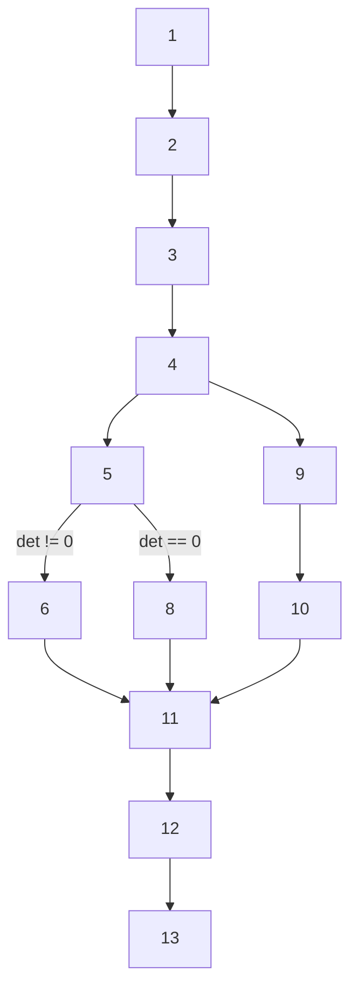

#  Software_Design_ESE
> Author : Aaron Augustine

> Star the gist so that I can get a consensus on how many people are using this resource
> 
[Github Repo Link for all ESE Notes](https://github.com/ToothlessRider/ESE_Notes.git).

# Table of Contents
1. [Previous year questions](#previous-year-questions)
2. [Basis Path Testing](#basis-path-testing)
3. [Types of Cohesion and Coupling](#ppt-25)
4. [Software Architecture](#ppt-26)
5. [Architectural Patterns](#ppt-36)
	- [Abstraction Occurence](#abstraction-occurence-pattern)
	- [Singleton Pattern](#singleton-pattern)
	- [Observer Pattern](#observer-pattern)
	- [Delegation Pattern](#delegation-pattern)
	- [Façade Pattern](#façade-pattern)
	- [Adaptor Pattern](#adaptor-pattern)
	- [Proxy Pattern](#proxy-pattern)
6. [GRASP Patterns](#grasp-patterns)
	- [Expert Pattern](#expert-pattern)
	- [Creator Pattern](#creator-pattern)
	- [Observer Pattern](#observer-pattern)
	- [Controller Pattern](#controller-pattern)
		- [Page Controller](#page-controller)
		- [Front Controller](#front-controller)
7. [Entity Relation Diagram](#er-diagram)


## Previous Year Questions

Q1. a. **Write a code to check if matrix has inverse or not. Draw control flow graph (CFG) for the same. <br>Find out total number of linearly independent path in CFG. <br>Give McCabe's metric or Number of test cases for the CFG.**

Ans.

## Code to find matrix inverse 
```python
1. import numpy as np

2. def has_inverse(matrix):
3.    try:
        # Compute the determinant of the matrix
4.        det = np.linalg.det(matrix)
        # If the determinant is not zero, the matrix has an inverse
5.        if det != 0:
6.            return True
7.        else:
8.            return False
9.    except np.linalg.LinAlgError:
        # Handle cases where the matrix is not square
10.        return False
11.
# Example usage:
12. matrix = np.array([[1, 2], [3, 4]])
13. print("Has inverse:", has_inverse(matrix))

```

### CFG 


### Calculating Cyclomatic Complexity (McCabe's Metric)

The Cyclomatic Complexity $V(G)$ of a program is given by: $V(G)=E−N+2$ where $E$ is the number of edges and $N$ is the number of nodes in the CFG.

From the CFG:

-   **Nodes (N)**: 12
-   **Edges (E)**: 13

Using the formula: <br> $V(G)=E−N+2$ <br> $=13-12+2=3$

### Number of Test Cases

The Cyclomatic Complexity indicates the number of linearly independent paths through the program. Therefore, the number of test cases required is equal to the Cyclomatic Complexity.

**Number of Test Cases**: 3

### Linearly Independent Paths


#### Path 1: Normal Execution (Determinant Non-Zero)
- 1 → 2 → 3 → 4 → 5 (det != 0) → 6 → 11 → 12 → 13

#### Path 2: Normal Execution (Determinant Zero)
- 1 → 2 → 3 → 4 → 5 (det == 0) → 8 → 11 → 12 → 13

#### Path 3: Exception Handling (Non-Square Matrix)
- 1 → 2 → 3 → 4 → 9 (exception) → 10 → 11 → 12 → 13

<hr>

Q1. b. **Why it is said to "Keep level of Abstraction as high as possible"? <br>How does it help in software design**

Ans.
#### High level of Abstraction
- A high level of abstraction ensures that your designs allow you to hide or defer consideration of details, thus reducing complexity
- A good abstraction is said to provide **information hiding**
- Abstractions allow you to **understand the essence** of a subsystem without having to know unnecessary details
- It also alllows us to **grasp the essential content**
- Defer the less important **grunt-level items until later**
- It also allows us to **deal with complexity**


<hr>

Q1. d. **What are different types of Coupling? List and explain each of the type**

Ans.
#### Content Coupling
- It occurs when one component **secretly modifies data / instructions** that are **internal to another component**
#### Common Coupling
- Occurs whenever you use a global variable, i.e., All components using global variables get coupled to each other
#### Control Coupling
- Occurs when one **procedure calls another one and controls what the second procedure does**.
#### External Coupling
- When one module **depends on other modules**
#### Data coupling , etc
- When two or more modules **share data with each other**

<hr>

Q2. a. **Why do you think software development should focus on the needs of users?**

Ans.
 Software development should focus on the needs of the users for the following reasons : $R^3$
* To *reduce training and support* costs ( i.e, make it so that users naturally understand how to use the software ).
* To *reduce time to learn* the system..
* To *reduce costs by developing only the required features*.
* To *create a UI accurate to what the user wants*.
* Since UI is the entire application for users, making sure it is good and according to what the user wants is very important.

This is mainly to answer these following questions : 
- *What is it that they need to do?*
- *Are they comfortable with the UI?*
- *Do they ‘see’ what they feel they need to see?*

<hr>

Q2. b. **What characteristics of users must be focused on in the software development process?**

Ans.
#### Characteristics are as follows : 
- **Goals for using the system**
	- What is the work the users need to get done?
- **Potential patterns of use**
	- 24/7? EOM/EOD/EOY? On-line; batch? Peak load
times? Down times? MTTR?
- **Demographics**
	- Cultures; religions; sensitivities
- **Knowledge of the application domain**
	- Finance and accounting? Manufacturing? Process control? Real time? Student environment?
- **Physical ability**
	- ADA? Other physical limitations

<hr>

Q2. c. **Differentiate between usability and utility with respect to software design.**

Ans.
### Usability

* Does the system allow the user to learn and to use raw capabilities easily?

The Key aspects of usability are : 
- **Learnability:** How easy is it for users to learn how to use the system?
- **Efficiency:** Once users have learned the system, how quickly can they perform tasks?
- **Memorability:** After a period of not using the system, how easily can users re-establish proficiency?
- **Error Prevention and Recovery:** How well does the system prevent errors, and if errors occur, how easily can users recover?
- **User Satisfaction:** How satisfied are users with their overall experience?

*Example:* An e-commerce website with a clear and intuitive navigation menu, simple checkout process, and helpful error messages has good usability.

### Utility

* Does the system provide the raw capabilities to allow the user to achieve their goal

The key aspects of utility are :
- **Relevance:** How well does the system address the user's specific requirements or objectives?
- **Functionality:** Does the system provide the necessary features and tools to accomplish tasks?
- **Value:** How much value does the user perceive in using the system?
- **Fit for Purpose:** Is the system designed to serve its intended purpose effectively?
   
*Example:* A project management software that includes features such as task tracking, team collaboration, and reporting provides utility for users managing complex projects.

<hr>

Q2. d. **What aspects can usability be divided into? Explain with examples.**

Ans. 
### Usability

* Does the system allow the user to learn and to use raw capabilities easily?

The Key aspects of usability are : 
- **Learnability:** How easy is it for users to learn how to use the system?
- **Efficiency:** Once users have learned the system, how quickly can they perform tasks?
- **Memorability:** After a period of not using the system, how easily can users re-establish proficiency?
- **Error Prevention and Recovery:** How well does the system prevent errors, and if errors occur, how easily can users recover?
- **User Satisfaction:** How satisfied are users with their overall experience?

*Example:* An e-commerce website with a clear and intuitive navigation menu, simple checkout process, and helpful error messages has good usability.

<hr>

Q3. a. **How do various stakeholders in the software industry evaluate user interfaces?**

Ans.
#### Heuristic evaluation
- Choose a use case .
- Study each **window, page or dialog** that appears when this is executed
- Look for usability defecets

#### Evaluation by observation of users
- Select a user for the corresponding use case
- Arrange an evaluation session with the users
- Note when the user finished their tasks and make observations


<hr>

Q3. b. **Explain the top-down design approach in software architecture design.**

Ans.
#### Top-down 
* First design the high level structures of the system
* Then work your way down to the low level constructs
* Finally arrive at the detailed decisions such as : 
	* Format of data items
	* Individual algorithms

Start with the software architecture and the type of database to be used

<hr>

Q3. c. **List and explain principles leading to good design.** *[ DHLHI ]*

Ans.
There are certain Overall Goals of good design. These are to : 
- Increase the profit by reducing cost
- Ensure that the design accomodates the user requirements
- Increase qualities such as
	- Usability
	- Efficiency
	- Reliability
	- Maintainability
	- Resuability, in the design

The principles to achieve a good design are as follows : **[DHLHRRAFPTD ]**
1. **Divide and Conquer** :
Instead of dealing with something big all at once, we break it down into small subproblems, i.e., : 
	- Smaller components are easier to understand
	- Parts can be replaced or exchanged

Ways to implement divide and conquer are : 
- Distributed system -> *Clients and Servers*
- System -> *Subsystems*
- Subsystem -> *Packages*
- Packages -> *Classes*
- Classes -> *Methods*
- 
2. **High Cohesion** :
A subsystem module has high cohesion if it keeps together things that are related and removes those that aren't.<br>
Types of cohesion are : 
- Functional Cohesion
- Layer Cohesion
- Communicational Cohesion
- Sequential Cohesion
- Procedural Cohesion
- Temporal Cohesion
- Utility Cohesion

3. **Low Coupling** : 
Coupling occurs when there are **interdependencies between multiple modules**<br>
The types of coupling are as follows : 
- Content Coupling
- Commong Coupling
- Control Coupling
- External Coupling
- Data coupling , etc

4. **High level of Abstraction** : 
Ensure that your designs allow you hide consideration of details, making them **less complex**

5. **Increase Reusability**
Design for reusability of components of GUI

6. **Reuse existing material**
Reuse existing designs and code wherever possible ( taking advantage of the reusability concept )

7. **Design for Flexibility**
Anticipate changes that might need to be added in the future

8. **Anticipate Obsolecence**
Plan for changes in technology and environment that might make your software obsolete
9. **Design for Portability**
Make sure the software can run on as many platforms as possible 
10. **Design for Testability** 
Make testing easier for the software
11. **Design Defensively**
Design it in a way that your code can't be misused

<hr>

Q3. d. **Explain communication cohesion with reference to architectural design.**

Ans.
All the modules that access or **"manipulate certain data”** are kept together (e.g. in the same class) - and everything else is kept out.<br>
**Main advantage:** 
- When you need to make changes to the data, you find all the code in one place
- Keep methods where the data is, if possible.

****
<hr>

Q4. a. **What are the different architectural styles? Which one would you choose for the software project "Digitization of Dr. B. R. Ambedkar Central Library of VJTI"?**

Ans.

<hr>

Q4. b. **Consider that software is to be built for the automatic recording of online meeting attendance. Assume suitable data and create a data model (ER-based).**

Ans.

>ER model to be made on your own assumptions
>[Link to ER diagrams](#er-diagram)

<hr>

Q4. c. **List and explain Pattern Description Parameters with reference to software design patterns**

Ans.
#### Pattern Description Parameters
There are certain paramaters that are used to describe patterns. [**PRSCARF**]

#### Context 
- The general situation in which the pattern is applicable
#### Problem :
- A short sentence describing the problem it is solving
#### Forces
- The issues or concerns while solving the problem
#### Solution
- Recommended way to solve the problem in the given context
#### Antipatterns
- solutions that are inferior or do not work in this context
#### Related Patterns 
- Patterns similar to this one
#### References
- People who developed or inspired the pattern

Ex : The *Facade Pattern* is used to provide interface from one layer to the next.

The *Singleton Pattern* is used to ensure global access to a single instance of a class.


<hr>

Q4. d. **List the various design patterns in Gangs of Four design pattern explain any one**

Ans. 
#### Gang of Four Patterns
1. Abstraction-Occurence Pattern
2. Delegation Pattern
3. Singleton Patter
4. Proxy Pattern

#### Proxy Pattern
- **Context** 
	- Often it is time consuming and complicated to create an instance of a heavyweight class
	- **Large classes must be loaded from the database to support usage**
- **Problem**
	- How to reduce the need to create instances of a heavyweight class ?
- **Forces**
	- We want the objects in a doman model to be made available for programs
	- It is impractical for all objects to be loaded into memory when a program starts
- **Solution**
	- A proxy in it's most general form **is a class functioning as an interface for something else**
****

<hr>

Q5. **Write code and draw class diagram to explain observer pattern (consider suitable example)**

Ans.
> Unanswered due to lack of time

<hr>

Q5. b. **Perform general class based modelling of delegator pattern also give specific example.**

Ans.
> Unanswered due to lack of time

<hr>

Q5. c. **Give context, forces, problem, solution and anti-pattern for adaptor pattern.**

Ans.
#### Adaptor Pattern
The Adapter Pattern is a structural design pattern that allows objects with incompatible interfaces to work together
- **Context**
	- You want to incorporate a class into the inheritance hierarchy
- **Problem**
	- How to obtain the power of **polymorphism** while reusing a class ?
- **Forces**
	- You don't want to use multiple inheritance
- **Solution**
****

<hr>

Q5. d. **Give real time example of façade pattern, give class diagram and code for same**

Ans. 
#### Façade Pattern
- **Context**
	- An application often contains **several complex packages**
- **Problem**
	- How do you simplify the view that programmers have of a complex package ?
- **Forces**
	- It is difficult for a programmer to fully understand and utilize a subsystem
	- If an class calls methods of the packages and the package is modified, then all these classes come under review.
- **Solution**
****

```
+------------------------+
|  ImageProcessingFacade |
+------------------------+
| + read_image(file)     |
| + apply_filter(filter) |
| + resize(width, height)|
| + save_image(file)     |
+------------------------+
           |
           |
+------------------+      +------------------+      +------------------+
|  OpenCVService   |      |  PILService      |      |  NumPyService    |
+------------------+      +------------------+      +------------------+
| + read_image()   |      | + apply_filter() |      | + resize()       |
| + save_image()   |      |                  |      |                  |
+------------------+      +------------------+      +------------------+

```

<hr>

## Basis Path Testing
> [PPT Link](https://classroom.google.com/c/NjU0MzUzOTIxNTA0/m/NjY0MzMxNzg2MTEy/details)

Q1. **What is Software Testing Funadmentals, it's Objectives, Principles and Testability ?**

Ans.
#### Fundamentals 
- S/w engineer tries to build s/w from an abstract concept
- He creates a set of test cases intended to "**demolish**" the software
- Testing is more destructive than constructive

#### Objectives
- Intent is to find an error in the software that might lead to failure
- Good test cases are those that can find , not-yet found errors
- Tests should require minimum time and effort
- Should be an indication of good software reliability

#### Principles
- Should be traceable to customer requirements
- Should be planned in advance
- Paretto principle ( 20:80 )
- Should begin in a **small-scale** and then progress to **large-scale**
- Exhaustive testing isn't possible

#### Testability
- How easily can a system be tested
> Characteristics of Testability

- Opearbility
- Observability
- Controllability
- Decomposability
- Simplicity
- Stability
- Understandability
 

<hr>

Q2. **What are the different CFG Notations?**

Ans. 
****

<hr>

Q3. **What are the different Usability Principles ?**

Ans.

1. Do not rely on usalbility guidelines
2. Base UI designs on user tasks
3. Ensure that sequence of actions to achieve tasks, are as simple as possible
4. Provide good feedback with effective error messages
5. Ensure that the user can always get out, go back or undo and action
6. Response time should be adequate
7. Use understandable coding techniques
8. Ensure UI is uncluttered
9. Consider needs of **Different groups of users**
10. Provide all necessary help
11. Be consistent

<hr>

Q4. **What is Basis Path Testing ?**

Ans.
Basis path testing is a white-box testing technique
- To derive a logical complexity measure of a procedural design.
- Test cases derived to exercise the basis set are guaranteed to execute every statement in the program at east one time.

Methods:
- Flow graph notation
- Independent program paths or Cyclomatic complexity
- Deriving test cases
- Graph Matrices

<hr>

## PPT 25
Q1. **What are the different types of Cohesion and mention the layers used in**
1. An Application Program
2. An Operating System
3. Communication

Ans.
A subsystem module has high cohesion if it keeps together things that are related and removes those that aren't.<br>
Types of cohesion are : 
#### Functional Cohesion
- When all the code that **computes a particular result** is kept together

#### Layer Cohesion
- Keeping all facilities for **providing or accessing related services** together
- Layers in an Application Program :
****
- Layers in an OS 
****
- Layers in communication 
****

#### Communicational Cohesion
- All the modules that **manipulate certain data** are kept together

#### Sequential Cohesion
- Procedures which provide **input to the next module** are kept together
#### Procedural Cohesion
- **Procedures used one after another** are kept together
#### Temporal Cohesion
- Operations performed **during the same phase of execution** are kept together
#### Utility Cohesion
- Related utilities are kept together


<hr>

Q2. **What are the different types of Coupling?**

Ans. 
> [Link to ans](#content-coupling)

<hr>

## PPT 26
Q1. **What is Software Architecture ? What is it's importance, and describe a good architectural model.**

Ans.
#### Software Architecture 
It is the process of designing the global organization (**structure**) of a software system which includes : 
- Dividing the software into **subsystems**
- Deciding on **component interaction**
- Determining their **interfaces**

Architecture is also the core of design, at it helps in creating overall **efficiency, reusability and maintainability** of the system.

#### Importance of Software Architecture
- To help everyone better understand the system
- Work individually on parts of the system
- To facilitate reuse and reusability
- Prepare for extension of the system
- To ensure maintainability and reliability of the system and architectural model must be **stable**

> Component Diagrams, Package Diagrams, Deployement Diagrams are in this PPT 

<hr>

## PPT 36
#### Architectural Patterns
- They are used for things on a **large-scale** and to create a **coarse-grained** design
- It is applied during the early iterations when the major structures are established

<hr>

#### Design Patterns
- This is related to **small and medium scale design** of objects
- This is used to design a solution for **connecting large scale elements made by architectural patterns**
- The recurring aspects of design are called design patterns

<hr>

## PPT 37
#### Abstraction Occurence Pattern
- **Context** 
	- In a domain model you find a set of related objects
	- They also have common points, but are different in important ways
- **Problem**
	- What is the best way to represent these in a class diagram ?
- **Forces**
	- You want to represent members of each **set of occurences without duplicating common information**
- **Solution**
****

<hr>


### Singleton Pattern
- **Context**
	- It is common to find classes for which only one instance should exist.
- **Problem**
	- How do you ensure that it is never possible to create more than one instance of a singleton class ?
- **Forces**
	- A public constructor can't guarantee that more than one instance will be created
- **Solution**
****

<hr>


#### Observer Pattern
- **Context**
	- When you have a two way association for two classes **Code becomes inseparable**
	- If you want to reuse one, you have to reuse the other
- **Problem**
	- How do you **reduce the interconnection** between classes that belong to different modules ?
- **Forces**
	- You want to maximize the flexibility of the system.
- **Solution**
****

<hr>

#### Delegation Pattern
- **Context**
	- You are designing a method in a class
	- You realize another class has the same method that provides the required service
	- **Inheritance isn't possible**
- **Problem**
	- How can you effectively make use of a **method that exists in another class**?
- **Forces**
	- You want to minimize development costs by reusing methods, and reduce coupling between classes.
- **Solution**
****

<hr>

#### Façade Pattern
- **Context**
	- An application often contains **several complex packages**
- **Problem**
	- How do you simplify the view that programmers have of a complex package ?
- **Forces**
	- It is difficult for a programmer to fully understand and utilize a subsystem
	- If an class calls methods of the packages and the package is modified, then all these classes come under review.
- **Solution**
****

<hr>

#### Proxy Pattern
- **Context** 
	- Often it is time consuming and complicated to create an instance of a heavyweight class
	- **Large classes must be loaded from the database to support usage**
- **Problem**
	- How to reduce the need to create instances of a heavyweight class ?
- **Forces**
	- We want the objects in a doman model to be made available for programs
	- It is impractical for all objects to be loaded into memory when a program starts
- **Solution**
	- A proxy in it's most general form **is a class functioning as an interface for something else**
****

### GRASP Patterns 
#### [ General Responsibility Assignment Software Patterns ]
GRASP (General Responsibility Assignment Software Patterns) is a set of design patterns that guide the assignment of responsibilities in object-oriented design

#### Expert Pattern
- Assign the responsibility to the class that has the necessary information to fulfil it.
- This promotes encapsulation
- Low coupling is ensured
- High cohesion is supported
- 

Example : Who should be responsible for knowing the grand total of a sale ?
**Domain Model** : Contains conceptual classes of the world
**Design Model** : Contains software classes

Assign the class which will be the **information expert** in this case. 


#### Creator Pattern
- **Problem** 
	- Who is responsible for creating **new instances of some class**?
- **Solution**
	- Assign class B the responsibility to create an instance of class A if it has the information needed to create it and works closely with Class A
- Clearly a **Sale** contains **SalesLineItem** objects.  
- So according to Creator Pattern, **Sales** is a good candidate for the responsibility of **creating** SalesLineItem instances
- **This approach results in low coupling, encapsulation and reusability**

#### Controller Pattern
It is useful for developing web based applications among other things<br>
- **Problem** 
	- It handles who should be responsible for an **input system event** ?
- **Solution**
	- It assigns the responsibility of handling system events to a controller class that represents a use case or handles the overall system events

****

Q. **What are the two types of controllers in Controller Patterns ?**

Ans. 
Two other design patterns related to Use Case controllers:
- Page Controller
- Front Controller

#### Page Controller
The controller uses a single Presenter which interacts with the Model (the data for the page). <br>When it receives
a request, the Page Controller can determine which partial View to display within the page, and then interact with that View following the MVP pattern.

#### Front Controller
In the Front Controller pattern, a separate controller examines each request and determines which page to display. <br>Each page is a complete MVP implementation, with its own View, and each Presenter interacts with the View and the Model (the data)


## ER Diagram
****
****

## Sequence Diagram
****
****

## Use Case Diagram
****
****
